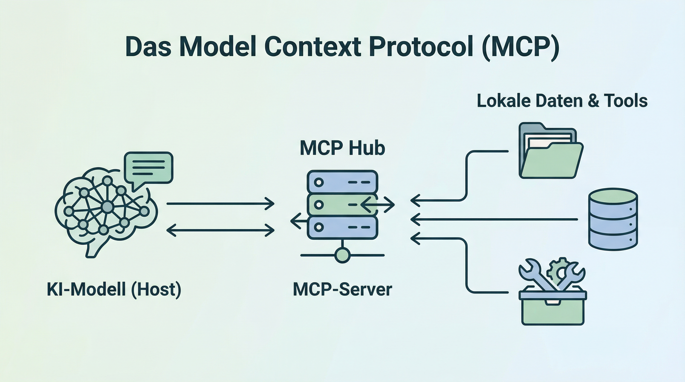

# Lab Session 1 - Advanced Deployment and Infrastructure
## Befehle & Deployment-Guide für Tag 03

An diesem Tag richten wir unsere lokale KI-Umgebung mittels Docker ein.

## 1. Docker Installation & Vorbereitung
Bevor wir die Container starten, muss Docker Desktop installiert und korrekt konfiguriert sein.

### 1.1 macOS Checkliste
- **Download:** Docker Desktop für Mac (Achte auf den richtigen Chip: Intel vs. Apple Silicon M1/M2/M3).
- **Berechtigungen:** Erlaube Docker beim ersten Start den "Privileged Access".
- **Ressourcen:** In den Einstellungen (Settings > Resources) sollten mindestens 4GB RAM zugewiesen sein.

### 1.2 Windows Checkliste: Der "anwendersichere" Deep-Dive
Unter Windows ist die Einrichtung etwas komplexer, da Docker eine Brücke zwischen Windows und Linux baut (**WSL 2 - Windows Subsystem for Linux**). Damit das funktioniert, müssen wir tief ins System:

#### Schritt A: Die BIOS-Hürde (Hardware-Virtualisierung)
Bevor wir Software installieren, muss die Hardware "wissen", dass sie Virtualisierung erlauben darf.
- **Was ist das BIOS?** Ein Menü, das *vor* Windows lädt.
- **Wie komme ich rein?** Starte deinen PC neu und hämmere sofort und wiederholt auf eine dieser Tasten (je nach Hersteller): `ENTF` (Del), `F2`, `F10` oder `F12`.
- **Was muss ich einstellen?** Suche (meist unter "Advanced", "CPU Configuration" oder "Security") nach:
  - **Intel CPUs:** `Intel Virtualization Technology` oder `VT-x` -> Stelle auf **Enabled**.
  - **AMD CPUs:** `SVM Mode` oder `AMD-V` -> Stelle auf **Enabled**.
- **Speichern:** Drücke `F10` zum Speichern und Verlassen. Dein PC startet nun normal Windows.

#### Schritt B: WSL 2 & PowerShell (Die Software-Basis)
Nun bereiten wir Windows vor. Wir nutzen dazu die **PowerShell**.
- **Warum PowerShell (Admin)?** Nur der Administrator darf tiefgreifende Windows-Features (wie das Linux-Subsystem) freischalten. Ohne Admin-Rechte verweigern die Befehle den Dienst.
- **So geht's:** Rechtsklick auf das Windows-Start-Symbol -> "Terminal (Administrator)" oder "PowerShell (Administrator)" auswählen. Bestätige die Sicherheitsabfrage.

**Führe diese Befehle nacheinander aus:**
1. `wsl --install` 
   *(Dieser Befehl lädt alle nötigen Komponenten herunter. Er kann einige Minuten dauern.)*
2. `wsl --update`
   *(Garantiert, dass du den neuesten Linux-Kernel hast.)*
3. `wsl --set-default-version 2`
   *(Zwingt Windows dazu, die moderne Version 2 zu nutzen, die Docker zwingend benötigt.)*

> [!IMPORTANT]
> **NEUSTART ZWINGEND:** Nachdem du diese Befehle ausgeführt hast, **musst** du Windows neu starten, damit die Änderungen wirksam werden.

#### Schritt C: Docker Desktop konfigurieren
Nach dem Neustart öffnest du Docker Desktop:
1. Gehe oben auf das Zahnrad (**Settings**).
2. Wähle links **General**.
3. Stelle sicher, dass der Haken bei **"Use the WSL 2 based engine"** gesetzt ist.

### 1.3 Test der Installation
Öffne dein Terminal (oder PowerShell unter Windows) und gib folgenden Befehl ein:
```bash
docker run hello-world
```
*(Wenn du hier ein "Hello from Docker!" siehst, hast du es geschafft!)*

---

## 2. OpenWebUI installieren
OpenWebUI gilt aktuell als SOTA (State of the Art) für OpenSource Chat-Oberflächen und dient als mächtiges lokales Frontend für die Interaktion mit Modellen (via Ollama, LMStudio, OpenRouter oder andere...).

**So installierst du es:**
Öffne das Terminal (entweder direkt in Docker Desktop unter "Containers" > "Terminal" oder dein normales System-Terminal) und gib diesen Befehl ein:

```bash
docker run -d -p 3000:8080 --add-host=host.docker.internal:host-gateway -v open-webui:/app/backend/data --name open-webui ghcr.io/open-webui/open-webui:main
```

### 2.1 OpenWebUI-Konfiguration: Modelle & Agenten
Sobald OpenWebUI unter `http://localhost:3000` läuft, binden wir unsere Modell-Backends an:

#### 🏠 Lokale Modelle (LM Studio)
1. Starte **LM Studio** auf deinem PC/Mac und lade ein effizientes, kleines Modell herunter (Empfehlung: `Qwen 3.5 (0.8B)` oder `Gemma 4 (2B)`).
2. Gehe im Dashboard auf den Reiter **"Local Server"** und klicke auf "Start Server".
3. In OpenWebUI: Gehe auf **Settings > Connections > OpenAI API**.
4. Trage bei der URL ein: `http://host.docker.internal:1234/v1`.

#### 🌐 Externe Modelle (OpenRouter / Gemini)
1. Erstelle einen API-Key auf [openrouter.ai](https://openrouter.ai/).
2. In OpenWebUI: Gehe auf **Settings > Connections > OpenAI API**.
3. Trage bei der URL ein: `https://openrouter.ai/api/v1` und gib deinen API-Key ein.

---

## 2.2 RAG und Dokumente konfigurieren
Das Herzstück von Nova ist das Wissen. Gehe dazu in OpenWebUI auf dein **User-Icon > Settings > Documents**:

**Allgemein:**
- **Engine zur Inhaltsextraktion:** Standard
- **Bilder aus PDFs extrahieren (OCR):** Aktivieren
- **PDF Loader Modus:** Seite
- **Embedding und Retrieval umgehen:** Deaktiviert lassen

**Text-Splitter (Chunking):**
- **Text-Splitter:** Token (Tiktoken)
- **Markdown-Header-Text-Splitter:** Aktivieren
- **Chunk-Größe:** 400
- **Chunk-Überlappung:** 40
- **Zielwert min. Chunk-Größe:** 0

**Embedding Modell:**
- **Modell-Engine:** Standard (SentenceTransformers)
- **Modell:** `sentence-transformers/all-MiniLM-L6-v2`
- **Batch-Größe:** 2

**RAG-Vorlage (Prompt-Template):**
Kopiere diesen Text in das Feld **RAG-Vorlage**:

```markdown
### Task:
Respond to the user query using the provided context, incorporating inline citations in the format [source_id] **only when the <source_id> tag is explicitly provided** in the context.

### Guidelines:
- If you don't know the answer, clearly state that.
- If uncertain, ask the user for clarification.
- Respond in the same language as the user's query.
- If the context is unreadable or of poor quality, inform the user and provide the best possible answer.
- If the answer isn't present in the context but you possess the knowledge, explain this to the user and provide the answer using your own understanding.
- **Only include inline citations using [source_id] (e.g., [1], [2]) when a `<source_id>` tag is explicitly provided in the context.**
- Do not cite if the <source_id> tag is not provided in the context.  
- Do not use XML tags in your response.
- Ensure citations are concise and directly related to the information provided.

### Example of Citation:
If the user asks about a specific topic and the information is found in "whitepaper.pdf" with a provided <source_id>, the response should include the citation like so:  
* "According to the study, the proposed method increases efficiency by 20% [whitepaper.pdf]."
If no <source_id> is present, the response should omit the citation.

### Output:
Provide a clear and direct response to the user's query, including inline citations in the format [source_id] only when the <source_id> tag is present in the context.

<context>
{{CONTEXT}}
</context>

<user_query>
{{QUERY}}
</user_query>
```
*Nach Änderungen bitte die Schaltfläche "Neu indizieren" nutzen.*

---

## 2.3 Websuche konfigurieren
Gehe dazu in OpenWebUI auf dein **User-Icon > Settings > Web Search**:

**Allgemein:**
- **Websuche:** Aktivieren
- **Web-Suchmaschine:** brave
- **Brave Search API-Schlüssel:** (Deinen Key hier eintragen)
- **Anzahl der Suchergebnisse:** 5
- **Gleichzeitige Anfragen:** 5

**Loader Einstellungen:**
- **Engine:** Standard
- **SSL-Zertifikat prüfen:** Aktiviert
- **Gleichzeitige Anfragen:** 2
- **YouTube-Sprache:** de

> [!NOTE]
> **Suchmaschinen-Vergleich:** Brave ist aktuell die beste Wahl für LLMs (sehr sauber aufbereitet). DuckDuckGo (DDGS) ist kostenlos, stößt aber schnell an Limits. SearXNG ist mächtig, kann aber schwache Modelle durch inkonsistente Formate verwirren.

---

## 2.4 Deine Agentin "Nova" erstellen
Damit wir nicht nur nackte Modelle nutzen, erstellen wir eine spezialisierte Agentin:
1. Gehe in den Bereich **Workspace > Models > Create a Model**.
2. **Name:** Nova (oder einen Namen nach eigenem Wunsch)
3. **Basemodel:** Wähle zwingend das Modell: `google/gemini-3-flash-preview` (via OpenRouter).
4. **System Prompt:** Kopiere den vollständigen Text aus der Datei [Nova_Systemprompt.md](./Nova_Systemprompt.md) hier hinein.
5. **Capabilities:** Aktiviere **Websearch**.

---

## 2.5 Labor-Challenge I: Vision & RAG (Basics)
In dieser Übung testen wir die Grenzen unserer lokalen Modelle und Agenten. Nutze dafür die Dateien im Ordner **`demodokumente`**.

### Challenge A: Die Nadel im Heuhaufen (RAG)
1. Lade **`CON01_Jahresabschluss_Needleinthemiddle.pdf`** hoch.
2. **Aufgabe:** Finde den Satz, der mit "Wurzel macht einen ..." beginnt (S. 66).
3. **Vergleich:** Lokal (Qwen 3.5 0.8B) vs. Cloud (Gemini 3.1 Flash).

### Challenge B: Bild-Analyse & Vision-Inventur
1. Lade **`Parkplatz_Autos-Farben_und ein Biber.png`** hoch.
2. **Aufgabe:** 
   - Zähle alle Autos und sortiere sie nach Farben.
   - Suche den versteckten Biber! (Lösung: `LSG_Biber.png`).

### Challenge C: Das Wimmelbild der ausgestorbenen Tiere
1. Lade **`Wimmelbild_Tiere_zweiTiere-nichtaktuell.png`** hoch.
2. **Aufgabe:** Suche Tiere, die es nicht mehr gibt oder nie gab (T-Rex & Einhorn).

---

## 3. Code-Interpreter (Jupyter) einrichten
Um der KI das Rechnen und die Datenanalyse mittels Python zu ermöglichen, richten wir einen Jupyter-Container ein.

### 3.1 Jupyter-Container erstellen
Führe diesen Befehl aus, um die Instanz zu starten. 

> [!CAUTION]
> **SICHERHEITSHINWEIS:** Ersetze `DEIN_SICHERER_TOKEN` durch einen zufälligen String (z.B. generiert via `openssl rand -hex 32`).

```bash
docker run -d \
  -p 8888:8888 \
  --name jupyter-interpreter \
  --restart always \
  jupyter/datascience-notebook \
  start.sh jupyter notebook \
  --NotebookApp.token='DEIN_SICHERER_TOKEN' \
  --NotebookApp.password='' \
  --NotebookApp.allow_origin='*' \
  --NotebookApp.disable_check_xsrf=True
```

### 3.2 Bibliotheken im Container installieren
Sobald der Container läuft, installieren wir die für die KI-Analyse notwendigen Bibliotheken aus der im Repo bereitgestellten `requirements_jupyter.txt`.

**Option 1: Über das Terminal (Schnell)**
```bash
docker exec jupyter-interpreter pip install -r requirements_jupyter.txt
```

**Option 2: Über die Jupyter-Oberfläche (Alternative)**
1. Öffne Jupyter im Browser (`http://localhost:8888`).
2. Nutze den Login-Token aus dem Docker-Log.
3. Klicke auf **New > Text File**, nenne sie `requirements.txt` und füge den Inhalt der Bibliotheksliste ein (oder lade die Datei hoch).
4. Gehe zurück auf die Übersicht, klicke auf **New > Terminal**.
5. Gib im Terminal ein: `pip install -r requirements.txt`.

### 3.3 Einbindung in OpenWebUI
1. Navigiere zu **Settings > Images & Web Search** (oder **Code Interpreter**).
2. Trage bei der Jupyter-URL ein: `http://host.docker.internal:8888`.
3. Gib den von dir gewählten Token (`DEIN_SICHERER_TOKEN`) ein.


*Beispiel der Konfiguration in OpenWebUI.*

### 3.4 Code Interpreter Prompt & Vertrag
Kopiere diesen Prompt in das Feld für den **System-Prompt** deines "Nova" Modells oder erstelle ein spezialisiertes Profil, damit die KI den Interpreter korrekt ansteuert:

> ### CODE INTERPRETER (JUPYTER) – PROMPT TEMPLATE
> Du hast Zugriff auf eine Jupyter-Python-Umgebung (Kernel). Der Kernelzustand bleibt über Ausführungen hinweg erhalten (Variablen/Imports können wiederverwendet werden).
> 
> **Ziel:** Wenn Rechnen/EDA/ML nötig ist, sollst du Code zuverlässig ausführen lassen und danach den tatsächlichen Output interpretieren (ohne Halluzinationen).
> 
> **A) HARTE AUSGABE- & FORMATREGELN (damit OpenWebUI triggert)**
> 1. Wenn du Code ausführen willst, MUSS deine gesamte Antwort in PHASE A exakt so aussehen (und sonst nichts):
>    `<code_interpreter type="code" lang="python"> # python code </code_interpreter>`
> 2. **VERBOTEN:** Kein JSON-Toolcall-Objekt, keine Markdown-Fences (```python), kein Text vor/nach dem Block in PHASE A.
> 3. Nutze ausschließlich das obige `<code_interpreter>`-Format.
> 
> **B) ZWEI-PHASEN-VERTRAG (Tool-Loop)**
> - **PHASE A (vor Ausführung):** Antworte ausschließlich mit EINEM `<code_interpreter>`-Block.
> - **PHASE B (nach Ausführung):** Antworte ausschließlich mit Text-Interpretation (kein weiterer Code-Block).
> 
> **Interpretationsstruktur (PHASE B):**
> 1. Datenüberblick (Shape, Spalten, Zielvariable).
> 2. Vorverarbeitung (Encodings, Scaling, Missing Values).
> 3. Modellvergleich (Accuracy, F1, ROC-AUC).
> 4. Bestes Modell (warum).
> 5. Grafiken (was man auf den Plots erkennt).

### 3.5 Test & Challenge D (Data Science)
**Funktionstest:** "Berechne die ersten 15 Fibonacci-Zahlen und erstelle ein Balkendiagramm dazu."

**Challenge D (Data Science Untersuchung):**
Nutze die analytische Power deiner Jupyter-Umgebung.
> "Nutze folgenden Datensatz: `https://raw.githubusercontent.com/ProfEngel/datasets/refs/heads/main/GolfSpielen.csv`
> Erstelle eine Klassifikation oder Regression (entscheide selbst, was angebracht ist). Nutze das Merkmal `Klassenvorhersage` als Zielvariable. 
> Nutze mindestens 4 Modelle für deine Untersuchung und vergleiche die Ergebnisse. Zeige am Ende das am besten performende Modell auf. Zeige auch die typischen Metriken (neben der Verlustfunktion) und nutze Grafiken, um deine Ergebnisse zu verdeutlichen. Nicht numerische Werte bitte vorab wandeln."

---

## 4. Docker MCP Toolkit & Web-Suche
Docker Desktop bietet das **MCP Toolkit (Beta)** an.

### Was ist MCP? (Einfach erklärt)


Das **Model Context Protocol (MCP)** ist ein neuer, offener Standard, der wie ein "Universalstecker" für KIs funktioniert. Er ermöglicht es, dass verschiedene KI-Modelle und Anwendungen nahtlos mit Datenquellen und Werkzeugen kommunizieren können.

**Das Prinzip: Server & Client**
Das System basiert auf einer einfachen Rollenverteilung, die man sich wie bei einem Restaurant vorstellen kann:
- **Der Client (z.B. OpenWebUI):** Das ist der Gast, der eine Bestellung aufgibt (z.B. "Suche mir die neuesten Nachrichten").
- **Der Server (MCP-Server):** Das ist der Koch, der die spezialisierten Werkzeuge hat (z.B. Zugriff auf das Internet oder eine Datenbank), um die Bestellung auszuführen.

**Warum ist das revolutionär?**
1. **Offener Standard:** MCP ist kein geschlossenes System einer einzelnen Firma. Jeder kann MCP-Server entwickeln oder nutzen.
2. **Flexibilität:** Die Rollen sind trennbar. Man kann einen eigenen MCP-Server betreiben (z.B. für interne Firmendaten), einen fertigen Client nutzen oder beides kombinieren.
3. **Endlose Vielfalt:** Das Docker MCP Toolkit zeigt nur eine kleine Auswahl. In der Realität gibt es bereits hunderte MCP-Server für fast alles: Finanzdaten, Smarthome-Steuerung, Google Drive, Slack oder spezialisierte Programmier-Bots.

Kurz gesagt: MCP gibt der KI "Hände und Augen", damit sie nicht nur redet, sondern aktiv für Sie arbeiten kann.
### 4.1 MCP Toolkit aktivieren & Server hinzufügen
1. Docker Desktop > **MCP Toolkit** (links).
2. **Catalog:** Suche nach `Brave Search`, `Fetch` und `Playwright` > Aktiviere sie via **"+"**.
3. **Clients:** Aktiviere den Schalter für LM Studio (oder andere Clients).
4. **Ports:** Notiere dir den Port des jeweiligen Servers in den Details.

### 4.2 OpenWebUI mit MCP verbinden (SSE)
Da OpenWebUI im Docker-Container läuft, binden wir sie als Netzwerk-Dienst (SSE) ein.
1. OpenWebUI > **Admin Settings > External Tools** > **"+" (Add Server)**.
2. **Type:** Wähle `MCP (Streamable HTTP)`.
3. **URL:** `http://host.docker.internal:<PORT>/sse` (Den Port aus Docker Desktop entnehmen).

---

## 5. Erweiterte Agenten-Fähigkeiten (Sub-Agenten)
Um komplexe Aufgaben zu bewältigen, nutzen wir das **Sub-Agent Tool**.

### 5.1 Installation des Sub-Agents
1. Gehe zu **Workspace > Tools** in OpenWebUI.
2. Klicke auf **"Import from OpenWebUI Community"** oder nutze diesen Link: [Sub-Agent Tool (v7bfeb0b7)](https://openwebui.com/posts/sub_agent_7bfeb0b7).
3. Bestätige den Import und aktiviere das Tool in den Einstellungen deiner Agentin Nova.

### 5.2 Der finale Belastungstest (Agentik & Multi-Step)
**Challenge E (Globale Inflation & Web-Visualisierung):**
Verwende das Sub-Agent Tool für eine tiefgreifende Recherche und Dashboard-Erstellung.
> "Wie hat sich die Inflation in Deutschland seit 2000 entwickelt? Kannst du das gegenüberstellen zu China? Zeige auch bitte auf, was die Gründe für Peaks sind. Zeige dann alles in ein oder mehreren passenden Charts in einem HTML/JS/CSS Dashboard an."

---

## 6. OpenWebUI Mastery: Benchmark-Challenges für zu Hause
Nutze diese Aufgaben, um die Werkzeuge (Sub-Agent, Code Interpreter, Knowledge Base) bis an ihre Grenzen zu testen.

### Benchmark 1: Creative Coding (The Snake Challenge)
**Modell:** Nova (mit Code Interpreter)
**Prompt:** "Erstelle ein vollständig spielbares Snake-Spiel in einer einzigen HTML-Datei inklusive CSS für das Styling und JavaScript für die Logik. Das Spiel soll im Chat-Fenster als Vorschau (oder nach Download) direkt ausführbar sein."

### Benchmark 2: Deep Knowledge Analysis (@Collections)
**Workflow:**
1. Lade 3-5 thematisch verwandte PDFs (z.B. KI-Papers) in **Workspace > Knowledge** hoch.
2. Erstelle eine **Collection** namens "KI-Forschung".
3. Starte einen Chat und tippe `@KI-Forschung`. 
**Prompt:** "Analysiere diese Dokumente übergreifend. Was sind die 3 konsistentesten Thesen und wo widersprechen sich die Autoren? Erstelle eine vergleichende Matrix."

### Benchmark 3: Market Intelligence (Sub-Agent Turbo)
**Modell:** Nova (mit Sub-Agent Tool)
**Prompt:** "Führe eine Marktanalyse zum Thema 'Autonomes Fahren: Tesla vs. Waymo' der letzten 24 Monate durch. Recherchiere aktuelle Vorfälle, regulatorische Änderungen und technologische Durchbrüche. Erstelle ein ausführliches Management-Summary mit Empfehlung."

### Benchmark 4: Mathematical Art (Visuals)
**Modell:** Nova (mit Code Interpreter)
**Prompt:** "Generiere eine hochauflösende Visualisierung der Mandelbrot-Menge mittels Python. Nutze eine ästhetische Farbpalette (z.B. 'magma' oder 'inferno') und speichere das Bild als PNG."

---

## 7. KI-Benchmarks: Qualität & Evaluation in der Praxis
Um die Leistungsfähigkeit verschiedener Modelle (Qwen 0.8B vs. Gemini 3.1 Flash) objektiv zu bewerten, führen wir systematische Benchmarks durch.

### 7.1 Die Benchmark-Bedingungen (Die "Hebel")
Ein fairer Vergleich erfordert identische Bedingungen. Achten Sie auf diese Parameter:
- **Temperature:** (0.0 für Fakten/Code, 0.7+ für Kreativität).
- **System Prompt:** Ein identischer System-Prompt ("Du bist ein Experte für...") neutralisiert Verhaltensunterschiede der Basemodelle.
- **RAG-Kontext:** Wird das Modell durch Dokumente unterstützt oder antwortet es "Zero-Shot" (nur aus dem Training)?

### 7.2 Fachspezifische Test-Prompts
Testen Sie Ihre Modelle in verschiedenen Domänen, um qualitative Unterschiede zu sehen:
- **Allgemein:** "Erkläre die Quantenverschränkung so, dass es ein 10-jähriger versteht."
- **BWL:** "Erstelle eine Break-Even-Analyse für ein SaaS-Startup mit fixen Kosten von 50.000 € und einem Deckungsbeitrag von 150 € pro Nutzer."
- **Jura:** "Prüfe die Zulässigkeit einer Klage vor dem Verwaltungsgericht, wenn der Widerspruchsbescheid der Ausgangsbehörde vor 5 Wochen zugestellt wurde."

### 7.3 Evaluation: Wer bewertet die Ergebnisse?
Die Bewertung erfolgt in einem zweistufigen Verfahren:
1. **Human Evaluation:** Sie als Fachexperte prüfen Korrektheit, logische Herleitung und stilistische Nuancen.
2. **LLM-as-a-Judge (Frontier-Vergleich):** Ein externes **Frontier-Modell** (z.B. GPT-5.X, Claude Sonnet 4.X oder Gemini 3.1 Pro via Perplexity) bewertet die Antworten der kleineren Modelle nach einer Punkteskala (1-10) hinsichtlich Präzision, Logik und Halluzinationen.

### 7.4 Modell-Orchestrierung & Routing
In der professionellen Praxis nutzt man selten nur *ein* Modell. Man **orchestriert** den Einsatz je nach Komplexität ("Modell-Tiering"):
- **Small (0.8B - 3B):** Blitzschnell für einfache Klassifizierungen oder das Routing von Anfragen.
- **Medium (7B - 30B):** Lokale Allrounder für RAG-Aufgaben und Standard-Analysen.
- **Frontier (Cloud-Giganten):** Für komplexe juristische Prüfungen, finale Validierungen oder strategische Planungen.

**Profi-Tipp:** Tools wie **LiteLLM** fungieren als intelligente Schaltzentrale (Router) und leiten Anfragen automatisch an das günstigste oder fähigste Modell weiter, ohne dass der Anwender das Backend manuell wechseln muss.

---
**Nächste Schritte:** 
Bringe deine Umgebung zum Glühen! 🚀
