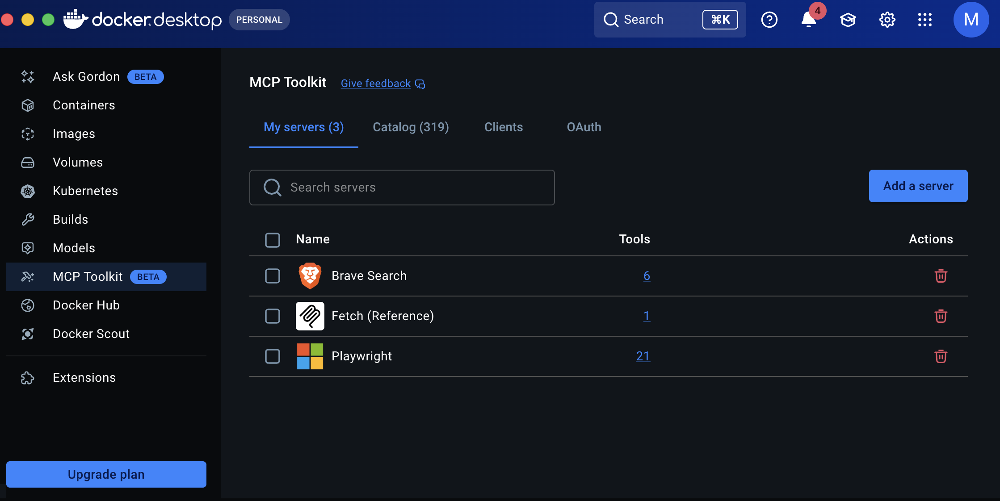
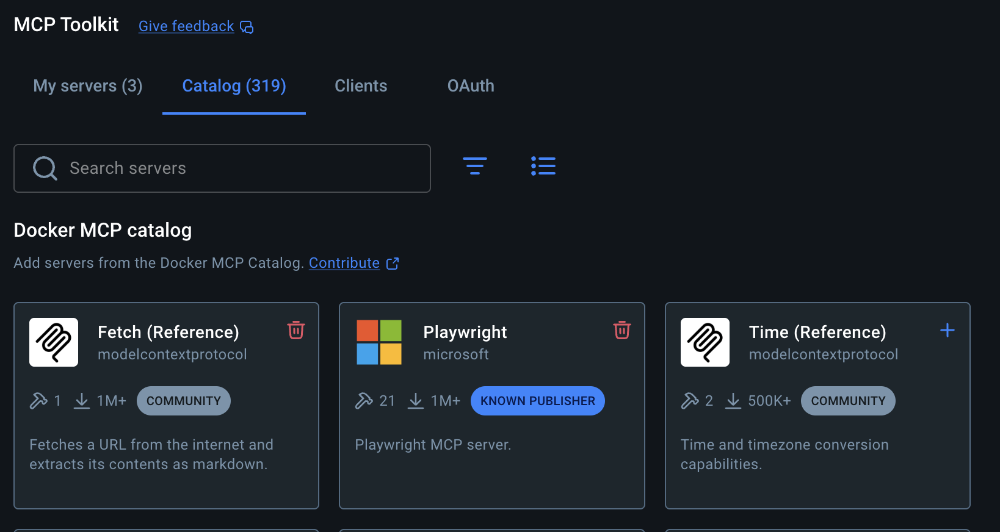
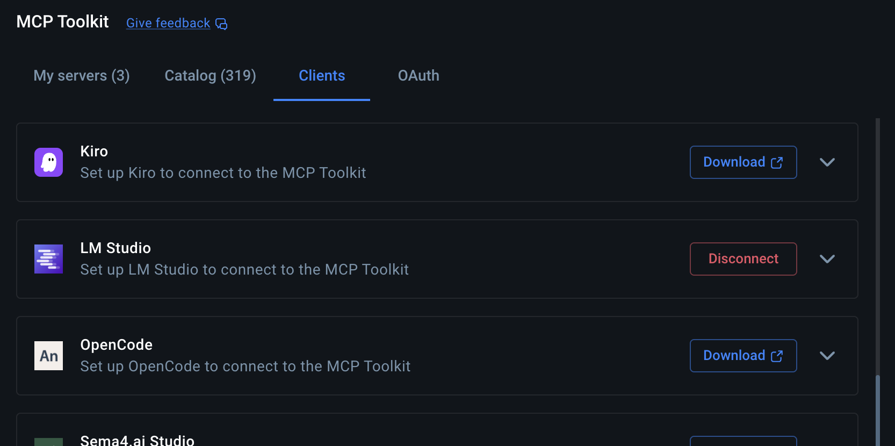

# Befehle & Deployment-Guide für Tag 03

An diesem Tag richten wir unsere lokale KI-Umgebung mittels Docker ein.

## 1. Docker Installation & Vorbereitung
Bevor wir die Container starten, muss Docker Desktop installiert und korrekt konfiguriert sein.

### 🍏 macOS Checkliste
- **Download:** Docker Desktop für Mac (Achte auf den richtigen Chip: Intel vs. Apple Silicon M1/M2/M3).
- **Berechtigungen:** Erlaube Docker beim ersten Start den "Privileged Access".
- **Ressourcen:** In den Einstellungen (Settings > Resources) sollten mindestens 4GB RAM zugewiesen sein.

### 🪟 Windows Checkliste: Der "anwendersichere" Deep-Dive
Unter Windows ist die Einrichtung etwas komplexer, da Docker eine Brücke zwischen Windows und Linux baut (**WSL 2 - Windows Subsystem for Linux**). Damit das funktioniert, müssen wir tief ins System:

#### Schritt A: Die BIOS-Hürde (Hardware-Virtualisierung)
Bevor wir Software installieren, muss die Hardware "wissen", dass sie Virtualisierung erlauben darf.
- **Was ist das BIOS?** Ein Menü, das *vor* Windows lädt.
- **Wie komme ich rein?** Starte deinen PC neu und hämmere sofort und wiederholt auf eine dieser Tasten (je nach Hersteller): `ENTF` (Del), `F2`, `F10` oder `F12`.
- **Was muss ich einstellen?** Suche (meist unter "Advanced", "CPU Configuration" oder "Security") nach:
  - **Intel CPUs:** `Intel Virtualization Technology` oder `VT-x` -> Stelle auf **Enabled**.
  - **AMD CPUs:** `SVM Mode` oder `AMD-V` -> Stelle auf **Enabled**.
- **Speichern:** Drücke `F10` zum Speichern und Verlassen. Dein PC startet nun normal Windows.

#### Schritt B: WSL 2 & PowerShell (Die Software-Basis)
Nun bereiten wir Windows vor. Wir nutzen dazu die **PowerShell**.
- **Warum PowerShell (Admin)?** Nur der Administrator darf tiefgreifende Windows-Features (wie das Linux-Subsystem) freischalten. Ohne Admin-Rechte verweigern die Befehle den Dienst.
- **So geht's:** Rechtsklick auf das Windows-Start-Symbol -> "Terminal (Administrator)" oder "PowerShell (Administrator)" auswählen. Bestätige die Sicherheitsabfrage.

**Führe diese Befehle nacheinander aus:**
1. `wsl --install` 
   *(Dieser Befehl lädt alle nötigen Komponenten herunter. Er kann einige Minuten dauern.)*
2. `wsl --update`
   *(Garantiert, dass du den neuesten Linux-Kernel hast.)*
3. `wsl --set-default-version 2`
   *(Zwingt Windows dazu, die moderne Version 2 zu nutzen, die Docker zwingend benötigt.)*

> [!IMPORTANT]
> **NEUSTART ZWINGEND:** Nachdem du diese Befehle ausgeführt hast, **musst** du Windows neu starten, damit die Änderungen wirksam werden.

#### Schritt C: Docker Desktop konfigurieren
Nach dem Neustart öffnest du Docker Desktop:
1. Gehe oben auf das Zahnrad (**Settings**).
2. Wähle links **General**.
3. Stelle sicher, dass der Haken bei **"Use the WSL 2 based engine"** gesetzt ist.

**Test der Installation (Terminal/PowerShell):**
```bash
docker run hello-world
```
*(Wenn du hier ein "Hello from Docker!" siehst, hast du es geschafft!)*

## 2. OpenWebUI installieren
OpenWebUI dient als lokales Frontend für die Interaktion mit Modellen (z.B. via Ollama oder APIs).

```bash
docker run -d -p 3000:8080 --add-host=host.docker.internal:host-gateway -v open-webui:/app/backend/data --name open-webui ghcr.io/open-webui/open-webui:main
```

## 2.1 OpenWebUI-Konfiguration: Modelle & Agenten
Sobald OpenWebUI unter `http://localhost:3000` läuft, binden wir unsere Modell-Backends an:

### 🏠 Lokale Modelle (LM Studio)
1. Starte **LM Studio** auf deinem PC/Mac und lade ein Modell (z.B. Llama 3 oder Mistral).
2. Gehe im Dashboard auf den Reiter **"Local Server"** und klicke auf "Start Server".
3. In OpenWebUI: Gehe auf **Settings > Connections > OpenAI API**.
4. Trage bei der URL ein: `http://host.docker.internal:1234/v1` (Der Host-Gateway sorgt dafür, dass Docker LM Studio auf deinem Rechner erreicht).

### ☁️ Externe Modelle (OpenRouter / Gemini)
1. Erstelle einen API-Key auf [openrouter.ai](https://openrouter.ai/).
2. In OpenWebUI: Gehe auf **Settings > Connections > OpenAI API** (auf das "+" für eine neue Verbindung klicken).
3. **URL:** `https://openrouter.ai/api/v1`
4. **Key:** Dein OpenRouter API-Key.

### 🤖 Deine Agentin "Nova" erstellen
Damit wir nicht nur nackte Modelle nutzen, erstellen wir eine spezialisierte Agentin:
1. Gehe in den Bereich **Workspace > Models > Create a Model**.
2. **Name:** Nova
3. **Basemodel:** Wähle zwingend das Modell: `google/gemini-3-flash-preview` (via OpenRouter).
4. **System Prompt:** Kopiere den vollständigen Text aus der Datei [Nova_Systemprompt.md](./Nova_Systemprompt.md) hier hinein.
5. **Capabilities:** Aktiviere **Websearch** (DuckDuckGo in den General Settings auswählen).

### 📑 RAG (Retrieval Augmented Generation) nutzen
Damit die KI deine eigenen Dokumente kennt:
1. Gehe auf **Workspace > Documents** und lade eine PDF hoch.
2. Im Chat kannst du die Datei nun mit dem Befehl `#` (Raute-Symbol) aufrufen. "Nova" wird nun zuerst in deinem Dokument suchen, bevor sie antwortet.

**Test der Konfiguration:**
Wähle das Modell "Nova" im Chat aus und frage: 
> "Hallo Nova, stelle dich kurz vor und sage mir, ob du Zugriff auf das Internet hast."

## 3. Code-Interpreter (Jupyter) einrichten
Um der KI das Rechnen und die Datenanalyse mittels Python zu ermöglichen, richten wir einen Jupyter-Container ein.

### 3.1 Jupyter-Container erstellen
Führe diesen Befehl aus, um die Instanz zu starten. 

> [!CAUTION]
> **SICHERHEITSHINWEIS:** Ersetze `DEIN_SICHERER_TOKEN` durch einen zufälligen String (z.B. generiert via `openssl rand -hex 32`).

```bash
docker run -d \
  -p 8888:8888 \
  --name jupyter-interpreter \
  --restart always \
  jupyter/datascience-notebook \
  start.sh jupyter notebook \
  --NotebookApp.token='DEIN_SICHERER_TOKEN' \
  --NotebookApp.password='' \
  --NotebookApp.allow_origin='*' \
  --NotebookApp.disable_check_xsrf=True
```

### 3.2 Bibliotheken im Container installieren
Sobald der Container läuft, installieren wir die für die KI-Analyse notwendigen Bibliotheken aus der im Repo bereitgestellten `requirements_jupyter.txt`.

```bash
docker exec jupyter-interpreter pip install -r requirements_jupyter.txt
```

### 3.3 Einbindung in OpenWebUI
Damit OpenWebUI den Jupyter-Container als "Code Interpreter" erkennt, müssen wir die Verbindung in den Einstellungen hinterlegen und ein spezielles Prompt-Template nutzen.

**Konfiguration in OpenWebUI:**
1. Navigiere zu **Settings > Images & Web Search** (oder **Code Interpreter** je nach Version).
2. Trage bei der Jupyter-URL ein: `http://host.docker.internal:8888`.
3. Gib den von dir gewählten Token (`DEIN_SICHERER_TOKEN`) ein.


*Beispiel der Konfiguration in OpenWebUI.*

**Prompt-Vorlage (System-Prompt):**
Kopiere diesen Prompt in das Feld für den **System-Prompt** oder das spezifische Modell-Profil, um sicherzustellen, dass die KI den Interpreter korrekt ansteuert:

> ### CODE INTERPRETER (JUPYTER) – PROMPT TEMPLATE
> Du hast Zugriff auf eine Jupyter-Python-Umgebung (Kernel). Der Kernelzustand bleibt über Ausführungen hinweg erhalten (Variablen/Imports können wiederverwendet werden).
> 
> **Ziel:** Wenn Rechnen/EDA/ML nötig ist, sollst du Code zuverlässig ausführen lassen und danach den tatsächlichen Output interpretieren (ohne Halluzinationen).
> 
> **A) HARTE AUSGABE- & FORMATREGELN (damit OpenWebUI triggert)**
> 1. Wenn du Code ausführen willst, MUSS deine gesamte Antwort in PHASE A exakt so aussehen (und sonst nichts):
>    `<code_interpreter type="code" lang="python"> # python code </code_interpreter>`
> 2. **VERBOTEN:** Kein JSON-Toolcall-Objekt, keine Markdown-Fences (```python), kein Text vor/nach dem Block in PHASE A.
> 3. Nutze ausschließlich das obige `<code_interpreter>`-Format.
> 
> **B) ZWEI-PHASEN-VERTRAG (Tool-Loop)**
> - **PHASE A (vor Ausführung):** Antworte ausschließlich mit EINEM `<code_interpreter>`-Block. Schreibe lauffähigen, vollständigen Code.
> - **PHASE B (nach Ausführung):** Antworte ausschließlich mit Text-Interpretation (kein weiterer Code-Block). Beziehe dich nur auf den tatsächlich sichtbaren Output.
> 
> **Interpretationsstruktur (PHASE B):**
> 1. Datenüberblick (Shape, Spalten, Zielvariable).
> 2. Vorverarbeitung (Encodings, Scaling, Missing Values).
> 3. Modellvergleich (Accuracy, F1, ROC-AUC).
> 4. Bestes Modell (warum).
> 5. Grafiken (was man auf den Plots erkennt).
> 
> **C) JUPYTER-SPEZIFISCH (stabil & nachvollziehbar)**
> - Kernel hält Zustand; vermeide unnötige Wiederholungen.
> - Vermeide `exit()`/`sys.exit()`.
> - Bei ML: setze `random_state`/Seeds, prüfe Daten (`df.dtypes`, `df.isna()`).
> 
> **D) DATENQUELLEN (URL / Upload)**
> - Bei CSV-URL: `pandas.read_csv(url)` nutzen.
> - Bei Upload: Verwende den bereitgestellten Pfad oder liste Dateien via `os.listdir('.')`.
> 
> **E) FEHLERBEHANDLUNG & ITERATION**
> - Bei Fehlern: PHASE A mit korrigiertem Code wiederholen.
> - Keine stillen Annahmen; prüfe Spaltennamen.
> 
> **F) PLOTS / OUTPUT**
> - Erzeuge mindestens eine sinnvolle Grafik (Chaos Matrix, ROC-Kurve).
> - Drucke eine kompakte Ergebnistabelle der Modelle.

### 3.4 Erster Test des Code-Interpreters
Sobald alles konfiguriert ist, machen wir einen Funktionstest:

1. Starte einen neuen Chat in OpenWebUI.
2. Klicke links neben dem Eingabefeld auf das **"+" Symbol** und stelle sicher, dass der **Code Interpreter** (Jupyter) aktiv ist.
3. Gib folgenden Test-Prompt ein:
   > "Berechne die ersten 15 Fibonacci-Zahlen und erstelle ein ansprechendes Balkendiagramm dazu."

**Erfolgskontrolle:** 
Die KI sollte nun zuerst den Code in den `<code_interpreter>`-Tags ausgeben (Phase A), dann den Jupyter-Lauf abwarten und schließlich in Phase B das Diagramm und die Zahlenreihe präsentieren.

## 4. Docker MCP Toolkit & Web-Suche
Docker Desktop bietet nun das **MCP Toolkit (Beta)** an, mit dem wir die Fähigkeiten unserer KI massiv erweitern können (z.B. Websuche, Dateizugriff).

### 4.1 MCP Toolkit aktivieren & Server hinzufügen
Öffne Docker Desktop und wähle im linken Menü **MCP Toolkit**.


*Hier siehst du deine bereits installierten MCP-Server (z.B. Brave Search).*

**Workflow zum Hinzufügen:**
1. Gehe auf den Reiter **Catalog**. Hier findest du über 300 vorgefertigte Server.
2. Suche nach **Brave Search**, **Fetch** und **Playwright**.
3. Klicke jeweils auf das **"+" Symbol**, um sie zu deinem Toolkit hinzuzufügen.


*Suche im Katalog nach den gewünschten Tools und füge sie hinzu.*

### 4.2 Clients freischalten
Damit deine lokale KI (z.B. in LM Studio) auf diese Tools zugreifen kann, musst du sie für den jeweiligen Client freischalten.


*Aktiviere den Schalter für LM Studio oder andere genutzte Clients.*

### 🔍 Web-Suche via Brave API
Für die Nutzung von **Brave Search** innerhalb des MCP-Toolkits benötigst du einen API-Key:
- **Registrierung:** Erstelle einen Account unter [api.search.brave.com](https://api.search.brave.com/).
- **Kosten:** Im kostenlosen Tarif sind aktuell ca. 2.000 Abfragen pro Monat inklusive (Free Tier).
- **Hinterlegung:** Klicke im MCP Toolkit auf den Brave Search Server und trage deinen Key in die Umgebungsvariablen/Einstellungen ein.

**Alternative:** Wer keine API-Keys nutzen möchte, kann in OpenWebUI direkt die integrierte **DuckDuckGo-Websuche** nutzen (Einstellungen > Websuche).

> [!WARNING]
> **VORSICHT MIT DEM KONTEXTFENSTER:** Jeder aktive MCP-Server sendet zusätzliche Informationen an das Modell. Wenn du zu viele Tools gleichzeitig aktivierst, wird das Kontextfenster (der "Arbeitsspeicher" der KI) schneller voll, was zu Fehlern oder "Vergesslichkeit" des Modells führen kann. Aktiviere nur die Server, die du aktuell wirklich benötigst.

### 4.3 OpenWebUI mit MCP verbinden
Da OpenWebUI im Docker-Container läuft, kann es nicht direkt auf die `stdio`-Schnittstellen der MCP-Server zugreifen. Wir binden sie daher als Netzwerk-Dienst (SSE) ein.

**Schritt-für-Schritt:**
1. Gehe in OpenWebUI auf **Admin Settings** > **External Tools**.
2. Klicke auf das **"+" Symbol** (Add Server), um ein neues Tool hinzuzufügen.
3. **Type:** Wähle zwingend `MCP (Streamable HTTP)`.
4. **URL:** Nutze die Adresse des Docker Toolkits. Da OpenWebUI im Container läuft, lautet der Host `host.docker.internal`.
   - *Format:* `http://host.docker.internal:<PORT>/sse`
   - *(Den genauen Port findest du in Docker Desktop unter den Details des jeweiligen MCP-Servers).*
5. **Name:** Gib dem Tool einen klaren Namen (z.B. "Brave Search").

**Aktivierung im Chat & Test:**
Wähle das Modell "Nova" aus, aktiviere den Brave MCP Server im Chat (+) unter "Integrations" und frage:
> "Suche mit Brave Search nach den 3 wichtigsten Durchbrüchen in der KI-Forschung von letzter Woche und erstelle eine Tabelle dazu."

## 5. Erweiterte Agenten-Fähigkeiten (Sub-Agenten)
Um komplexe Aufgaben (mehrstufige Recherchen, Analysen) zu bewältigen, können wir OpenWebUI mit einem **Sub-Agent Tool** ausstatten. Dies ist der "Turbolader" für Nova.

**Installation des Sub-Agents:**
1. Gehe zu **Workspace > Tools** in OpenWebUI.
2. Klicke auf **"Import from OpenWebUI Community"** oder nutze diesen direkten Link: [Sub-Agent Tool (v7bfeb0b7)](https://openwebui.com/posts/sub_agent_7bfeb0b7).
3. Bestätige den Import und aktiviere das Tool in den Einstellungen deiner Agentin Nova.

**Warum das Sub-Agent Tool?**
- **Delegation:** Nova kann nun Aufgaben, die mehr als 3 Schritte erfordern, an einen spezialisierten Sub-Agenten auslagern.
- **Autonomie:** Der Sub-Agent arbeitet im Hintergrund die Suchergebnisse ab und liefert Nova nur das fertige Resultat.

### 5.1 Der finale Belastungstest (Agentik & Multi-Step)
Um die volle Power von **Nova** und dem **Sub-Agent Tool** zu testen, nutzen wir eine komplexe Aufgabe, die Recherche, Strukturierung und Dokumentation kombiniert.

**Der "Final Boss" Testprompt:**
Kopiere diesen Prompt in den Chat mit Nova:

> "Hallo Nova, wie war dein Tag? Erzähle mir was es Aktuelles der letzten 24 Stunden (nur die je drei relevantesten Themen) aus der Politik, Wirtschaft und dem Sport aus Deutschland und der Welt gibt. Beginne mit der Nennung des heutigen Datums und füge dann die jeweiligen Informationen in wenigen aber ausführlichen Worten mit Inline-Zitation unter den Themen: Deutschland, Welt auf. Achte auf verifizierte aktuelle Nachrichten. Vermeide Halluzinationen.
> 
> Kannst Du im Anschluss für Deine Ergebnisse eine neue Notiz erstellen mit dem Titel „News vom TT.MM.JJJJ“ (heutiges Datum) und dann die Ergebnisse dort eintragen?"

**Beobachte den Workflow:**
- Nova sollte zuerst den Zeitstempel für heute abrufen.
- Sie wird dann den Sub-Agenten delegieren, um die verschiedenen News-Bereiche abzugreifen.
- Am Ende wird sie die Ergebnisse zusammenfassen und (sofern das Tooling es zulässt) eine neue Notiz in deinem Workspace anlegen.

---
**Nächste Schritte:** 
1. Binde den Jupyter-Server in den OpenWebUI Einstellungen als "Code Interpreter" ein (`http://host.docker.internal:8888`).
2. Aktiviere die gewünschten MCP-Server in Docker Desktop und notiere dir die Ports.
3. Verbinden die Server in den OpenWebUI Admin-Settings via **Streamable HTTP (SSE)**.
4. Importiere das **Sub-Agent Tool** und starte den finalen News-Test.
5. Genieße dein vollständig lokales, agentisches KI-Setup! 🚀
