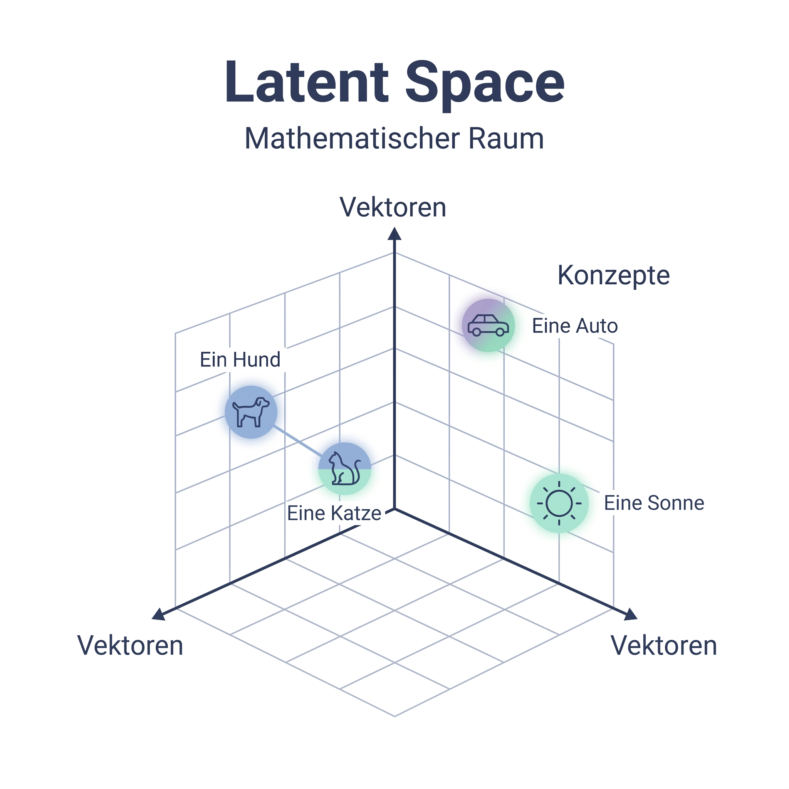

# Die Magie der Latent Diffusion: Bilderzeugung verstehen

Dieses Dokument bietet einen tiefen Einblick in die technische Funktionsweise, das aktuelle Ökosystem und die strategischen Vorteile moderner KI-Bildgenerierung. Wir verlassen die Welt der Wörter und tauchen ein in die Dimensionen der Pixel und mathematischen Räume.

---

## 1. Geschichte & Pioniere
Die Ära der fotorealistischen Bildsynthese begann nicht mit einem Chatbot, sondern mit einer mathematischen Revolution.

- **Wissenschaftlicher Ursprung:** Die **Latent Diffusion Models (LDM)** wurden maßgeblich von der **CompVis Group an der LMU München** unter der Leitung von Björn Ommer entwickelt. Die Veröffentlichung von *„High-Resolution Image Synthesis with Latent Diffusion Models“* (2022) durch Robin Rombach und Patrick Esser legte den Grundstein.
- **Demokratisierung:** Stability AI nutzte diese Forschung, um **Stable Diffusion** zu veröffentlichen – das erste leistungsstarke Modell, das auf Heim-PCs lief.
- **Die neue Generation:** Heute führen Firmen wie **Black Forest Labs** (mit FLUX) den Markt an, indem sie die Bildqualität und das Textverständnis massiv verbessert haben.

---

## 2. Das Prinzip der Diffusion
Bildgeneratoren „denken“ nicht in Sätzen, sondern in Rauschen und Entrauschung.

### Die Bildhauer-Metapher
Stellen Sie sich einen Bildhauer vor, der in einer staubigen Werkstatt steht. Er sieht keinen Marmorblock, sondern eine dichte Wolke aus fliegendem Staub (Rauschen). Schritt für Schritt schält er die Form eines Objekts aus diesem Chaos heraus, bis eine perfekte Statue (Struktur) übrig bleibt.

### Technischer Ablauf
1. **Forward Diffusion (Training):** Ein Modell lernt, wie man ein klares Bild durch Hinzufügen von Gaußschem Rauschen schrittweise zerstört.
2. **Reverse Diffusion (Inferenz):** Wenn Sie einen Prompt eingeben, startet die KI mit einem Feld aus komplettem Zufallsrauschen. Geleitet durch Ihren Text (der als „Magnet“ fungiert), entfernt sie in ca. 20–50 Schritten (**Sampling Steps**) gezielt das Rauschen, bis das gewünschte Bild erscheint.

> [!TIP] Warum "Nicht" nicht funktioniert
> Wenn Sie prompten „Keine Katze im Bild“, aktiviert das Modell dennoch das Konzept „Katze“ im Latent Space. Da das Modell primär auf die Anwesenheit von Konzepten reagiert, wird es fast sicher eine Katze generieren. Nutzen Sie stattdessen **Negative Prompts**.

---

## 3. Der Latent Space: Die Landkarte der Konzepte
Ein Bildmodell speichert keine JPEGs. Es speichert Beziehungen zwischen Konzepten in einem hochdimensionalen, mathematischen Raum.

- **Vektoren & Koordinaten:** In diesem Raum liegen ähnliche Begriffe nah beieinander. „Hund“ und „Golden Retriever“ haben fast identische Koordinaten.
- **Komprimierung:** Da es zu rechenintensiv wäre, direkt auf Millionen von Pixeln zu arbeiten, findet der Prozess im **Latent Space** statt – einer stark komprimierten Version der Bilddaten. Erst am Ende übersetzt der **VAE (Variational Autoencoder)** diese mathematischen Punkte zurück in sichtbare Pixel.

---

## 4. Open vs. Closed Systems: Die strategische Wahl
Unternehmen müssen entscheiden, ob sie Bequemlichkeit oder Kontrolle priorisieren.

| Kriterium | Cloud-Systeme (Closed / SaaS) | Lokale Systeme (Open Weight) |
| :--- | :--- | :--- |
| **Beispiele** | DALL-E 3, Gemini, Adobe Firefly | FLUX, Stable Diffusion, ERNIE |
| **Datenschutz** | Daten verlassen das Haus | Absolut lokal (kein Upload) |
| **Zensur** | Strenge Filter / Guardrails | Keine künstlichen Einschränkungen |
| **Kontrolle** | Prompt-basiert, begrenzt | Maximale Tiefe (Nodes, LoRAs) |
| **Kosten** | Abo oder Credit-Modell | Einmalige Hardware-Anschaffung |
| **Souveränität** | Abhängigkeit vom Anbieter | Volle digitale Souveränität |

### Wo stehen die Modelle?
Tagesaktuelle Vergleiche der Bildqualität und Geschwindigkeit finden Sie auf dem **[Artificial Analysis Image Leaderboard](https://artificialanalysis.ai/image/leaderboard/editing)**.

---

## 5. Hardware & Lokales Hosting
Wer die Kontrolle behalten will, braucht die richtige Ausrüstung.

- **NVIDIA is King:** Aufgrund der **CUDA-Schnittstelle** sind NVIDIA-Grafikkarten für KI-Berechnungen alternativlos.
- **VRAM (Videospeicher):** Das wichtigste Kriterium.
    - **12 GB:** Minimum für moderne Modelle wie FLUX.1-schnell.
    - **16 GB - 24 GB:** Empfohlen für Profi-Workflows und Training.
- **Quantisierung:** Große Modelle (z.B. 12B oder 20B Parameter) können durch „Quantisierung“ komprimiert werden (z.B. auf 4-Bit oder 8-Bit), um auf kleinerer Hardware zu laufen, ohne dass das menschliche Auge einen Qualitätsverlust bemerkt.

---

## 6. LoRAs: Das Expertenwissen injizieren
Ein **LoRA (Low-Rank Adaptation)** ist das wichtigste Werkzeug für Konsistenz.

Stellen Sie sich vor, das Basis-Modell ist ein Allwissender, der aber die neueste Kaffeemaschine Ihrer Firma nicht kennt. Eine LoRA ist wie eine „Zusatzlinse“ oder ein „Plug-in“, das dem Modell genau dieses Objekt oder einen spezifischen Stil beibringt.

- **Training:** Mit nur 20–50 Bildern und Tools wie dem [ai-toolkit](https://github.com/ostris/ai-toolkit) lässt sich in 30 Minuten eine eigene LoRA trainieren.
- **Vorteil:** Man muss nicht das gesamte Modell (viele GB) neu trainieren. Eine LoRA ist nur wenige MB groß und kann flexibel „aufgesteckt“ werden.

---

## 7. ComfyUI: Der Maschinenraum
Während Midjourney ein „Chat-Fenster“ ist, ist ComfyUI ein „Baukasten“.

In ComfyUI bauen Sie Ihren Bild-Algorithmus visuell aus **Nodes** (Knoten) zusammen:
1. **Checkpoint Loader:** Lädt das Gehirn (Modell).
2. **CLIP-Text:** Übersetzt Ihren Text in Vektoren.
3. **K-Sampler:** Führt die eigentliche Entrauschung durch (Herzstück).
4. **VAE Decode:** Macht aus Mathematik wieder Pixel.

**Vorteil gegenüber Plattformen:** Sie können den Prozess an jeder Stelle manipulieren – z.B. eine Skizze als Strukturvorgabe einspeisen (**ControlNet**) oder mehrere Personenreferenzen mischen.

---

## 8. Ressourcen & Community
- **[Civitai](https://civitai.com/):** Die zentrale Plattform für LoRAs, Modelle und Inspiration.
- **[Hugging Face](https://huggingface.co/):** Die Infrastruktur für Profi-Modelle (FLUX.2-klein, ERNIE-Image-Turbo).

---

## Anhang: Bildbeispiele aus dem Modul

Hier sehen Sie die Anwendung der theoretischen Konzepte in der Praxis:

| Konzept | Beispielbild |
| :--- | :--- |
| **Präzises Subjekt** |  |
| **Komposition** |  |
| **Tiefenstaffelung** |  |
| **Komplexität** |  |
| **Konsistenz** |  |
| **Bildreferenz (i2i)** |  |
