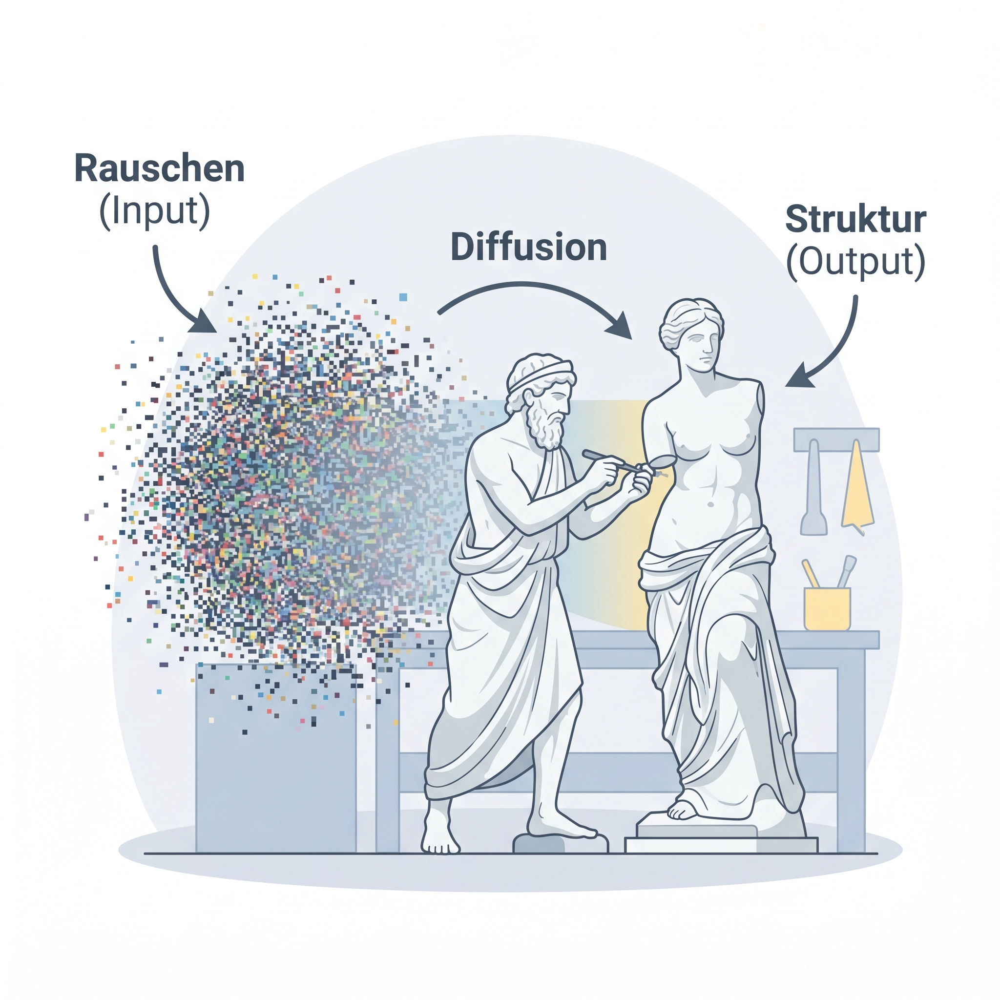
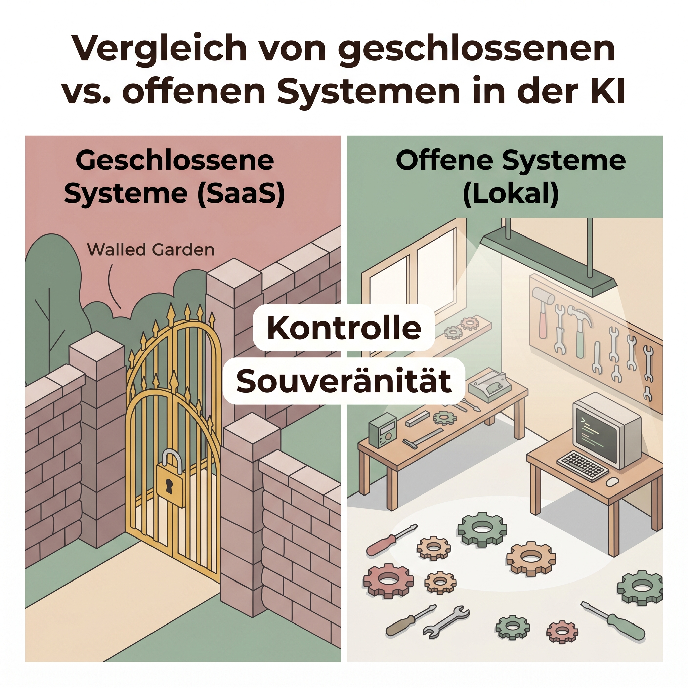
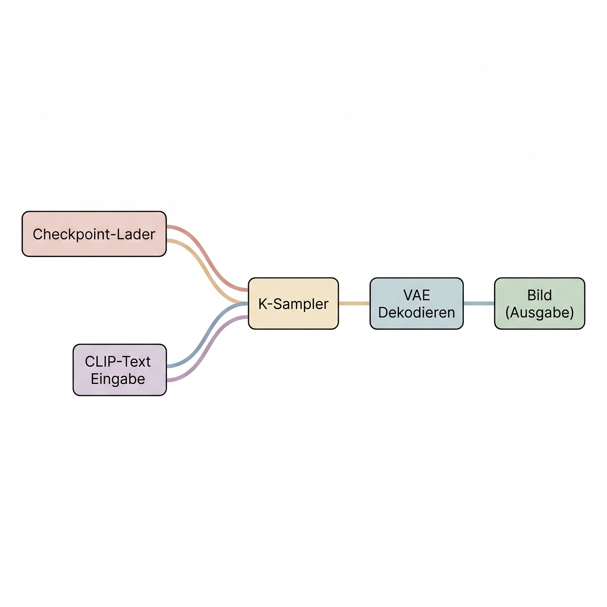

# Die Magie der Latent Diffusion: Bilderzeugung verstehen

Dieses Dokument bietet eine tiefgehende Analyse der technischen Architektur, der strategischen Marktdynamiken und der praktischen Anwendung moderner KI-Bildgenerierung. Wir verlassen die Welt der linearen Texte und betreten die Dimensionen der Pixel, Vektoren und mathematischen Räume.

---

## 1. Der Paradigmenwechsel: Pixel vs. Token
Während Large Language Models (LLMs) darauf trainiert sind, Absichten zu verstehen und Kontexte in Dialogform zu interpretieren, operieren Bildgeneratoren fundamentally anders. Sie „denken“ nicht in Sätzen, sondern sind angewandte Stochastik. Wer versucht, mit einer Bild-KI zu „chatten“, wird oft enttäuscht. Erfolg hat hier nur, wer lernt, visuelle Entscheidungen präzise in die Sprache der Mathematik und Schlagworte zu übersetzen.

---

## 2. Die Architektur der Stochastik: Diffusion
Der Begriff „Diffusion“ stammt ursprünglich aus der Thermodynamik. In der Welt der KI beschreibt er einen Prozess, bei dem aus absolutem Chaos (Rauschen) eine strukturierte Form entsteht.

### Forward & Reverse Diffusion
1. **Forward Diffusion (Training):** Ein Modell nimmt Millionen echter Bilder und fügt ihnen schrittweise statisches Rauschen (Gaußsches Rauschen) hinzu, bis nur noch ein „Rauschteppich“ (wie bei einem alten Fernseher ohne Empfang) übrig ist. Das neuronale Netz lernt dabei, wie dieses Rauschen hinzugefügt wurde.
2. **Reverse Diffusion (Inferenz/Generierung):** Wenn Sie einen Prompt eingeben, erzeugt die KI zunächst ein Feld aus komplett zufälligem Rauschen. Ausgestattet mit dem Wissen aus dem Training beginnt das Netz nun, dieses Rauschen *rückwärts* in ca. 20 bis 50 Schritten (**Sampling Steps**) zu entfernen.

Ihr Text-Prompt fungiert bei dieser Rauschunterdrückung als **Konditionierung** (Conditioning). Die Wörter ziehen das Modell wie Magnete in bestimmte Ecken des Lösungsraums.

---

## 3. Der Latent Space: Jenseits der Pixel
Moderne Bild-KIs arbeiten nicht direkt auf den Millionen Pixeln eines Bildes – das wäre mathematisch zu rechenintensiv. Stattdessen nutzen sie den **Latent Space**.

### Die Landkarte der Konzepte
Der Latent Space ist ein hochdimensionaler, mathematischer Raum, in dem Konzepte (wie „Katze“, „flauschig“, „Sonnenuntergang“) als Koordinaten (Vektoren) gespeichert sind. 
- **Semantische Nähe:** Konzepte, die sich visuell ähneln, liegen im Latent Space nah beieinander.
- **Der VAE (Variational Autoencoder):** Der VAE ist der „Übersetzer“. Er komprimiert Bilder für das Training in den Latent Space und dekomprimiert die mathematischen Ergebnisse der Diffusion am Ende wieder zurück in sichtbare Pixel (Pixel Space).
- **CLIP (Contrastive Language-Image Pre-training):** CLIP ist die Brücke. Dieses Modell hat gelernt, welche Texte zu welchen Bildern passen, und übersetzt Ihre Wörter in die Sprache des Latent Space, damit der Diffusions-Prozess weiß, in welche Richtung er „bauen“ soll.

---

## 4. Die Anatomie des perfekten Prompts
Da jedes Wort im Prompt wie ein Magnet wirkt, stören Füllwörter und Höflichkeit den Prozess. Professionelles Prompting gleicht eher einer Regieanweisung für einen Kameramann.

### Die 6-Stufen-Formel
1. **Das Hauptmotiv (Subject):** Was ist im Fokus? (z.B. *A vintage red Ford Mustang*).
2. **Das Medium (Medium):** Welcher Stil? (z.B. *Cinematic photography, oil painting, 3D render*).
3. **Umgebung & Kontext (Environment):** Wo findet es statt? (z.B. *driving on a wet neon-lit street*).
4. **Kamera & Perspektive (Composition/Camera):** (z.B. *wide angle shot, 85mm lens, top-down*).
5. **Beleuchtung (Lighting):** (z.B. *golden hour, softbox, dramatic shadows*).
6. **Stil-Modifikatoren (Modifiers):** (z.B. *hyperrealistic, 8k, award-winning*).

### Negativ-Prompts
Da Modelle das Wort „nicht“ schwer verarbeiten (der Magnet für „Auto“ wird aktiviert, egal ob „kein“ davor steht), nutzt man Negative Prompts. Hier trägt man ein, wovon sich das Modell mathematisch *entfernen* soll (z.B. *ugly, blurry, extra fingers, text, watermark*).

---

## 5. Strategisches Ökosystem: Cloud vs. Open Source
Unternehmen stehen heute vor einer fundamentalen Entscheidung über ihre digitale Souveränität.

### Die zensierte Cloud (Walled Gardens)
Plattformen wie **Midjourney, DALL-E 3 (OpenAI)** oder **Adobe Firefly** bieten Bequemlichkeit und extrem hohe Qualität „out-of-the-box“.
- **Vorteile:** Einfacher Einstieg, keine eigene Hardware nötig.
- **Nachteile:** Starke Zensur (Guardrails), keine Kontrolle über die Daten, laufende Abo-Kosten, keine tiefgreifende Personalisierung möglich.

### Die Open-Source-Rebellion (Souveränität)
Modelle wie **FLUX (Black Forest Labs)** oder **Stable Diffusion** können heruntergeladen und lokal betrieben werden.
- **Vorteile:** Absolute Kontrolle, kein Datentransfer nach außen, keine Zensur, unendliche Möglichkeiten durch Community-Modelle auf **Civitai**.
- **Benchmarks:** Auf dem **[Artificial Analysis Leaderboard](https://artificialanalysis.ai/image/leaderboard/editing)** lässt sich tagesaktuell verfolgen, wie Open-Weight-Modelle (wie Flux.1-pro) mittlerweile die Cloud-Platzhirsche überholen.

---

## 6. Kontrolle & Konsistenz: Der Maschinenraum
Für den professionellen Einsatz reicht ein „schönes Bild“ nicht aus. Es wird Kontrolle über jedes Detail benötigt.

### ComfyUI: Knotenbasierte Intelligenz
ComfyUI ist der Goldstandard für Profi-Workflows. Anstatt eines Textfeldes nutzt man ein System aus **Nodes** (Knoten), die mit „Kabeln“ verbunden werden.

Dies erlaubt es, den Datenfluss an jeder Stelle zu manipulieren. Man kann beispielsweise eine Skizze als geometrisches Korsett erzwingen (**ControlNet**) oder Gesichter aus Referenzbildern präzise übertragen (**IP-Adapter**).

### LoRA (Low-Rank Adaptation)
Ein LoRA ist ein winziges Zusatz-Modell (Plug-in), das dem Basis-Modell spezifisches Wissen einimpft – etwa das exakte Design eines Firmenprodukts oder einen einzigartigen Corporate-Stil. Mit nur ca. 20 Fotos lässt sich eine LoRA in 30 Minuten auf einer handelsüblichen Grafikkarte trainieren.

---

## 7. Hardware & Infrastruktur
Wer lokale Modelle nutzen möchte, muss in Hardware investieren:
- **NVIDIA Grafikkarten:** Unverzichtbar aufgrund der CUDA-Technologie.
- **VRAM (Videospeicher):** Das „Nadelöhr“. 12 GB sind das Minimum, 16–24 GB sind für Profis der Standard.
- **Quantisierung:** Technik, um große Modelle durch Komprimierung auch auf kleineren Karten lauffähig zu machen, ohne sichtbaren Qualitätsverlust.

---

## 8. Ethik, Recht & die Rolle des Menschen
Die Perfektion der Bild- und Audiosynthese (Voice Cloning) bringt enorme Verantwortung mit sich.

### Deepfakes & CEO-Fraud
Stimmen und Gesichter können heute so perfekt geklont werden, dass das menschliche Gehör und Auge sie nicht mehr vom Original unterscheiden kann. Dies erfordert neue Sicherheitsprotokolle in Unternehmen (z.B. bei der Freigabe von Zahlungen).

### Der Augmented Human (KI-Orchestrator)
Die Technologie ersetzt nicht die Kreativität, sondern befreit sie vom handwerklichen Engpass. Der Mensch wird zum **Regisseur (Orchestrator)**, der verschiedene KIs vernetzt. Die Arbeitszeit verschiebt sich von der *Produktion* (zeichnen, retuschieren) hin zur *Kuratierung, Strategie und Qualitätssicherung*.

---

## Ressourcen für die Praxis
- **[Civitai](https://civitai.com/):** Der Marktplatz für Open-Source Modelle und LoRAs.
- **[Hugging Face](https://huggingface.co/):** Die Infrastruktur für professionelle Modellgewichte (z.B. FLUX, ERNIE).
- **[ai-toolkit](https://github.com/ostris/ai-toolkit):** Das Standard-Tool für das Training eigener LoRAs.
