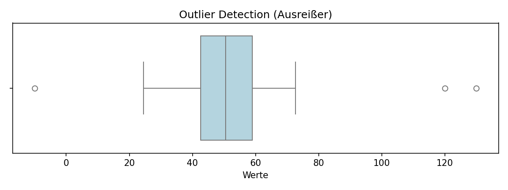
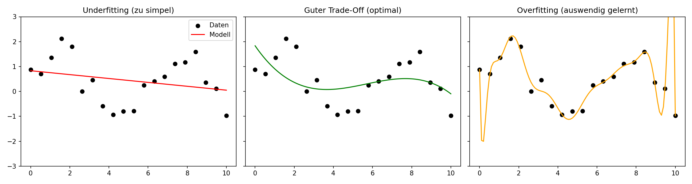
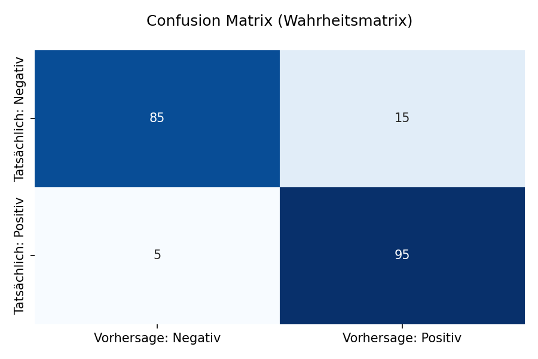

# Cheat Sheet: Data Science & Machine Learning

Dieses Cheat Sheet ist deine schnelle Referenz für die Analyse-Phase. Es enthält die wichtigsten Stolpersteine der Datenvorbereitung (EDA), die Steuerung von Modellen (Hyperparameter) sowie die essenziellen Metriken zur Erfolgsmessung.

---

## 1. Hindernisse in der Datenvorbereitung (EDA)
Bevor ein Modell trainiert wird, müssen die Daten sauber sein. Hier sind die häufigsten Hindernisse und deren Lösungen:

- **Missing Values (Fehlende Werte):** Algorithmen stürzen ab, wenn Datenfelder leer sind.
  - *Lösung:* Imputation (z.B. Mittelwert/Median einsetzen) oder Löschen der betroffenen Zeilen.
- **Outliers (Ausreißer):** Ein Tippfehler (z.B. Hauspreis von 10.000.000 € statt 100.000 €) verzerrt den gesamten Mittelwert und das Modell.
  - *Lösung:* Ausreißer über Boxplots identifizieren und entfernen oder bereinigen.
- **Imbalanced Datasets (Ungleichgewichte):** Wenn eine Klasse dominiert (z.B. Datensatz enthält 99% gesunde Maschinen und 1% defekte), lernt das Modell einfach immer "gesund" vorherzusagen.
  - *Lösung:* SMOTE (Synthetische Daten erzeugen) oder Über-/Unter-Sampling.
- **Kategoriale Daten:** Algorithmen können nicht mit Wörtern ("sonnig", "regnerisch") rechnen.
  - *Lösung:* Encoding (Umwandlung in Zahlen, z.B. 0 und 1).

> **💡 Demo-Prompt zur Datenvorbereitung:**
> "Lade den Datensatz `https://raw.githubusercontent.com/ProfEngel/datasets/main/Schwertlilie_missingvalues.csv`. Prüfe auf fehlende Werte und wende eine sinnvolle Imputation an. Zeige mir danach über einen Boxplot, ob es Ausreißer gibt, und wandle kategoriale Werte in Zahlen um."

---

## 2. Hyperparameter & Modell-Tuning
Ein Algorithmus lernt die Muster aus den Daten, aber wir steuern *wie* er lernt, indem wir **Hyperparameter** setzen.

- **Lernrate ($\eta$):** Bestimmt die Schrittgröße beim Lernen.
  - *Zu hoch:* Das Modell springt wild herum und findet die Lösung nicht.
  - *Zu niedrig:* Das Modell braucht ewig zum Trainieren.
- **Regularisierung (L1 / L2):** Bestraft zu komplexe Modelle, indem Parameter künstlich verkleinert werden.
- **Overfitting (Überanpassung):** Das Modell hat die Trainingsdaten stur auswendig gelernt, versagt aber bei neuen Testdaten. 
  - *Woran man es erkennt:* Hohe Trainings-Accuracy, miese Test-Accuracy.
  - *Lösung:* Regularisierung, Dropout (Neuronen deaktivieren) oder Modell vereinfachen (z.B. Baum-Tiefe reduzieren).
- **Underfitting (Unteranpassung):** Das Modell ist zu simpel und versteht das Problem gar nicht erst.
  - *Lösung:* Komplexeres Modell wählen, Feature Engineering (neue Spalten aus bestehenden Daten berechnen).

> **💡 Demo-Prompt zum Tuning:**
> "Trainiere einen Entscheidungsbaum auf `https://raw.githubusercontent.com/ProfEngel/KI-Literacy/refs/heads/main/datascience/data/GolfSpielen.csv`. Optimiere die Hyperparameter (z.B. `max_depth`), um Overfitting zu vermeiden. Zeige mir den Unterschied in der Accuracy zwischen dem Trainings- und dem Testset."

---

## 3. Evaluierungs-Kennzahlen (Metriken)

Um zu wissen, ob unser Modell gut ist, betrachten wir spezifische Kennzahlen.

### A. Klassifikation (Vorhersage von Kategorien)
Nutze diese Metriken, wenn du Gruppen vorhersagst (z.B. *Käufer vs. Nicht-Käufer* oder *Spam vs. Kein Spam*).

**Die Confusion Matrix (Wahrheitsmatrix):** 
Stellt die tatsächlichen Klassen den vom Modell vorhergesagten gegenüber (True Positives, False Positives, False Negatives, True Negatives).

- **Accuracy (Genauigkeit):** Anteil aller korrekten Vorhersagen.
  - *Wann wichtig:* Bei gut ausbalancierten Datensätzen (50% Klasse A, 50% Klasse B).
  - *Gute Werte:* 70-90% (Über 90% ist oft verdächtig gut).
- **Precision (Präzision):** Wie viele der vom Modell als "Positiv" erkannten Fälle waren auch wirklich positiv?
  - *Beispiel:* Ein Spam-Filter hat hohe Precision, wenn keine echten E-Mails im Spam landen.
  - *Wann wichtig:* Wenn ein Fehlalarm (False Positive) hohe Kosten oder Ärger verursacht.
- **Recall (Sensitivität):** Wie viele der *tatsächlichen* positiven Fälle wurden vom Modell erkannt?
  - *Beispiel:* In der Medizin (Krebsdiagnose) muss der Recall bei fast 100% liegen, damit kein Kranker übersehen wird (selbst wenn es Fehlalarme gibt).
  - *Wann wichtig:* Wenn es gefährlich ist, einen Fall zu verpassen (False Negative).
- **F1-Score:** Das harmonische Mittel aus Precision und Recall.
  - *Wann wichtig:* Wenn du einen guten Kompromiss brauchst und der Datensatz ungleich verteilt ist.

> **💡 Demo-Prompt zur Klassifikation:**
> "Trainiere ein Klassifikationsmodell auf dem Datensatz `https://raw.githubusercontent.com/ProfEngel/datasets/refs/heads/main/Titanic_small.csv`. Gib mir neben der Accuracy unbedingt die Confusion Matrix aus. Erkläre mir anhand von Precision und Recall, wo die Schwächen des Modells liegen."

### B. Regression (Vorhersage von Zahlenwerten)
Nutze diese Metriken, wenn du kontinuierliche Werte vorhersagst (z.B. *Immobilienpreise, Umsatz*).

- **MAE (Mean Absolute Error):** Der durchschnittliche absolute Fehler in der Original-Einheit.
  - *Beispiel:* Vorhersage von Häuserpreisen. Ein MAE von 20.000 € bedeutet, das Modell schätzt im Schnitt 20.000 € zu hoch oder zu niedrig.
  - *Wann wichtig:* Wenn Ausreißer nicht extrem hart bestraft werden sollen.
- **MSE / RMSE (Root Mean Squared Error):** Der quadrierte Fehler (bzw. die Wurzel daraus). 
  - *Beispiel:* Ein RMSE bestraft eine einzige Fehlprognose von 100.000 € weitaus härter als fünf Fehler von 20.000 €.
  - *Wann wichtig:* Wenn große Ausreißer im Modell absolut vermieden werden müssen.
- **R² (R-Quadrat):** Anteil der durch das Modell erklärten Varianz.
  - *Beispiel:* R² = 0,8 bedeutet, dass 80% der Schwankungen durch das Modell korrekt erklärt werden.
  - *Werte:* < 0,5 (unbrauchbar), 0,5 - 0,7 (okay), > 0,7 (sehr gut).

> **💡 Demo-Prompt zur Regression:**
> "Führe eine Regression auf `https://raw.githubusercontent.com/ProfEngel/datasets/refs/heads/main/bostonhousing.csv` durch. Zeige mir den MAE und RMSE in einer Tabelle. Erkläre mir in einem Satz anhand des R²-Wertes, wie verlässlich das Modell für das echte Management ist."

---
[[Projekt_KI_VL]]
