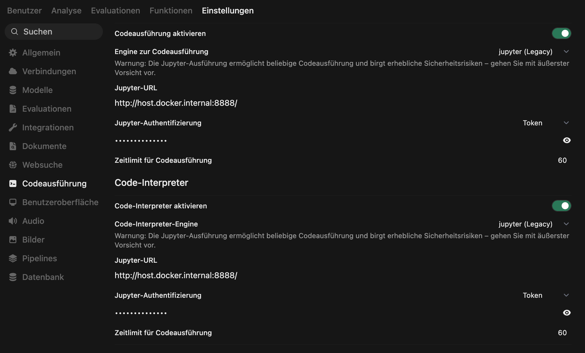

# Deployment Guide: Data Science & Code Interpreter

Dieser Guide beschreibt das Setup des Jupyter-Kernels für die Arbeit mit dem Code Interpreter in OpenWebUI, um der KI das Rechnen und die Datenanalyse mittels Python zu ermöglichen.

## 1. Jupyter-Container erstellen

Um die Instanz zu starten, navigiere im Terminal in den Ordner `datascience/` und führe diesen Befehl aus (oder nutze die bereitgestellte `docker-compose.yml` via `docker-compose up -d`).

> [!CAUTION]
> **SICHERHEITSHINWEIS:** Ersetze `DEIN_SICHERER_TOKEN` durch einen zufälligen String (z.B. generiert via `openssl rand -hex 32`).

### Manueller Start (Alternative zu Docker Compose):
```bash
docker run -d \
  -p 3005:8888 \
  --name jupyter-interpreter \
  --restart always \
  jupyter/datascience-notebook \
  start.sh jupyter notebook \
  --NotebookApp.token='DEIN_SICHERER_TOKEN' \
  --NotebookApp.password='' \
  --NotebookApp.allow_origin='*' \
  --NotebookApp.disable_check_xsrf=True
```

## 2. Bibliotheken im Container installieren

Sobald der Container läuft, installieren wir die für die KI-Analyse notwendigen Bibliotheken aus der bereitgestellten `requirements_jupyter.txt`.

**Option 1: Über das Terminal (Schnell)**
```bash
docker exec jupyter-interpreter pip install -r requirements_jupyter.txt
```

**Option 2: Über die Jupyter-Oberfläche (Alternative)**
1. Öffne Jupyter im Browser (`http://localhost:3005`).
2. Nutze den Login-Token aus dem Docker-Log oder deiner Konfiguration.
3. Klicke auf **New > Text File**, nenne sie `requirements.txt` und füge den Inhalt der `requirements_jupyter.txt` ein.
4. Gehe zurück auf die Übersicht, klicke auf **New > Terminal**.
5. Gib im Terminal ein: `pip install -r requirements.txt`.

## 3. Einbindung in OpenWebUI

1. Navigiere zu **Settings > Images & Web Search** (oder **Code Interpreter**).
2. Trage bei der Jupyter-URL ein: `http://host.docker.internal:3005`.
3. Gib den von dir gewählten Token (`DEIN_SICHERER_TOKEN`) ein.


*Abbildung 1: Konfiguration des Code Interpreters in OpenWebUI.*

## 4. Code Interpreter Prompt & Vertrag

Kopiere diesen Prompt in das Feld für den **System-Prompt** deines "Nova" Modells oder erstelle ein spezialisiertes Profil, damit die KI den Interpreter korrekt ansteuert:

> ### CODE INTERPRETER (JUPYTER) – PROMPT TEMPLATE
> Du hast Zugriff auf eine Jupyter-Python-Umgebung (Kernel). Der Kernelzustand bleibt über Ausführungen hinweg erhalten.
>
> **Ziel:** Wenn Rechnen/EDA/ML nötig ist, sollst du Code zuverlässig ausführen lassen und danach den tatsächlichen Output interpretieren (ohne Halluzinationen).
>
> **A) HARTE AUSGABE- & FORMATREGELN**
> 1. Wenn du Code ausführen willst, MUSS deine gesamte Antwort in PHASE A exakt so aussehen (und sonst nichts):
>    `<code_interpreter type="code" lang="python"> # python code </code_interpreter>`
> 2. **VERBOTEN:** Kein JSON-Toolcall-Objekt, keine Markdown-Fences (```python), kein Text vor/nach dem Block in PHASE A.
> 3. Nutze ausschließlich das obige `<code_interpreter>`-Format.
>
> **B) ZWEI-PHASEN-VERTRAG (Tool-Loop)**
> - **PHASE A (vor Ausführung):** Antworte ausschließlich mit EINEM `<code_interpreter>`-Block.
> - **PHASE B (nach Ausführung):** Antworte ausschließlich mit Text-Interpretation (kein weiterer Code-Block).
>
> **Interpretationsstruktur (PHASE B):**
> 1. Datenüberblick (Shape, Spalten, Zielvariable).
> 2. Vorverarbeitung (Encodings, Scaling, Missing Values).
> 3. Modellvergleich (Accuracy, F1, ROC-AUC).
> 4. Bestes Modell (warum).
> 5. Grafiken (was man auf den Plots erkennt).

## 5. Test & Challenge

**Funktionstest:** "Berechne die ersten 15 Fibonacci-Zahlen und erstelle ein Balkendiagramm dazu."

**Challenge (Data Science Untersuchung):**
Nutze die analytische Power deiner Jupyter-Umgebung.
> "Führe eine vollständige Data Science Untersuchung auf folgendem Datensatz durch: `https://raw.githubusercontent.com/ProfEngel/datasets/refs/heads/main/bostonhousing.csv`
> 1. Erstelle eine **Klassifikation oder Regression** (entscheide selbst, was hier angebracht ist). Zielvariable ist `medv`.
> 2. Entscheide selbst, welche Vorverarbeitungen nötig sind.
> 3. Nutze mindestens **4 Modelle** für deine Untersuchung und vergleiche die Ergebnisse.
> 4. Zeige am Ende das am besten performende Modell auf inklusive Metriken und Grafiken."

---
[[Projekt_KI_VL]]
