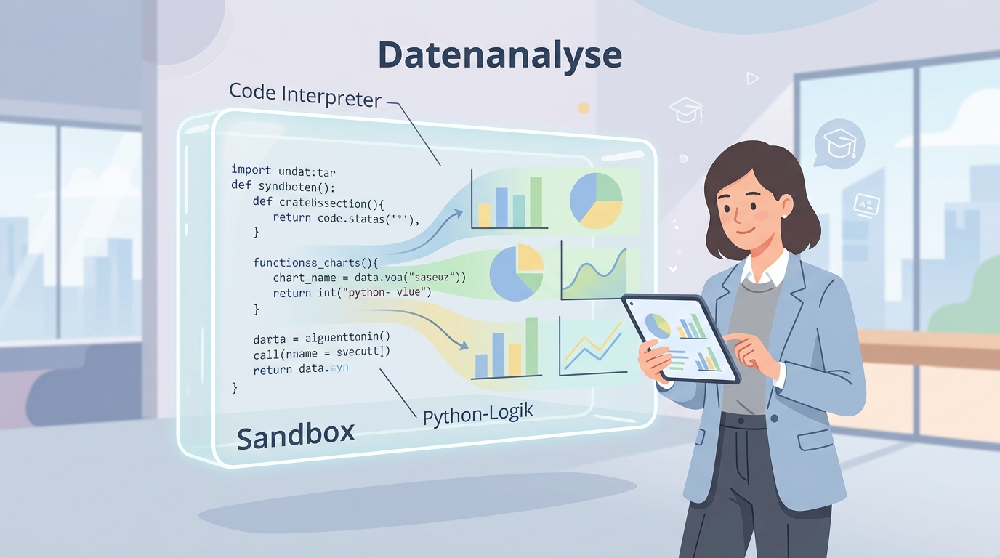
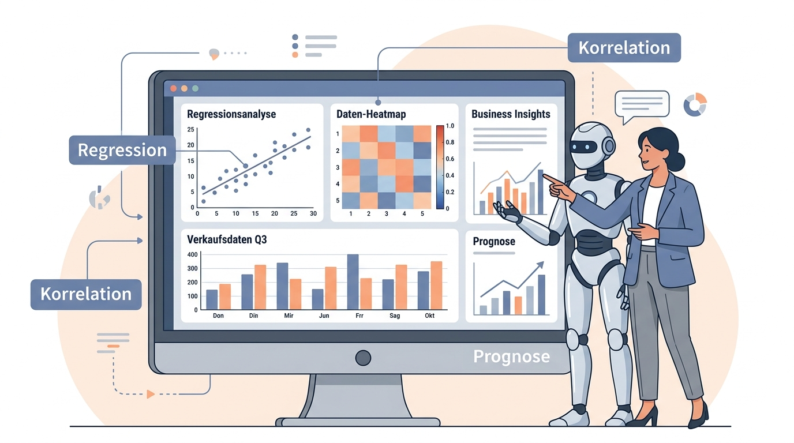

# Labor: Data Science Praxis – Den Code Interpreter beherrschen

In dieser Übung lernst du, wie du den Jupyter-Interpreter in OpenWebUI nutzt, um komplexe analytische Aufgaben zu lösen. Wir teilen das Labor in zwei Phasen auf: **Aufbereitung (Tag 6)** und **Analyse (Tag 7)**.

---

# 🛠️ Tag 6: Datenbändigung & Aufbereitung

## Aufgabe 1: Der Funktionstest (Fibonacci & Grafik)
**Ziel:** Sicherstellen, dass die Verbindung zum Jupyter-Kernel steht und Grafiken korrekt im Chat angezeigt werden.

**Prompt:**
> "Berechne die ersten 15 Fibonacci-Zahlen unter Nutzung deines Code Interpreters. Erstelle anschließend ein Balkendiagramm, das die Werte zeigt. Nutze eine ästhetische Farbpalette."

**Worauf du achten solltest:**
- Erscheint der `<code_interpreter>` Block?
- Wird das Bild direkt im Chat-Fenster gerendert?

---

## Aufgabe 2: Datenreinigung (Online Datensätze)
**Ziel:** KI-gestützte Aufbereitung von realen (unsauberen) Daten direkt aus dem Netz.

*Abbildung 1: Die Sandbox als geschützter Raum für logische Berechnungen und Datenanalyse.*

**Prompt:**
> "Analysiere folgende zwei Datensätze direkt über ihre URLs:
> 1. `https://raw.githubusercontent.com/ProfEngel/KI-Literacy/refs/heads/main/datascience/data/GolfSpielen.csv`
> 2. `https://raw.githubusercontent.com/ProfEngel/datasets/refs/heads/main/Schwertlilie_missingvalues.csv`
>
> **Aufgabe:** 
> - Prüfe beide auf fehlende Werte und Inkonsistenzen.
> - Bereinige die Daten (Imputation von Missing Values).
> - Wandle kategoriale Werte (wie 'Wetter') in numerische Werte um.
> - Führe die Datensätze zusammen (sofern sinnvoll) oder zeige mir die bereinigten Header beider Tabellen."

---

## Aufgabe 3: Explorative Analyse & Korrelation
**Ziel:** Zusammenhänge in Daten erkennen.

**Prompt:**
> "Erstelle eine Korrelationsmatrix für den bereinigten Golf-Datensatz. Welche Faktoren haben den größten Einfluss darauf, ob Golf gespielt wird? Visualisiere die Korrelationen in einer Heatmap (Seaborn)."

---

# 📊 Tag 7: Analyse, Modellierung & Kommunikation

## Aufgabe 4: Statistische Modellierung
**Ziel:** Vorhersagen treffen und Modelle vergleichen.

*Abbildung 2: Statistische Modellierung und Visualisierung von Business Insights.*

**Prompt:**
> "Nutze die Daten, um ein einfaches Klassifikationsmodell (z. B. Decision Tree oder Logistic Regression) zu trainieren. Zielvariable ist 'Spielen'. 
> 1. Teile die Daten in Training und Test-Set.
> 2. Gib die Genauigkeit (Accuracy) und eine Confusion Matrix aus.
> 3. Vergleiche mindestens zwei verschiedene Algorithmen."

---

## Aufgabe 5: Business Insights & Management Summary
**Ziel:** Die Sprache der Daten in Management-Entscheidungen übersetzen.

**Prompt:**
> "Basierend auf dem Modell aus Aufgabe 4: Erstelle ein kurzes Management Summary (max. 3 Bulletpoints). Erkläre, unter welchen Wetterbedingungen wir das Marketing für den Golfplatz hochfahren sollten und wie sicher wir uns bei dieser Empfehlung sind (statistisch gesehen)."

---

## Aufgabe 6: Interaktive Visualisierung mit Plotly
**Ziel:** Daten für Endnutzer aufbereiten.

**Prompt:**
> "Erstelle ein interaktives Diagramm mit Plotly, das den Zusammenhang zwischen Temperatur und der Spielentscheidung zeigt. Sorge dafür, dass man beim Hovern über die Datenpunkte die exakten Werte sehen kann."

---

## Challenge: Die mathematische Kunst (Mandelbrot)
**Ziel:** Grenzen der Rechenleistung testen.

**Prompt:**
> "Generiere eine hochauflösende Visualisierung der Mandelbrot-Menge mittels Python. Nutze eine ästhetische Farbpalette (z. B. 'magma') und speichere das Bild als PNG, damit ich es herunterladen kann."

---

## Troubleshooting & Validierung
- **Fehlermeldung im Code:** Wenn der Interpreter einen Fehler wirft, kopiere den Fehler nicht manuell. Die KI sieht den Fehler meist selbst und versucht in einem zweiten Durchgang, den Code zu korrigieren.
- **Plausibilitätscheck:** Frage die KI nach jedem Schritt: „Warum hast du dich für diese Methode entschieden?“

---
[[Projekt_KI_VL]]
