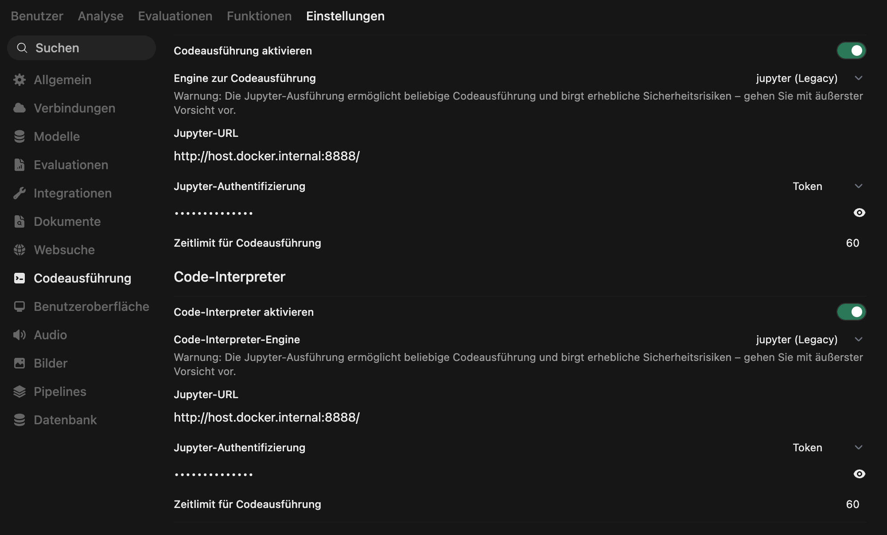
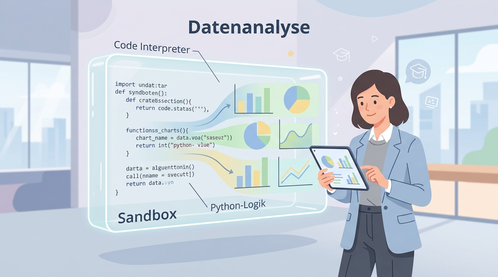

# Vorlesungsbegleiter: KI-Driven Data Science (Master Guide)

Dieses Dokument ist dein ultimativer Begleiter durch das Data-Science-Modul. Wenn du diesen Guide vollständig durchgearbeitet hast, verstehst und beherrschst du die **Basics von Statistik, Python und Data Science**. Du bist in der Lage, eigenständig eine **Explorative Datenanalyse (EDA)** durchzuführen, sowie statistische Modelle für **Klassifikation und Regression** zu trainieren und zu bewerten.

---

# 🛠️ PHASE 1: Technisches Setup & Deployment

Bevor wir Modelle bauen, müssen wir unser Labor einrichten. Wir nutzen eine isolierte **Docker-Sandbox (Jupyter-Kernel)**, in der die KI autonom Python-Code ausführt. Das löst das Halluzinations-Problem von normalen Chatbots bei Mathematik.

### Schritt 1: Container starten
Navigiere in deinem Terminal in den Ordner `datascience/` und starte die Umgebung:
```bash
docker-compose up -d
```
*Dies startet einen Jupyter-Server auf Port 3005.*

### Schritt 2: Data-Science-Bibliotheken installieren
Damit die KI "schlaue" Dinge tun kann, braucht sie Pakete wie Pandas, Scikit-Learn und Plotly.
Führe im Terminal aus:
```bash
docker exec jupyter-interpreter pip install -r requirements_jupyter.txt
```

### Schritt 3: Anbindung an OpenWebUI
1. Gehe in OpenWebUI auf **Settings > Images & Web Search** (bzw. Code Interpreter).
2. **URL:** `http://host.docker.internal:3005`
3. **Token:** `DEIN_SICHERER_TOKEN` (wie in der `docker-compose.yml` definiert).



---

# 🧠 PHASE 2: Theorie – Die KI als analytisches Werkzeug

## Der Unterschied zu herkömmlichem Chat (ReAct-Workflow)
Herkömmliche LLMs "erraten" das nächste Wort, was bei Rechnen fehlschlägt. Der **Code Interpreter** fungiert als Laborassistent:
1. **Gedanke (Reasoning):** "Ich muss den Mittelwert berechnen."
2. **Handlung (Action):** Die KI schreibt Python-Code und sendet ihn an Jupyter.
3. **Beobachtung (Observation):** Jupyter führt aus und schickt das Ergebnis zurück.
4. **Interpretation:** Die KI erklärt dir das Ergebnis.



---

# 📊 PHASE 3: Statistik & Python Grundlagen

Als moderner Manager ("Management Translator") musst du den Code nicht perfekt selbst schreiben können, aber du benötigst **Code Literacy**, um die KI zu kontrollieren.

## Wichtige Python-Bibliotheken
- **Pandas (`pd`):** Datenmanipulation, Tabellen lesen und filtern.
- **NumPy (`np`):** Mathematische Operationen auf Listen/Arrays.
- **Matplotlib / Seaborn:** Statische, druckreife Diagramme.
- **Plotly:** Interaktive Charts für Dashboards.
- **Scikit-Learn (`sklearn`):** Maschinelles Lernen (Regression, Klassifikation).

## Sokratisches Lernen (Python & Statistik)
Wenn du tief in Python oder Statistik einsteigen willst, nutze die bereitgestellten interaktiven Kanäle (siehe `datascience-lernen.md` und `python-lernen.md`). Dort fungiert die KI als dein Tutor.

---

# 🧹 PHASE 4: Datenreinigung & EDA (Explorative Datenanalyse)

Bevor Algorithmen rechnen können, müssen die Daten sauber sein. **"Garbage In, Garbage Out!"**

### Herausforderungen in der Datenvorbereitung
- **Missing Values (Fehlende Werte):** Müssen durch *Imputation* (Mittelwert/Median einsetzen) oder durch Löschen der Zeile behandelt werden.
- **Outlier (Ausreißer):** Extremwerte (z.B. Tippfehler bei Preisen) verzerren Modelle.
- **Imbalanced Datasets:** Wenn eine Klasse dominiert (z.B. 99% Kaffee, 1% Cola), helfen Methoden wie **SMOTE** (Über-Sampling).
- **Encoding:** KI braucht Zahlen. Wörter wie "sonnig" oder "regnerisch" müssen in Zahlen (0, 1) gewandelt werden.

### Typische EDA-Befehle (Python-Check)
Achte darauf, dass die KI diese Methoden zur Überprüfung nutzt:
- `df.info()` und `df.describe()` (Struktur und Statistik)
- `df.isnull().sum()` (Fehlende Werte zählen)
- `df.corr()` (Korrelationen aufzeigen)

---

# 🤖 PHASE 5: Machine Learning (Klassifikation & Regression)

In der Modellierungsphase generieren wir Wissen aus Daten.

## 1. Modelltypen
- **Regression:** Vorhersage eines kontinuierlichen Wertes (Wie hoch wird der *Preis* sein? Wie viel *Umsatz* machen wir?).
- **Klassifikation:** Vorhersage einer Gruppe/Kategorie (Ist diese E-Mail *Spam* oder *kein Spam*? Wird der Kunde *kaufen* oder *abwandern*?).

## 2. Hyperparameter & Modell-Tuning
Ein Algorithmus wird durch externe Stellschrauben (**Hyperparameter**) gesteuert:
- **Lernrate ($\eta$), Batch-Größe, Anzahl der Schichten.**
- **Overfitting:** Das Modell lernt die Trainingsdaten "auswendig" und scheitert in der Praxis. **Lösung:** Regularisierung (L1/L2), Dropout.
- **Underfitting:** Das Modell ist zu dumm/simpel. **Lösung:** Komplexere Modelle, Feature Engineering.

## 3. Evaluation: Ist das Modell gut?
### Metriken für Klassifikation
- **Genauigkeit (Accuracy):** % der korrekten Vorhersagen (Vorsicht bei ungleich verteilten Daten!).
- **Präzision (Precision):** Vermeidet Fehlalarme.
- **Recall (Sensitivität):** Findet alle tatsächlichen Fälle (z.B. wichtig, um keinen Krebs zu übersehen).
- **F1-Score:** Robuster Durchschnitt aus Präzision und Recall.

### Metriken für Regression
- **MAE (Mean Absolute Error):** Durchschnittliche Abweichung in Originaleinheit (z.B. 2.000 € daneben).
- **MSE / RMSE:** Bestraft extreme Ausreißer stärker (quadriert).
- **R² (R-Quadrat):** Erklärte Varianz (ab 0,7 gilt oft als gut).

---

# 🧪 PHASE 6: Das Data Science Labor (Praxis-Übungen)

Führe diese Übungen chronologisch in OpenWebUI mit aktiviertem Jupyter-Tool durch.

### Aufgabe 1: Der Funktionstest (Fibonacci & Grafik)
**Ziel:** Verbindung zum Jupyter-Kernel testen.
> "Berechne die ersten 15 Fibonacci-Zahlen unter Nutzung deines Code Interpreters. Erstelle ein Balkendiagramm mit einer ästhetischen Farbpalette."

### Aufgabe 2: Datenreinigung (Missing Values & Encoding)
**Ziel:** KI-gestützte Aufbereitung von realen (unsauberen) Daten.
> "Analysiere folgende Datensätze direkt über ihre URLs:
> 1. `https://raw.githubusercontent.com/ProfEngel/KI-Literacy/refs/heads/main/datascience/data/GolfSpielen.csv`
> 2. `https://raw.githubusercontent.com/ProfEngel/datasets/refs/heads/main/Schwertlilie_missingvalues.csv`
> **Aufgabe:** Prüfe auf fehlende Werte, wende Imputation an und wandle kategoriale Werte in Zahlen um. Zeige mir den sauberen DataFrame-Head."

### Aufgabe 3: EDA & Korrelation
**Ziel:** Zusammenhänge visualisieren.
> "Erstelle eine Korrelationsmatrix für den bereinigten Golf-Datensatz. Welche Faktoren haben den größten Einfluss? Visualisiere dies als Heatmap (Seaborn)."

### Aufgabe 4: Statistische Modellierung (Klassifikation)
**Ziel:** Modelle trainieren und vergleichen.
> "Nutze die Golf-Daten für ein Klassifikationsmodell (Zielvariable ist `Spielen`). Teile die Daten in Train/Test-Set. Trainiere zwei Algorithmen (z.B. Decision Tree und Logistic Regression). Gib die Accuracy und die Confusion Matrix aus."

### Aufgabe 5: Business Insights & Management Summary
**Ziel:** Den "Management Translator" spielen.
> "Basierend auf Aufgabe 4: Erstelle ein kurzes Management Summary (max. 3 Bullets). Erkläre dem CEO in Nicht-Nerd-Sprache, unter welchen Wetterbedingungen das Marketing hochgefahren werden muss."

### Aufgabe 6: Interaktive Visualisierung
> "Erstelle ein interaktives Diagramm mit Plotly, das den Zusammenhang zwischen Temperatur und der Spielentscheidung zeigt. Beim Hovern sollen die exakten Werte sichtbar sein."

### 🎖️ Aufgabe 7: Die finale Data Science Prüfung
> "Führe eine vollständige Data Science Untersuchung auf folgendem Datensatz durch: `https://raw.githubusercontent.com/ProfEngel/datasets/refs/heads/main/bostonhousing.csv`
> 1. Erstelle eine **Regression**. Zielvariable ist `medv`.
> 2. Kümmer dich um Vorverarbeitung (Scaling, Missing Values).
> 3. Nutze **4 verschiedene Modelle** (z.B. Linear, Random Forest, XGBoost).
> 4. Präsentiere RMSE und R² und erkläre mir, welches Modell warum gewonnen hat."

---

# 📚 PHASE 7: Prompt-Katalog (Erweiterte Szenarien)
Wenn du spezielle Aufgaben hast, nutze diese Vorlagen:

- **Imbalanced Datasets (SMOTE):**
  > "Lade `Titanic_small.csv`. Prüfe die Verteilung von `Survived`. Wende SMOTE an, um die Minderheitsklasse für das Training zu stärken."
- **Clustering (K-Means - Unsupervised Learning):**
  > "Lade `Schwertlilie.csv`. Führe K-Means Clustering durch, ignoriere das Label. Bestimme die optimale Clusteranzahl via Elbow-Plot."
- **Association Rules (Warenkorbanalyse):**
  > "Lade `shopping_trends_updated.csv`. Wende Assoziationsregeln an (z.B. Apriori), um zu finden, welche Kategorien oft zusammen gekauft werden."
- **Text Mining & Sentiment:**
  > "Lade `VW_Tweets_Dieselskandal_2016.xlsx`. Führe Textbereinigung durch, erstelle eine Word Cloud und eine Sentiment-Analyse."
- **Zeitreihen & Finanzen (Yahoo Finance):**
  > "Nutze `yfinance`, um NVIDIA (`NVDA`) Kurse zu laden. Visualisiere den 50-Tage Durchschnitt und erstelle eine Prognose für 30 Tage (ARIMA)."

---

## 🛡️ Best Practices zur Validierung
1. **Der Zwei-Phasen-Vertrag:** Die KI muss erst den Code schreiben/ausführen und darf das Ergebnis erst danach interpretieren (Phase B).
2. **Hinterfragen:** Ein R² von 1.0 oder eine Accuracy von 100% deutet immer auf **Data Leakage** oder falsches Overfitting hin!
3. **Daten-Souveränität:** Durch Docker bleiben die Daten lokal bei dir.

---
[[Projekt_KI_VL]]
