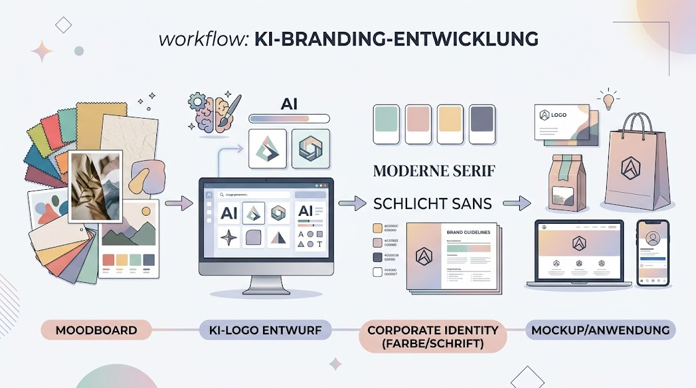
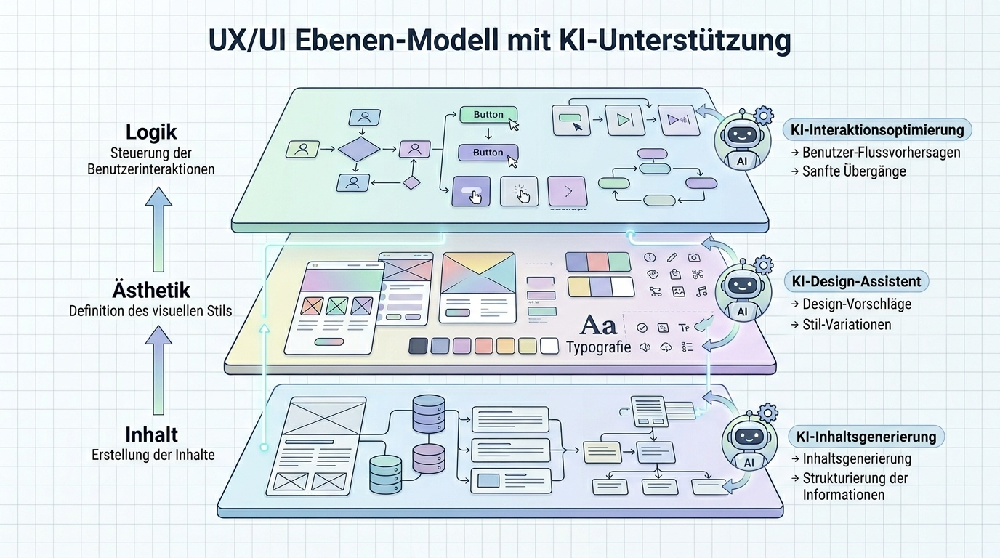

# Anleitung: Design & Branding-Workflows mit KI

## Zielbild
Dieses Modul baut auf dem klassischen **[Grafikdesign-Skript (PDF)](../02_templates/05%20-%20Grafikdesign.pdf)** auf und erweitert es um KI-gestützte Workflows. In diesem Modul lernen wir, wie man eine konsistente visuelle Identität (Branding) entwickelt, indem wir klassische Designregeln mit der Geschwindigkeit von KI-Tools kombinieren. Am Ende steht ein vollständiges Design-Paket: Logo, Farbwelt, Typografie und ein UI-Mockup.

---

## Unterrichtsskript

### Phase 1: Die Sprache der Gestaltung (Theorie & Analyse)
Bevor wir Tools nutzen, schulen wir das Auge.
*   **Diskussion:** Warum funktionieren manche Logos über Jahrzehnte? (Zeitlosigkeit vs. Trend).
*   **Aufgabe 1: Analyse der Gestaltgesetze:** Suche ein bestehendes Design (Website oder Poster) und identifiziere die angewendeten Gestaltgesetze.
*   **Lernziel:** Verständnis von Ordnung, Balance und visueller Hierarchie.

### Phase 2: Brand Discovery (Moodboarding mit KI)

Wir nutzen KI, um die "Seele" einer Marke zu definieren.
*   **Tools:** ChatGPT/Claude (für Konzepte), Midjourney/Flux (für Moods).
*   **Aufgabe 2: Das KI-Moodboard:** Generiere 4 Bilder, die die Stimmung einer Marke für "nachhaltigen Luxus" beschreiben. Achte auf konsistente Texturen und Farben.
*   **Lernziel:** Abstraktion von Werten in visuelle Stimmungen.

### Phase 3: Logo Prototyping & Vektorisierung
Vom Prompt zum professionellen Logo.
*   **Workflow:**
    1.  **Ideation**: Nutze spezialisierte Logo-Prompts in Midjourney.
    2.  **Refinement**: Nutze Upscaling und Inpainting für Details.
    3.  **Vektorisierung**: Umwandlung in Pfade mittels **Adobe Firefly** oder **Vectorizer.ai**.
*   **Aufgabe 3: Das 10-Minuten-Logo:** Erstelle ein minimalistisches Logo für ein Start-up und wandle es in eine skalierbare Vektordatei um.
*   **Lernziel:** Beherrschung der Kette von Raster (KI) zu Vektor (Produktion).

### Phase 4: Corporate Identity (Farbe & Schrift)
Systematisierung des Designs.
*   **Tools:** **Huemint**, **Canva Magic Studio**, **Adobe Color**.
*   **Aufgabe 4: Das Styleguide-Blatt:** Definiere Primär- und Sekundärfarben sowie eine Font-Paarung, die zum Logo aus Phase 3 passt.
*   **Lernziel:** Erstellung eines kohärenten Design-Systems.

### Phase 5: UI/UX & Layouting (Mockups)

Anwendung des Designs auf digitale Produkte.
*   **Tools:** **Figma AI**, **Canva**, **Uizard**.
*   **Aufgabe 5: Das Landing-Page Mockup:** Entwirf eine Hero-Section für eine Website unter Nutzung deines Logos und Farbschemas. Nutze KI für Platzhaltertexte und passende Bilder (Referenz: [Bilderzeugung](../bilderzeugung/)).
*   **Lernziel:** Anwendung von Design-Systemen auf komplexe Layouts.

### Phase 6: Mockups & Präsentation
Das Design in der "echten Welt".
*   **Aufgabe 6: Das Product-Reveal:** Setze dein Logo auf ein physisches Produkt (Mockup), z.B. eine Kaffeetasse oder ein Smartphone. Nutze dafür Inpainting-Techniken aus dem Bilderzeugungs-Modul.
*   **Lernziel:** Professionelle Präsentation von Design-Ergebnissen.

---

## Hausaufgabe
Erstelle eine einseitige "Brand Identity Card" für ein fiktives Unternehmen. Sie muss enthalten: Logo (Vektor), Farbcodes (HEX), Schriftarten und ein Anwendungsbeispiel (Mockup). Dokumentiere, an welchen Stellen die KI den Prozess beschleunigt hat.
