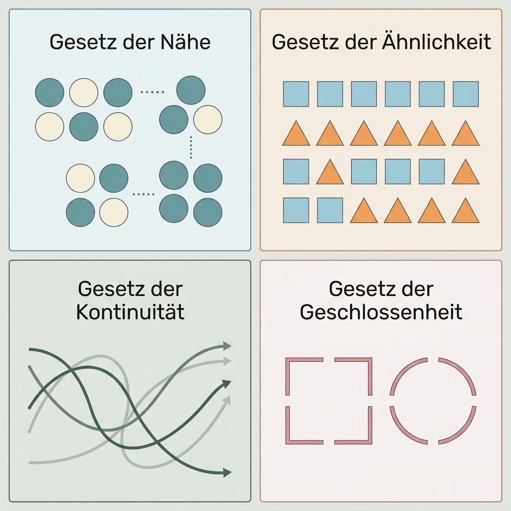

# Design-Theorie & KI-Beschleunigung

Dieses Dokument verbindet klassische Grafikdesign-Prinzipien mit modernen KI-gestützten Workflows. Das Ziel ist es, gestalterische Qualität durch tiefes Verständnis zu sichern und die Umsetzung durch KI zu beschleunigen.

## 1. Gestaltgesetze & KI-Wahrnehmung

Klassische Gestaltgesetze (Nähe, Ähnlichkeit, Geschlossenheit) bestimmen, wie wir Informationen gruppieren.
*   **Traditionell**: Manuelles Anordnen von Elementen, um visuelle Hierarchien zu schaffen.
*   **KI-Beschleunigung**: Nutzung von **Vision-LLMs** (z.B. GPT-4o, Claude 3.5), um Layout-Entwürfe auf ihre "Scanbarkeit" und visuelle Hierarchie zu prüfen.
    *   *Prompt-Beispiel:* "Analysiere diesen Screenshot. Welche Elemente fallen zuerst ins Auge? Werden die Gestaltgesetze der Nähe korrekt angewendet?"

## 2. Farbenlehre & Harmonien
Farben wecken Emotionen und steuern die Markenwahrnehmung.
*   **Traditionell**: Manuelle Auswahl über den Farbkreis (Komplementär, Analog).
*   **KI-Beschleunigung**: Generierung von **Corporate Palettes** mittels Tools wie *Huemint* oder *Canva Magic Color*.
    *   *AI-Workflow:* Erzeuge eine Palette basierend auf Adjektiven wie "innovativ, vertrauenswürdig, ökologisch".

## 3. Typografie & Font-Pairing
Die Wahl der Schriftart bestimmt die "Stimme" eines Designs.
*   **Traditionell**: Suche in Font-Bibliotheken nach passenden Paarungen (Serif/Sans-Serif).
*   **KI-Beschleunigung**: KI-gestützte Font-Empfehlungen basierend auf dem Inhaltskontext.
    *   *Tipp:* Moderne Design-Tools schlagen Schriften vor, die emotional zum generierten Bildmaterial passen.

## 4. Komposition & Raster (Grid)
Der Goldene Schnitt und die Drittel-Regel sorgen für Balance.
*   **Traditionell**: Manuelles Konstruieren von Rastern.
*   **KI-Beschleunigung**: **Generatives Outpainting** und **Inpainting** (siehe Modul [Bilderzeugung](../bilderzeugung/)). KI kann Kompositionen erweitern, während sie die Balance des ursprünglichen Rasters beibehält.

## 5. Logo-Design & Markenidentität
Ein Logo ist die Essenz einer Marke.
*   **Traditionell**: Hunderte Skizzen, Vektorisierung in Illustrator.
*   **KI-Beschleunigung**: **Prompt-basiertes Prototyping** mit Midjourney oder Flux.
    *   *Workflow:* 
        1. Generierung von 50 Logo-Ideen in 10 Minuten.
        2. Auswahl des besten Konzepts.
        3. KI-Vektorisierung (z.B. mit Adobe Firefly oder Vectorizer.ai).

---

## Referenz zu anderen Modulen
*   **[Bilderzeugung](../bilderzeugung/)**: Nutzung von Diffusion-Modellen für Texturen, Stockfotos und Mockup-Hintergründe.
*   **[Videoerzeugung](../videoerzeugung/)**: Animation von Design-Assets für Social Media (Motion Design).
