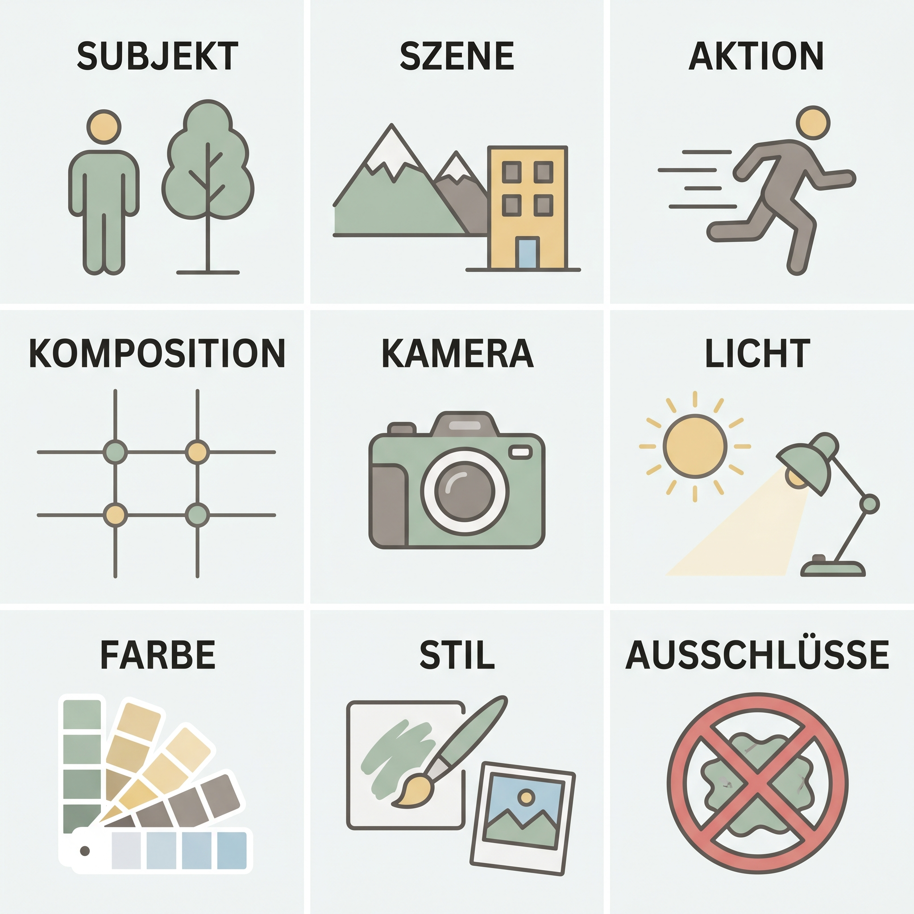
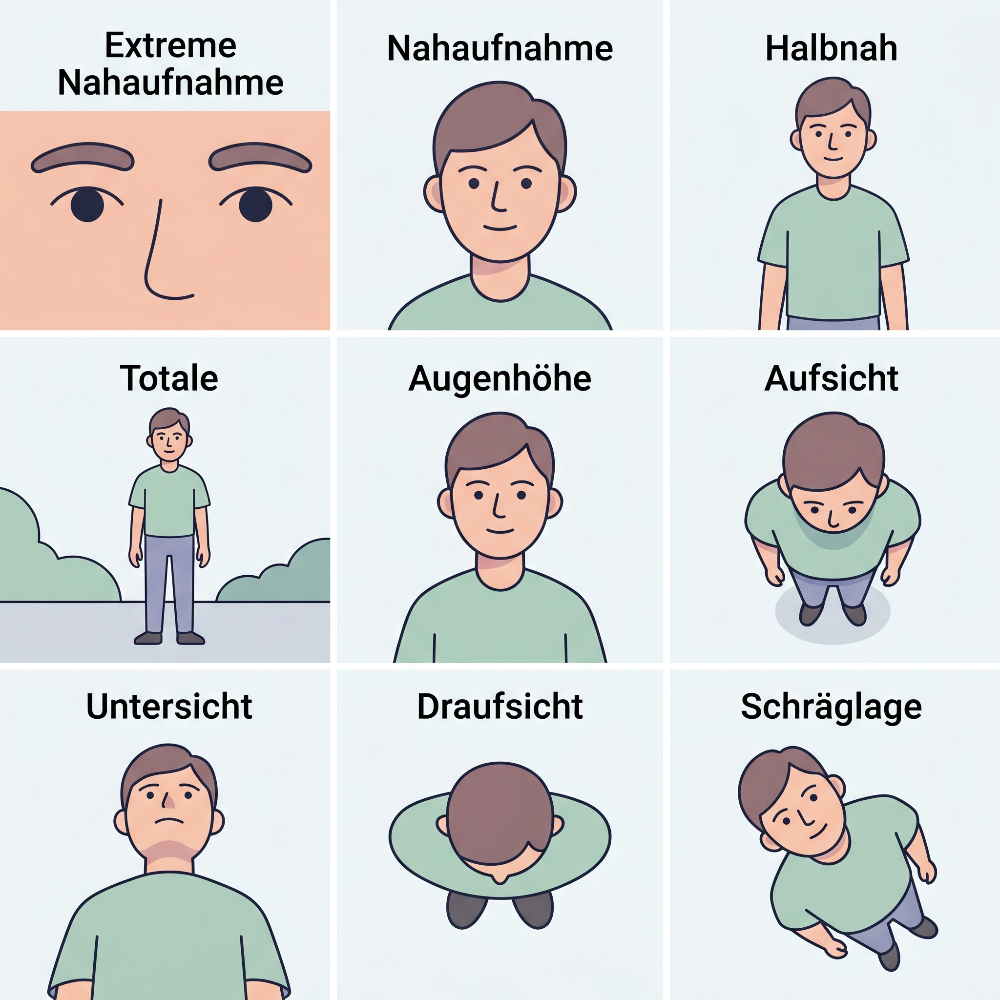
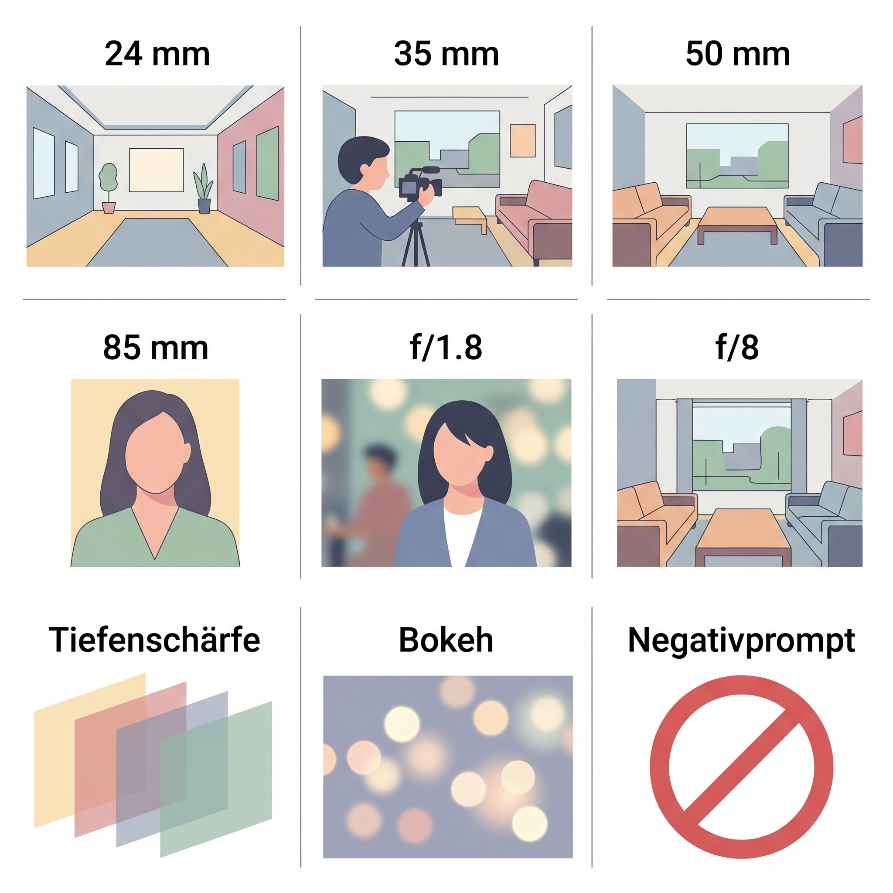
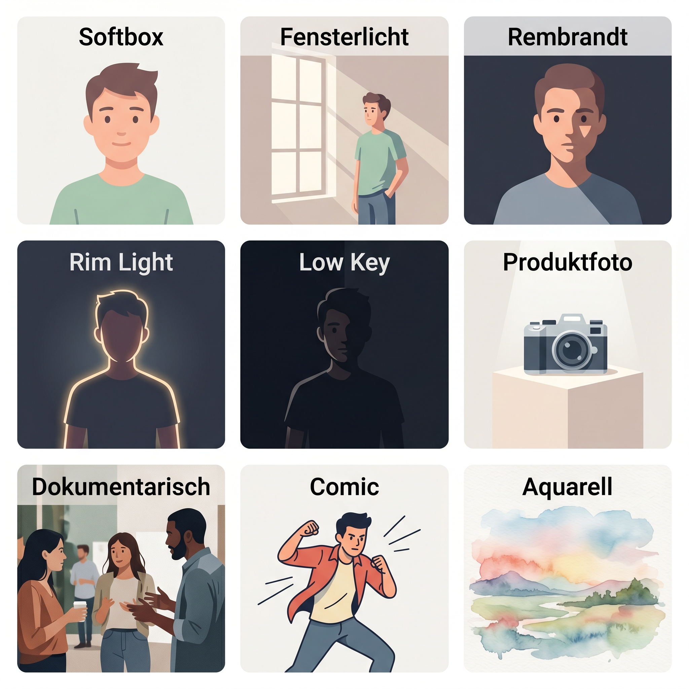

# Cheat Sheet: KI-Bilderzeugung

Dieses Cheat Sheet bietet eine kompakte Übersicht über die wichtigsten Prompt-Strukturen und technischen Parameter für die gezielte Bildgenerierung.

---

## 1. Die Prompt-Grundformel

Die optimale Reihenfolge für einen stabilen Prompt:
**Subjekt/Szene → Komposition/Kamera → Licht → Look/Farbe → Constraints**



| Deutsch | Englisch | Funktion im Prompt |
|---|---|---|
| Subjekt | subject | Hauptmotiv: Person, Objekt, Ort oder Szene |
| Szene | scene / setting | Umgebung, Hintergrund, Kontext |
| Aktion / Pose | action / pose | Handlung, Haltung, Bewegung |
| Komposition | composition | Bildaufbau, Platzierung, Vorder-/Hintergrund |
| Kamera | camera | Shotgröße, Perspektive, Brennweite |
| Licht | lighting | Lichtquelle, Richtung, Qualität |
| Look / Farbe | look / color palette | Farbstimmung, Kontrast, Atmosphäre |
| Stil / Medium | style / medium | Foto, Illustration, Comic, Aquarell usw. |
| Constraints | constraints / negative prompt | Ausschlüsse und Qualitätsgrenzen |

### Struktur-Template
- **Subject:** Hauptmotiv (Was?)
- **Scene:** Umgebung/Hintergrund (Wo?)
- **Action/Pose:** Bewegung oder Haltung
- **Composition:** Anordnung im Bild
- **Camera:** Perspektive, Shotgröße, Brennweite
- **Lighting:** Lichtquelle, Richtung, Qualität
- **Look/Color:** Farbschema, Atmosphäre
- **Style/Medium:** Künstlerischer Stil oder Medium
- **Materials/Texture:** Oberflächenbeschaffenheit
- **Constraints:** Was soll *nicht* erscheinen?

---

## 2. Copy-Paste Mastertemplate

```text
[Medium/Style]
photorealistic image / comic illustration / oil painting / 3D render

[Subject]
main subject, appearance, shape, color, size, material, condition

[Scene]
where the subject is, background, environment, time of day, atmosphere

[Action/Pose]
what is happening, body posture, gesture, expression, movement

[Composition]
centered / left third / right third, foreground-middle ground-background, negative space, aspect ratio

[Camera]
close-up / medium shot / wide shot, eye-level / top-down / low angle, 24mm / 35mm / 50mm / 85mm, shallow or deep depth of field

[Lighting]
soft key from camera-left, hard sunlight, softbox at 45 degrees, rim light, low fill, warm highlights, cool shadows

[Look/Color]
natural tones, muted palette, teal-and-amber restrained, neutral commercial grade

[Materials/Texture]
glazed ceramic, matte wood, brushed metal, skin pores, fabric weave, soft fur

[Constraints]
no extra objects, no text, no watermark, no duplicate items, no anatomy errors, no plastic skin
```

---

## 3. Technische Parameter



### Shotgrößen
- **Extreme close-up:** Sehr nah, Details dominieren.
- **Close-up:** Gesicht oder Objekt im Fokus.
- **Medium shot:** Oberkörper oder Hauptobjekt mit etwas Umfeld.
- **Wide shot:** Ganze Person oder ganze Szene.
- **Over-the-shoulder:** Blick über Schulter in die Handlung.
- **Top-down flat lay:** Draufsicht direkt von oben.

### Perspektiven
- **Eye-level:** Neutral, natürlich, auf Augenhöhe.
- **High angle:** Blick von oben (Motiv wirkt kleiner/verletzlicher).
- **Low angle:** Blick von unten (heroisch, dominant).
- **Bird’s-eye:** Grafisch, ordnend aus der Luft.
- **Dutch angle:** Schräg gestellt, instabil, dynamisch.

| Deutsch | Englisch | Typischer Einsatz |
|---|---|---|
| Extreme Nahaufnahme | extreme close-up | Details, Texturen, Augen, Material |
| Nahaufnahme | close-up | Gesicht, Objekt, Emotion |
| Halbnah | medium shot | Oberkörper, Handlung mit Kontext |
| Totale | wide shot | ganze Person oder ganze Szene |
| Augenhöhe | eye-level | neutral, natürlich |
| Aufsicht | high angle | Überblick, verletzlicher/kleiner wirkend |
| Untersicht | low angle | dominant, heroisch, monumental |
| Draufsicht | top-down / bird's-eye | ordnend, grafisch, Flat Lay |
| Schräglage | dutch angle | Spannung, Dynamik, Instabilität |



### Brennweiten & Blende
- **24mm:** Weitwinkel (viel Raum, starke Perspektive).
- **35mm:** Reportage-Look (natürlich).
- **50mm:** Neutraler Standard (universell).
- **85mm:** Porträt-Brennweite (weicher Hintergrund).
- **f/1.4 - f/2.8:** Starke Unschärfe im Hintergrund (Bokeh).
- **f/8 - f/11:** Hohe Schärfentiefe (alles scharf).

| Parameter | Englisch | Wirkung |
|---|---|---|
| 24 mm | wide-angle lens | viel Raum, stärkere Perspektive |
| 35 mm | documentary lens / reportage lens | natürlich, szenisch |
| 50 mm | standard lens | neutral, universell |
| 85 mm | portrait lens | schmeichelnde Porträtdistanz, Hintergrundtrennung |
| f/1.8 | wide aperture | geringe Schärfentiefe, weicher Hintergrund |
| f/8 | small aperture | mehr Schärfentiefe, mehr Kontext |
| Tiefenschärfe | depth of field | steuert, was scharf erscheint |
| Bokeh | bokeh | ästhetische Unschärfe/Lichtpunkte |
| Negativprompt | negative prompt | verhindert Artefakte, falsche Elemente, ungewollte Stile |

---

## 4. Licht & Stil



### Licht-Setups
- **Softbox:** Weich, modern, kontrolliert.
- **Window light:** Natürlich, ruhig, glaubwürdig.
- **Rembrandt:** Dramatisch, modellierend (Dreieck auf der Wange).
- **Rim light:** Lichtkante zur Trennung vom Hintergrund.
- **Low key:** Dunkel, kontrastreich, filmisch.

### Stil-Vorlagen
- **Photorealistic documentary photo**
- **High-end commercial product photography**
- **Cinematic live-action still frame**
- **Anime illustration / Pixar-like 3D animation**
- **Oil painting / Watercolor illustration**

| Deutsch | Englisch | Wirkung |
|---|---|---|
| Softbox | softbox lighting | weich, kontrolliert, studioartig |
| Fensterlicht | window light | natürlich, ruhig, glaubwürdig |
| Rembrandt-Licht | Rembrandt lighting | dramatisch, modellierend |
| Kantenlicht | rim light | trennt Motiv vom Hintergrund |
| Low Key | low-key lighting | dunkel, kontrastreich, filmisch |
| Produktfoto | product photography | klar, sauber, kommerziell |
| Dokumentarisch | documentary style | realistisch, beobachtend |
| Comic | comic illustration | grafisch, vereinfacht, expressiv |
| Aquarell | watercolor illustration | weich, analog, luftig |

---

---

## 5. Musterprompts & Inspiration

Eine umfangreiche Sammlung von strukturierten Prompts für verschiedene Kategorien (Foto, Werbung, Sketchnotes, Infografiken etc.) finden Sie in der separaten Datei:

👉 **[[diffusion_prompts|Prompt-Katalog: Bildgenerierung]]**

Dort finden Sie auch den optimierten **LLM-Workflow**, um aus einer einfachen Idee einen professionellen Bild-Prompt zu erstellen.

---

## 6. Ressourcen & Communities

- **[Civitai](https://civitai.com/):** Die zentrale Plattform für Open-Source Modelle und LoRAs.
- **[Hugging Face](https://huggingface.co/):** Die Infrastruktur für professionelle Modellgewichte (z.B. FLUX, ERNIE).
- **[Artificial Analysis](https://artificialanalysis.ai/image/leaderboard/editing):** Unabhängige Leaderboards für Bildgeneratoren.
