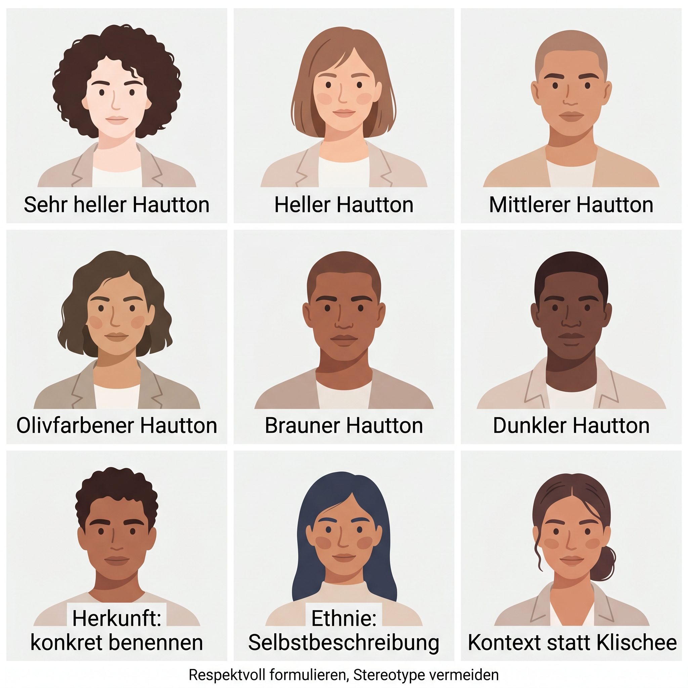
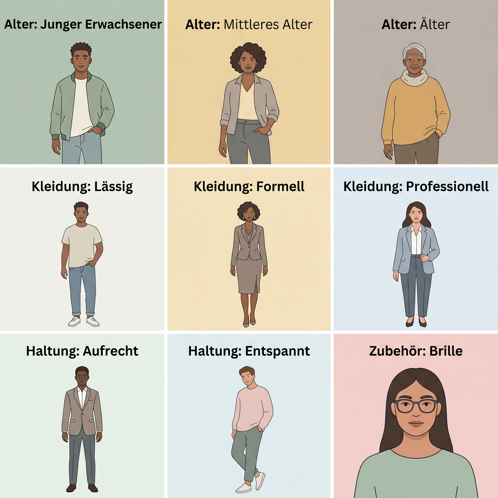

# Cheat Sheet: Personas beschreiben – Diversität & Zusatzmerkmale

Dieses Cheat Sheet ergänzt die Personenbeschreibung um Merkmale, die oft vergessen werden: Hautton, Herkunft, Alter, Kleidung, Haltung, Accessoires, Ausdruck und Kontext. Diese Angaben sollten nur verwendet werden, wenn sie für die Szene, Rolle oder didaktische Aufgabe relevant sind.

## Hautfarbe, Ethnie und Herkunft



| Bereich | Deutsch | Englisch | Vorsicht |
|---|---|---|---|
| Hautton | sehr heller, heller, mittlerer, olivfarbener, brauner, dunkler Hautton | very fair skin tone, fair skin tone, medium skin tone, olive skin tone, brown skin tone, dark skin tone | Hautton nicht mit Charaktereigenschaften verbinden |
| Herkunft | deutsche Person mit türkischer Familiengeschichte, ghanaisch-deutsche Person, koreanische Person | German person with Turkish family background, Ghanaian-German person, Korean person | nicht raten, nicht exotisieren |
| Ethnie | Selbstbeschreibung, konkrete Community, falls relevant | self-description, specific community, if relevant | keine Kostüme, Akzente oder Stereotype als Ersatz für Identität |
| Kultur | Alltag, Beruf, Feier, Ort, konkrete Szene | everyday setting, professional setting, celebration, location, concrete scene | keine „typischen“ Requisiten ohne Grund |

**Prompt-Tipp:** Hautfarbe, Herkunft und kultureller Kontext sind getrennte Ebenen. Ein präziser Prompt kann eines davon nennen, muss aber nicht alle nennen.

## Alter, Kleidung, Haltung, Accessoires



| Merkmal | Deutsch | Englisch |
|---|---|---|
| Alter | junge erwachsene Person, Mitte 30, mittleres Alter, ältere Person | young adult, mid-thirties, middle-aged person, older adult |
| Kleidung | casual, formal, beruflich, funktional, sportlich, schlicht, farblich abgestimmt | casual, formal, professional attire, functional clothing, sporty, simple, color-coordinated |
| Haltung | aufrecht, entspannt, sitzend, gehend, zur Kamera gedreht, im Profil | upright, relaxed, seated, walking, turned toward the camera, in profile |
| Ausdruck | neutral, freundlich, konzentriert, nachdenklich, selbstbewusst, überrascht | neutral, friendly, focused, thoughtful, confident, surprised |
| Accessoires | Brille, Uhr, Kopfhörer, Tasche, Namensschild, Werkzeug | glasses, watch, headphones, bag, name tag, tool |
| Kontext | Büro, Hochschule, Werkstatt, Studio, Stadt, Zuhause, Veranstaltung | office, university, workshop, studio, city, home, event |

## Was häufig fehlt

- **Rolle:** Studentin, Dozent, Projektmanagerin, Designer, Gründerin, Techniker.
- **Situation:** präsentiert etwas, arbeitet am Laptop, diskutiert, hört zu, erklärt.
- **Beziehung zur Kamera:** Blick in die Kamera, Blick zur Seite, im Gespräch, beobachtet.
- **Bildsprache:** realistisch, illustrativ, dokumentarisch, Editorial, Lehrbuchgrafik.
- **Konsistenz:** dieselbe Person, gleiche Frisur, gleiche Kleidung, gleiche Farbwelt.
- **Constraints:** keine Glamour-Pose, keine Stereotype, keine Markenlogos, keine übertriebene Retusche.

## Sensibles Prompting

```text
Beschreibe beobachtbare Merkmale konkret und wertfrei.
Nutze Herkunft oder Ethnie nur, wenn sie für Aufgabe, Figur oder Kontext relevant ist.
Formuliere Kultur über konkrete Situation statt über Klischees.
Vermeide Begriffe, die Körper, Alter, Hautfarbe oder Herkunft bewerten.
```

## Beispielprompt

```text
erwachsene Person Ende 20, mittlerer Hautton, koreanisch-deutsche Herkunft,
kurzes glattes schwarzes Haar, ovales Gesicht, schlichte runde Brille,
casual Business-Kleidung in gedeckten Farben, konzentrierter freundlicher Ausdruck,
sitzt in einem hellen Seminarraum und erklärt eine digitale Kampagne,
pädagogischer Illustrationsstil, gedeckte Pastellfarben, keine Stereotype, keine Logos
```
