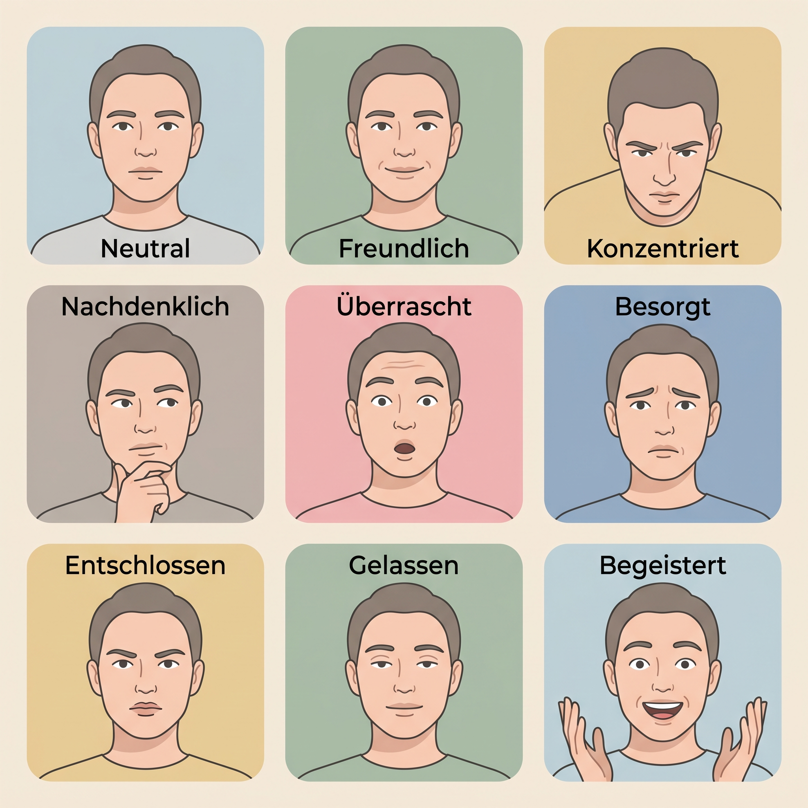
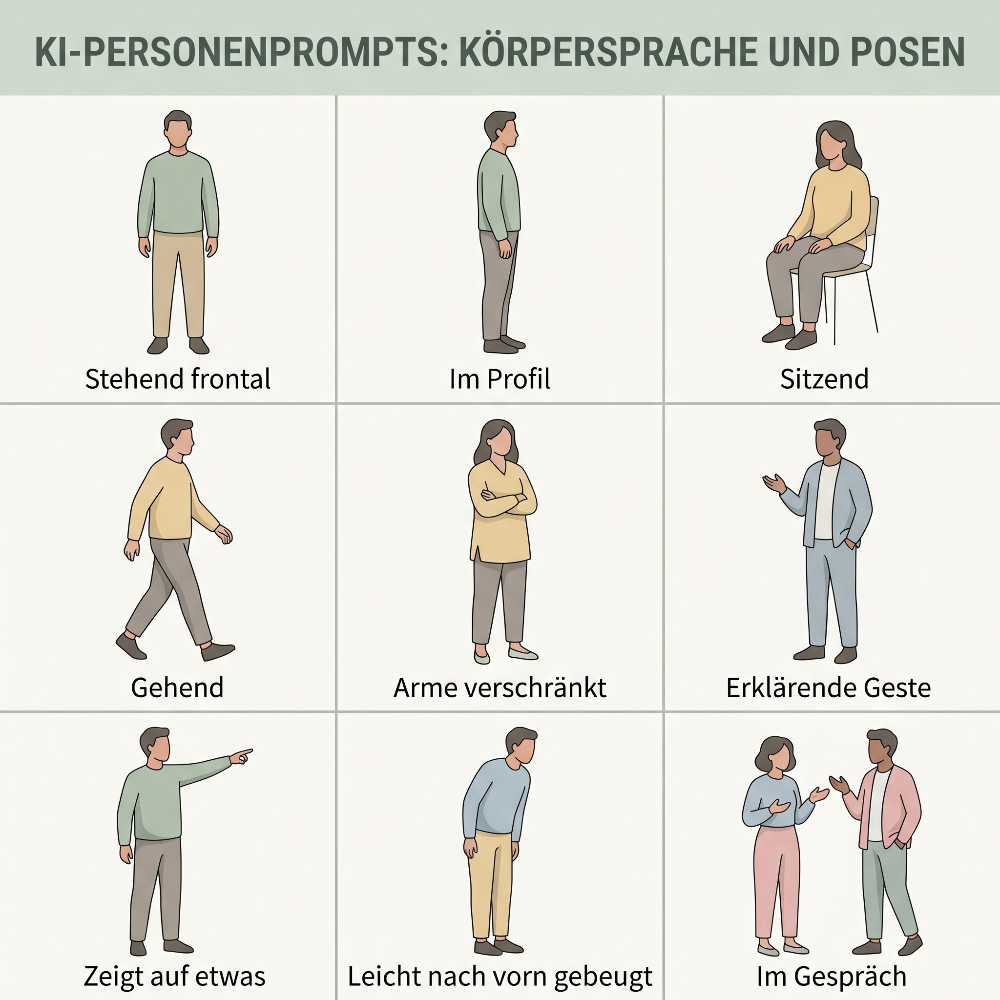

# Cheat Sheet: Personas beschreiben – Emotionen & Posen

Dieses Cheat Sheet ergänzt Personenprompts um Gesichtsausdruck, Körpersprache und Pose. Gerade bei Personas machen diese Angaben den Unterschied zwischen einer statischen Figur und einer glaubwürdigen Szene.

## Grundformel

```text
[Person], [Emotion/Gesichtsausdruck], [Blickrichtung], [Körperhaltung],
[Geste/Pose], [Interaktion mit Objekt oder Person], [Kontext], [Kamera/Licht/Stil]
```

## Emotionen und Gesichtsausdruck



| Ausdruck | Deutsch | Englisch | Typische Signale |
|---|---|---|---|
| Neutral | neutraler Ausdruck | neutral expression | entspannte Gesichtszüge, geschlossener Mund |
| Freundlich | freundlicher Ausdruck, leichtes Lächeln | friendly expression, slight smile | weiche Augen, offene Mimik |
| Konzentriert | konzentrierter Blick | focused expression, concentrated gaze | leicht gesenkte Brauen, Blick auf Aufgabe |
| Nachdenklich | nachdenklicher Ausdruck | thoughtful expression | Blick zur Seite, Hand am Kinn |
| Überrascht | überraschter Ausdruck | surprised expression | geöffnete Augen, leicht geöffneter Mund |
| Besorgt | besorgter Ausdruck | concerned expression | angehobene innere Brauen, gespannte Mundlinie |
| Entschlossen | entschlossener Ausdruck | determined expression | gerader Blick, klare Kieferlinie |
| Gelassen | gelassener Ausdruck | calm expression, composed expression | entspannte Augen, ruhige Mimik |
| Begeistert | begeisterter Ausdruck | excited expression, enthusiastic expression | großes Lächeln, offene Gestik |

**Prompt-Tipp:** Emotionen wirken glaubwürdiger, wenn sie nicht nur benannt, sondern über sichtbare Signale beschrieben werden: `focused expression, eyes directed at the laptop, slightly furrowed brows`.

## Blickrichtung

| Deutsch | Englisch | Wirkung |
|---|---|---|
| Blick in die Kamera | looking at the camera | direkt, präsent, portraitartig |
| Blick zur Seite | looking to the side | beobachtend, nachdenklich |
| Blick nach unten | looking down | konzentriert, lesend, arbeitend |
| Blick auf ein Objekt | looking at an object | handlungsbezogen |
| Blick zu einer anderen Person | looking at another person | dialogisch, sozial |
| abgewandter Blick | averted gaze | distanziert, kontemplativ |

## Posen und Körpersprache



| Pose | Deutsch | Englisch | Einsatz |
|---|---|---|---|
| Stehend frontal | stehend frontal | standing front-facing | neutrale Persona, Profilbild, Character Sheet |
| Im Profil | im Profil, seitliche Ansicht | in profile, side view | Vergleich, Bewegung, sachliche Darstellung |
| Sitzend | sitzend | seated, sitting | Gespräch, Arbeit, Seminar, Beratung |
| Gehend | gehend | walking | Alltag, Dynamik, Übergang |
| Arme verschränkt | Arme verschränkt | arms crossed | zurückhaltend, skeptisch, selbstbewusst |
| Erklärende Geste | erklärende Geste | explanatory gesture | Lehre, Präsentation, Beratung |
| Zeigt auf etwas | zeigt auf etwas | pointing at something | Hinweis, Interface, Objektbezug |
| Nach vorn gebeugt | leicht nach vorn gebeugt | slightly leaning forward | Interesse, Zuhören, Konzentration |
| Im Gespräch | im Gespräch | in conversation | Dialog, Teamarbeit, soziale Szene |

**Prompt-Tipp:** Posen sollten zur Szene passen: `seated at a table, leaning slightly forward, hands resting near a notebook` ist meist stabiler als nur `interested pose`.

## Gesten

| Deutsch | Englisch | Hinweis |
|---|---|---|
| offene Handflächen | open palms | wirkt erklärend und zugänglich |
| Hand am Kinn | hand on chin | wirkt nachdenklich |
| Hand hebt ein Objekt | holding an object | bindet die Person an eine Handlung |
| zeigt auf Bildschirm | pointing at a screen | nützlich für DCM-, UI- und Kampagnenszenen |
| Hände in den Taschen | hands in pockets | entspannt, informell |
| Hände auf dem Tisch | hands resting on the table | ruhig, professionell |

## Intensität steuern

| Intensität | Deutsch | Englisch | Beispiel |
|---|---|---|---|
| subtil | subtil, zurückhaltend | subtle, restrained | `subtle smile` |
| moderat | deutlich, aber natürlich | clear but natural | `clearly focused expression` |
| stark | ausgeprägt, emotional | strong, expressive | `visibly surprised expression` |
| überzeichnet | übertrieben, cartoonhaft | exaggerated, cartoonish | nur bei Comic/Illustration nutzen |

## Beispielprompt

```text
weiblich gelesene erwachsene Person Mitte 30, freundlicher konzentrierter Ausdruck,
slight smile, eyes directed at a laptop, seated at a table, slightly leaning forward,
one hand resting near a notebook, the other hand making an explanatory gesture,
casual professional clothing, bright seminar room, muted pastel educational illustration,
no exaggerated emotion, no glamour pose, no stereotypes
```

