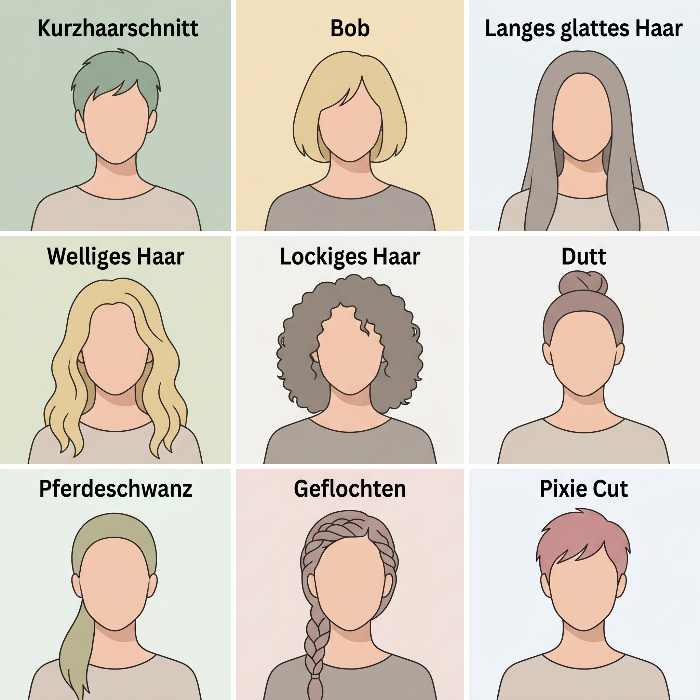
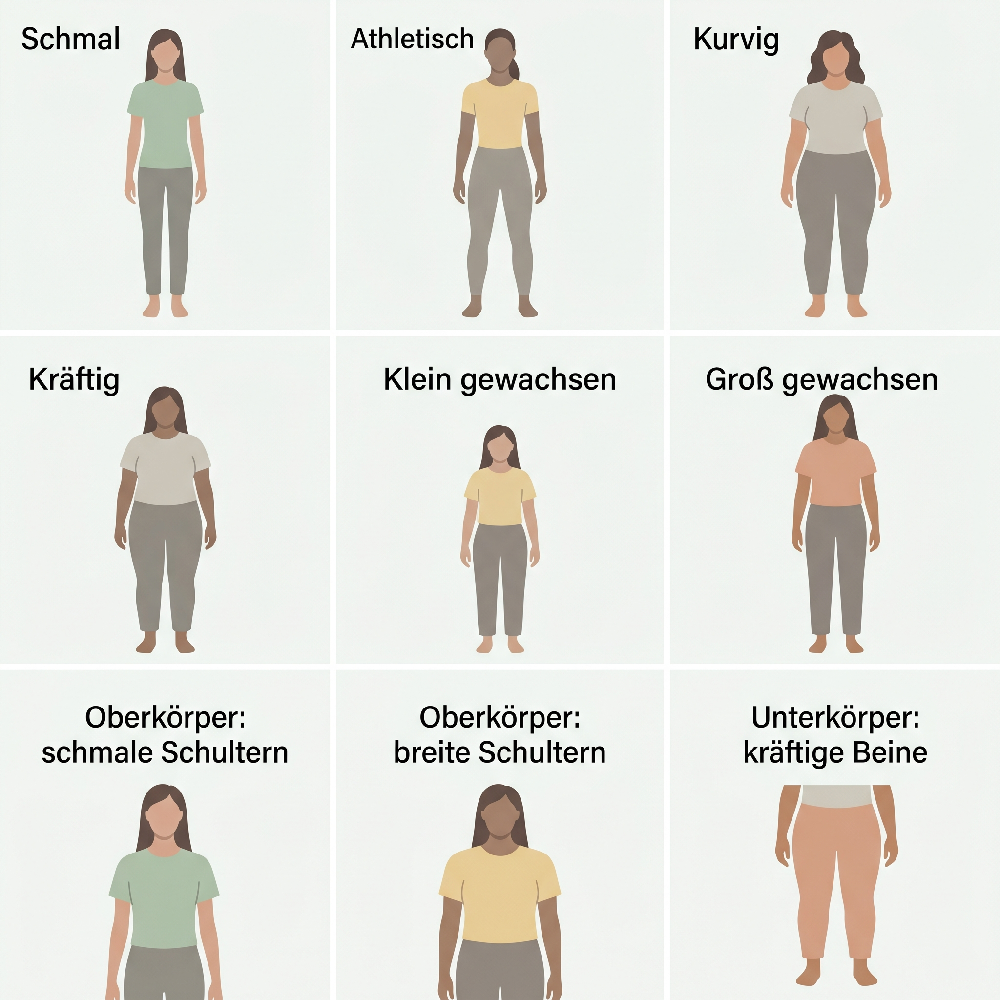
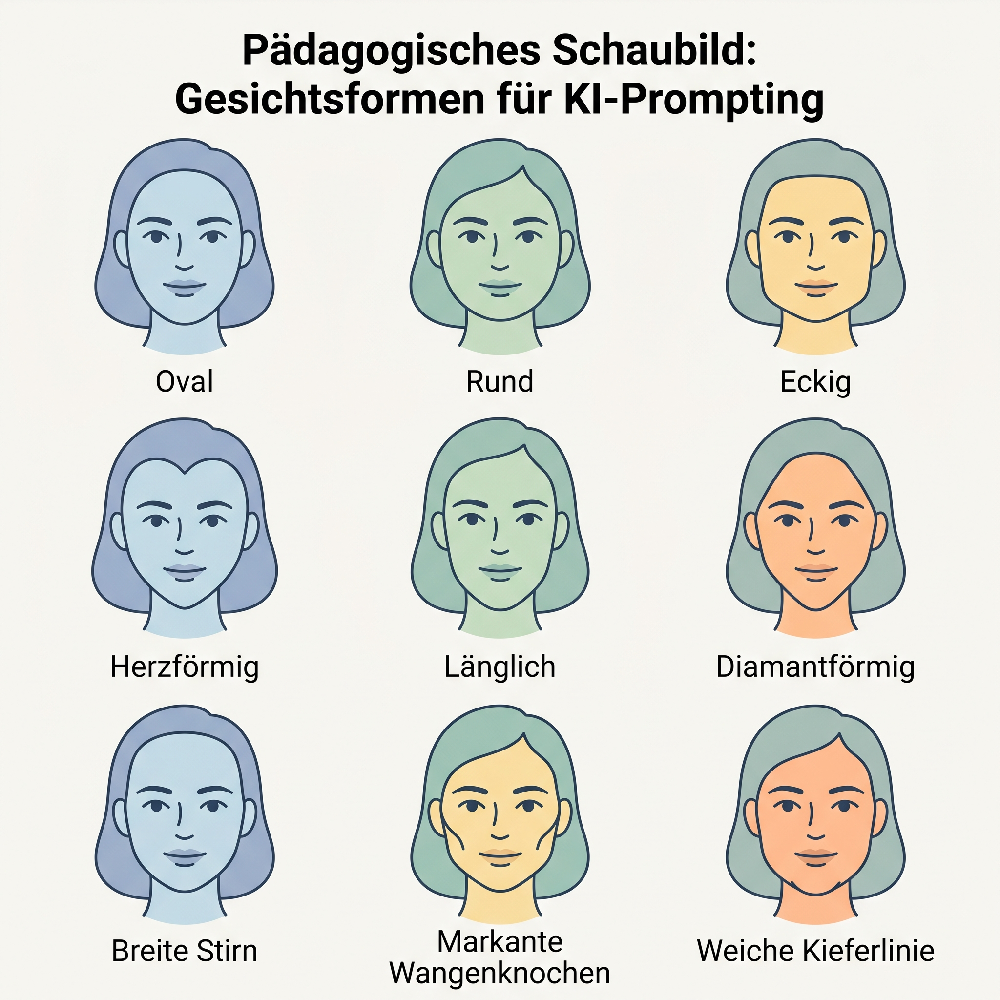
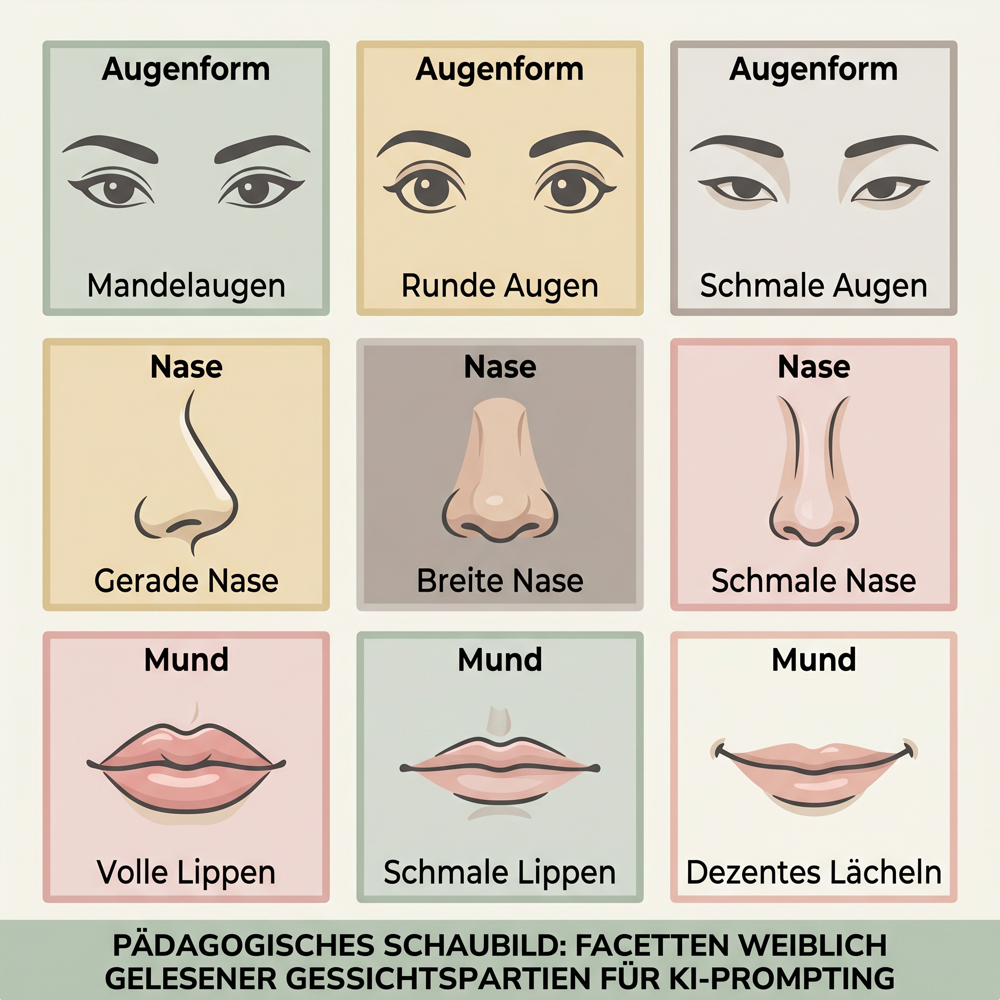

# Cheat Sheet: Personas beschreiben – Frau

Dieses Cheat Sheet hilft dabei, weiblich gelesene Personas für KI-Bilder präzise, respektvoll und reproduzierbar zu beschreiben. Die Begriffe sind Prompt-Bausteine, keine Bewertung von Aussehen.

## Grundformel

```text
weiblich gelesene erwachsene Person, [Alter], [Körperbau], [Gesichtsform],
[Frisur], [Haarfarbe/Haartextur], [Hautton/Herkunft nur falls relevant],
[Kleidung], [Haltung], [Ausdruck], [Kontext/Rolle], [Bildstil/Kamera/Licht]
```

## Frisuren



| Merkmal | Deutsch | Englisch |
|---|---|---|
| Länge | kurzer Haarschnitt, kinnlanger Bob, schulterlang, langes glattes Haar | short haircut, chin-length bob, shoulder-length hair, long straight hair |
| Textur | glatt, leicht wellig, lockig, kraus, voluminös | straight, slightly wavy, curly, coily, voluminous |
| Styling | Dutt, Pferdeschwanz, geflochten, Pixie Cut, Seitenscheitel | bun, ponytail, braided, pixie cut, side part |
| Farbe | dunkelbraun, schwarz, blond, rotbraun, grau, mehrfarbig gefärbt | dark brown, black, blonde, auburn, gray, multi-colored dyed hair |

**Prompt-Tipp:** Beschreibe zuerst Länge und Textur, danach Styling: `schulterlanges, welliges dunkelbraunes Haar, locker offen getragen`.

## Körperbau



| Bereich | Deutsch | Englisch |
|---|---|---|
| Ganzkörper | schmal, athletisch, kurvig, kräftig, klein gewachsen, groß gewachsen | slender, athletic, curvy, sturdy, short stature, tall stature |
| Oberkörper | schmale Schultern, breite Schultern, kurzer Oberkörper, langer Oberkörper | narrow shoulders, broad shoulders, short torso, long torso |
| Unterkörper | schmale Hüfte, breite Hüfte, kräftige Beine, lange Beine, kurze Beine | narrow hips, wide hips, strong legs, long legs, short legs |
| Haltung | aufrecht, entspannt, leicht nach vorn gebeugt, dynamisch in Bewegung | upright, relaxed, slightly leaning forward, dynamic movement |

**Vermeiden:** wertende Begriffe wie „perfekt“, „ideal“, „sexy“, „Problemzone“ oder vorher/nachher-artige Beschreibungen.

## Gesichtsform



| Merkmal | Deutsch | Englisch |
|---|---|---|
| Grundform | ovales Gesicht, rundes Gesicht, eckige Gesichtsform, herzförmiges Gesicht | oval face, round face, square face, heart-shaped face |
| Proportion | längliches Gesicht, breite Stirn, markante Wangenknochen | long face, broad forehead, prominent cheekbones |
| Kieferlinie | weiche Kieferlinie, schmale Kieferpartie, klar definierte Kinnpartie | soft jawline, narrow jaw, well-defined chin |

## Augen, Nase, Mund



| Detail | Deutsch | Englisch |
|---|---|---|
| Augenform | mandelförmige Augen, runde Augen, schmale Augen, leicht tief liegende Augen | almond-shaped eyes, round eyes, narrow eyes, slightly deep-set eyes |
| Augenbrauen | gerade, weich gebogen, dicht, fein, natürlich | straight eyebrows, softly arched eyebrows, thick eyebrows, fine eyebrows, natural eyebrows |
| Nase | gerade Nase, breite Nase, schmale Nase, leicht gerundete Nasenspitze | straight nose, broad nose, narrow nose, slightly rounded nose tip |
| Mund | volle Lippen, schmale Lippen, dezentes Lächeln, neutraler Ausdruck | full lips, thin lips, subtle smile, neutral expression |

## Beispielprompt

```text
weiblich gelesene erwachsene Person Mitte 30, athletischer Körperbau,
ovale Gesichtsform mit weicher Kieferlinie, schulterlanges welliges dunkelbraunes Haar,
mandelförmige Augen, gerade Nase, dezentes Lächeln, olivfarbener Hautton,
schlichte dunkelgrüne Bluse, aufrechte entspannte Haltung, moderne Büro-Umgebung,
weiches Tageslicht, pädagogischer realistischer Illustrationsstil, keine Glamour-Pose
```
