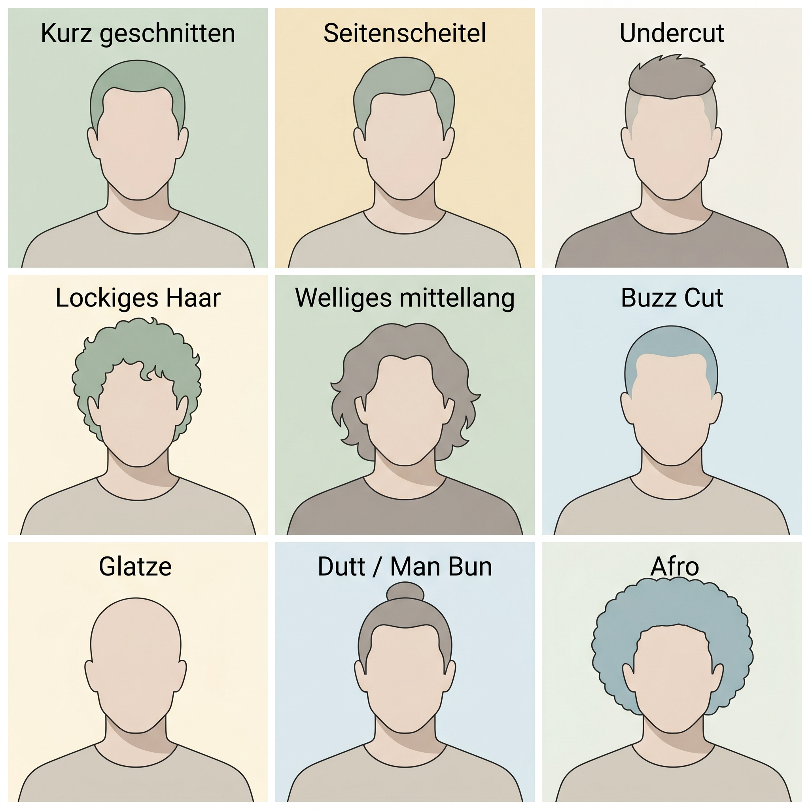
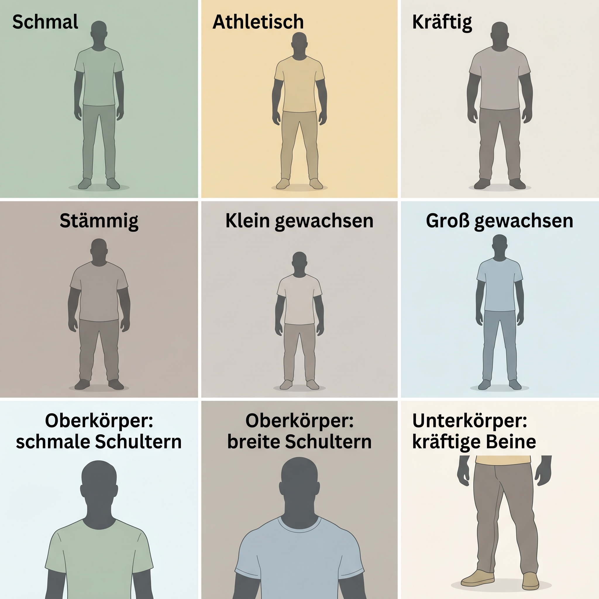
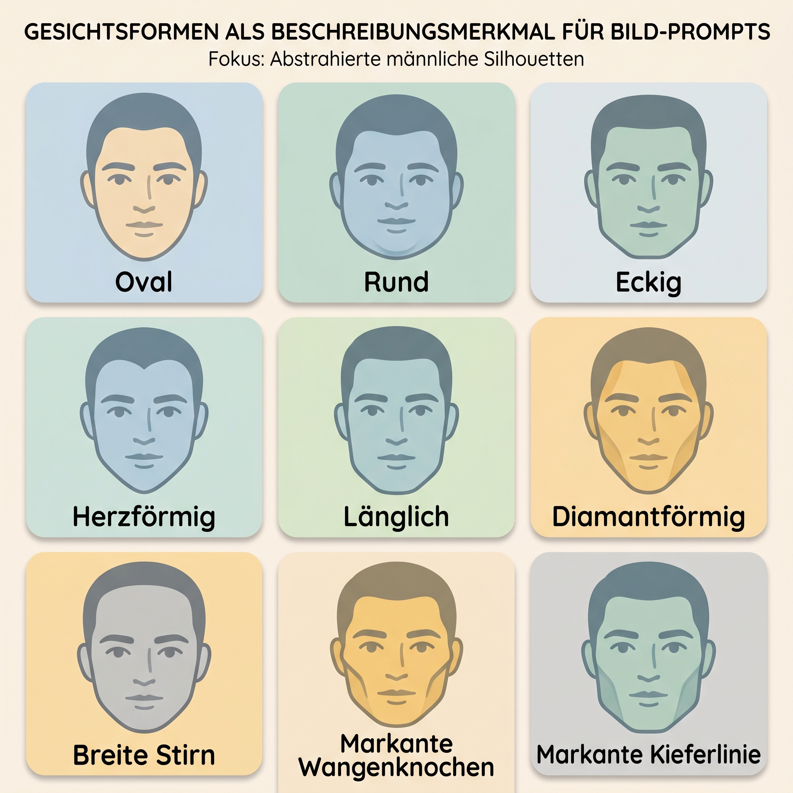
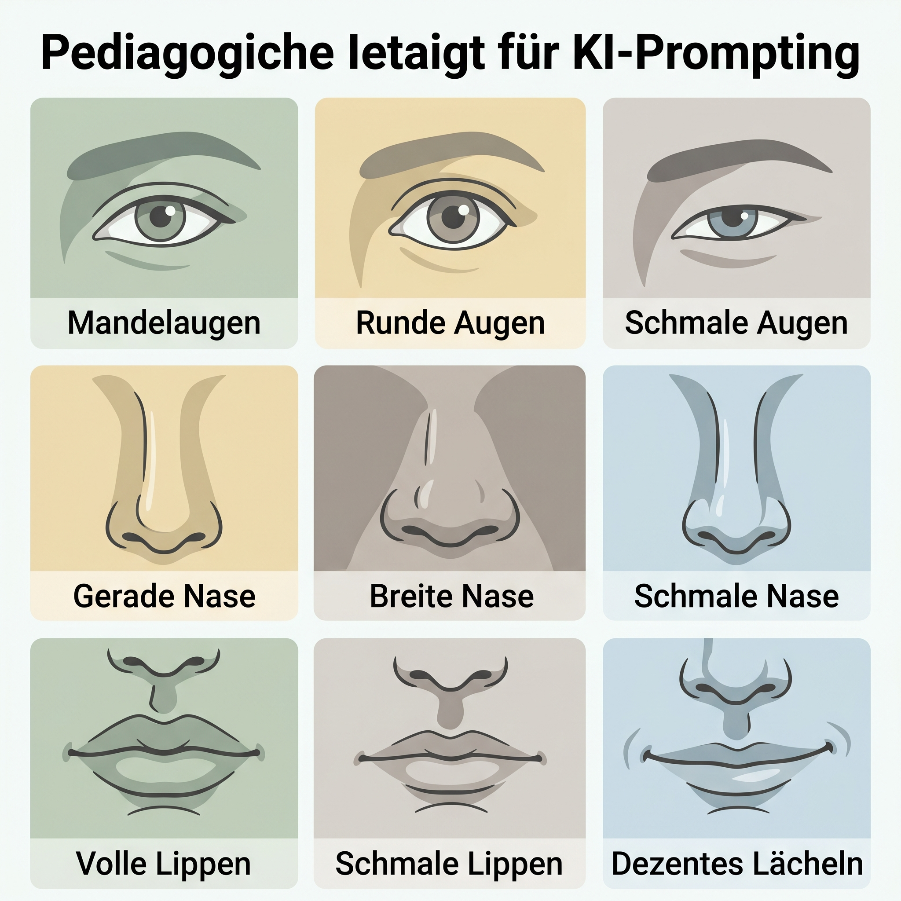

# Cheat Sheet: Personas beschreiben – Mann

Dieses Cheat Sheet hilft dabei, männlich gelesene Personas für KI-Bilder präzise, respektvoll und reproduzierbar zu beschreiben. Die Begriffe sind Prompt-Bausteine, keine Bewertung von Aussehen.

## Grundformel

```text
männlich gelesene erwachsene Person, [Alter], [Körperbau], [Gesichtsform],
[Frisur/Bart], [Haarfarbe/Haartextur], [Hautton/Herkunft nur falls relevant],
[Kleidung], [Haltung], [Ausdruck], [Kontext/Rolle], [Bildstil/Kamera/Licht]
```

## Frisuren



| Merkmal | Deutsch | Englisch |
|---|---|---|
| Länge | kurz geschnitten, mittellang, Buzz Cut, Glatze | short hair, medium-length hair, buzz cut, bald head |
| Textur | glatt, wellig, lockig, kraus, Afro | straight, wavy, curly, coily, afro |
| Styling | Seitenscheitel, Undercut, zurückgekämmt, Dutt / Man Bun | side part, undercut, slicked back, bun / man bun |
| Bart | glattrasiert, Dreitagebart, kurzer Vollbart, Schnurrbart | clean-shaven, stubble, short full beard, mustache |

**Prompt-Tipp:** Bart und Frisur getrennt beschreiben: `kurzes welliges Haar mit Seitenscheitel, gepflegter Dreitagebart`.

## Körperbau



| Bereich | Deutsch | Englisch |
|---|---|---|
| Ganzkörper | schmal, athletisch, kräftig, stämmig, klein gewachsen, groß gewachsen | slender, athletic, strong build, stocky, short stature, tall stature |
| Oberkörper | schmale Schultern, breite Schultern, gerader Oberkörper, langer Oberkörper | narrow shoulders, broad shoulders, straight torso, long torso |
| Unterkörper | schmale Hüfte, kräftige Beine, lange Beine, kurze Beine | narrow hips, strong legs, long legs, short legs |
| Haltung | aufrecht, entspannt, dynamisch, zurückhaltend, leicht zur Seite gedreht | upright, relaxed, dynamic, reserved posture, slightly turned to the side |

**Vermeiden:** wertende Fitnessbegriffe wie „perfekter Körper“, „Alpha“, „muskulös um jeden Preis“ oder abwertende Körperbeschreibungen.

## Gesichtsform



| Merkmal | Deutsch | Englisch |
|---|---|---|
| Grundform | ovales Gesicht, rundes Gesicht, eckige Gesichtsform, herzförmiges Gesicht | oval face, round face, square face, heart-shaped face |
| Proportion | längliches Gesicht, breite Stirn, markante Wangenknochen | long face, broad forehead, prominent cheekbones |
| Kieferlinie | weiche Kieferlinie, markante Kieferlinie, breites Kinn | soft jawline, pronounced jawline, broad chin |

## Augen, Nase, Mund



| Detail | Deutsch | Englisch |
|---|---|---|
| Augenform | mandelförmige Augen, runde Augen, schmale Augen, tiefer liegende Augen | almond-shaped eyes, round eyes, narrow eyes, deep-set eyes |
| Augenbrauen | gerade, dicht, weich gebogen, fein | straight eyebrows, thick eyebrows, softly arched eyebrows, fine eyebrows |
| Nase | gerade Nase, breite Nase, schmale Nase, markanter Nasenrücken | straight nose, broad nose, narrow nose, prominent nasal bridge |
| Mund | volle Lippen, schmale Lippen, dezentes Lächeln, neutraler Ausdruck | full lips, thin lips, subtle smile, neutral expression |

## Beispielprompt

```text
männlich gelesene erwachsene Person Anfang 40, kräftiger Körperbau,
eckige Gesichtsform mit markanter Kieferlinie, kurzes schwarzes Haar,
kurzer Vollbart, runde Augen, gerade Nase, neutraler freundlicher Ausdruck,
dunkler Hautton, schlichtes graues Hemd, entspannte aufrechte Haltung,
urbaner Arbeitskontext, weiches Fensterlicht, moderner realistischer Illustrationsstil
```
