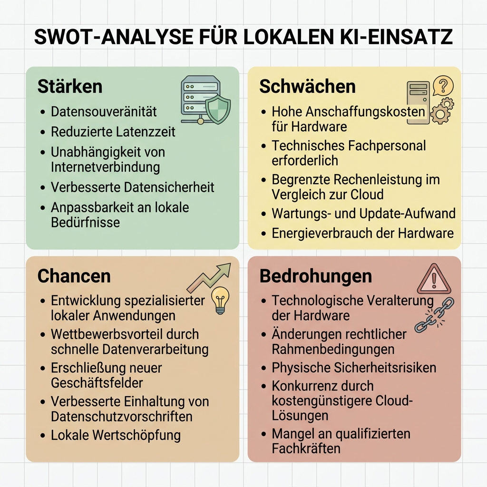
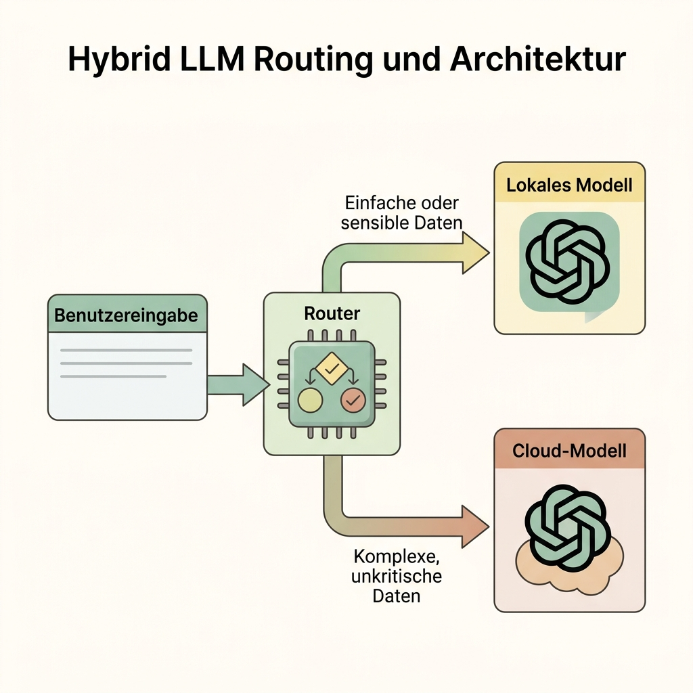
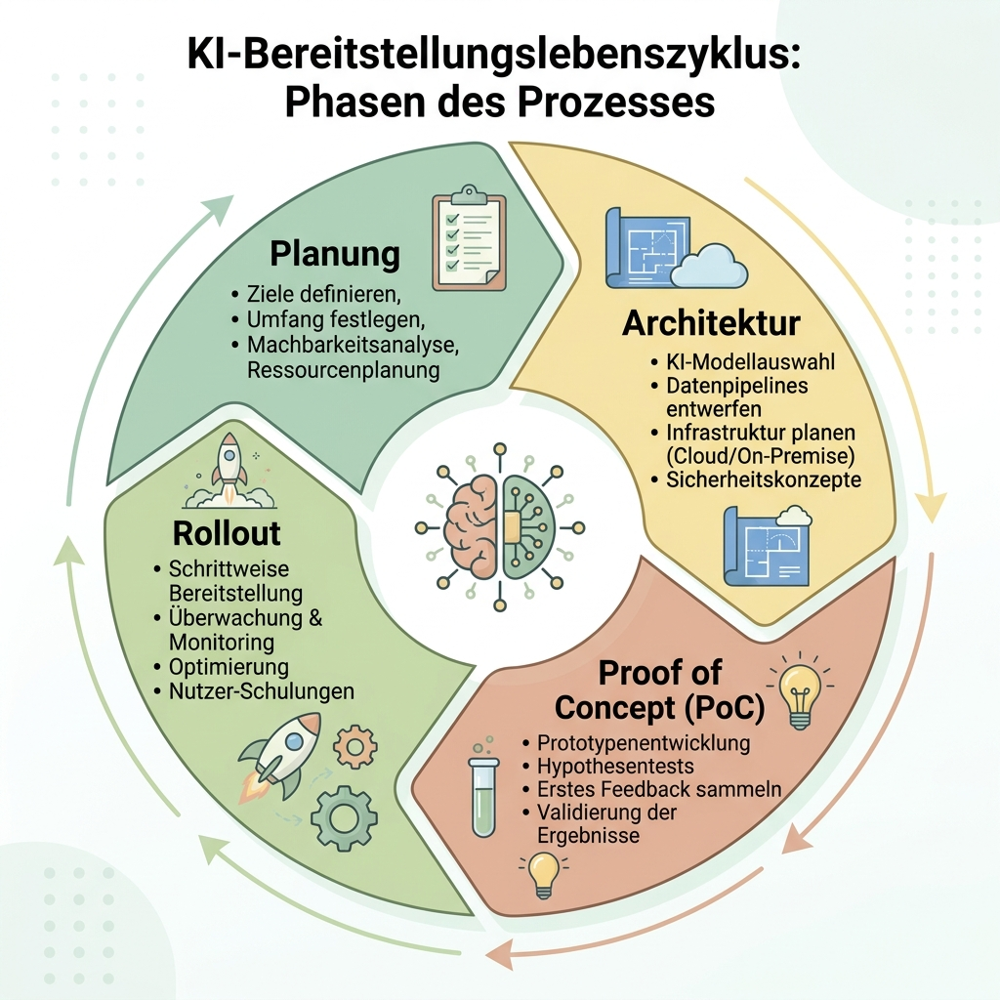

# Anleitung: Consulting & Deployment von KI-Lösungen im realen Kontext

## Zielbild
Dieses Modul bietet einen tiefen Einblick in die Beratungspraxis (Consulting) und das technische Deployment von KI-Systemen. Wir beleuchten den gesamten Lebenszyklus eines KI-Projekts: von der initialen Kundenbefragung über methodische Architekturentscheidungen (Nutzwertanalyse, SWOT) bis hin zur dynamischen Orchestrierung mittels LLM-Routing und der langfristigen Betreuung.

---

## Unterrichtsskript

### Phase 1: Erstbefragung, Bedarfs- und Reifegradanalyse
Der Erfolg eines KI-Deployments entscheidet sich vor der ersten Zeile Code. In dieser Phase wird nicht nur das Ziel, sondern auch der "KI-Reifegrad" der Organisation ermittelt.

*   **Zielgruppen- und Infrastruktur-Segmentierung:**
    *   *Privatpersonen / Einzelunternehmer:* Fokus liegt auf geringen Kosten, sofortiger Nutzbarkeit (SaaS-Lösungen, Out-of-the-Box Tools wie ChatGPT Plus oder einfache lokale UIs wie LM Studio). Keine dedizierte IT-Abteilung vorhanden.
    *   *KMUs (Kleine und Mittlere Unternehmen):* Starker Fokus auf Datenintegration in bestehende Prozesse (ERP, CRM), strenge Einhaltung von Datenschutzrichtlinien (DSGVO) und überschaubare Wartungskosten. Meist werden Hybrid-Ansätze (lokale Filterung, Cloud-Generierung) bevorzugt.
    *   *Konzerne:* Höchste Anforderungen an Compliance, Governance, Revisionssicherheit und SLAs. Oft ist die Entwicklung eigener Private Clouds oder On-Premise Cluster auf Enterprise-Niveau (z.B. Nvidia DGX Systeme) zwingend erforderlich.

*   **Der Consulting-Fragebogen (Auszug):**
    *   *Data-Readiness:* In welchem Format und welcher Qualität liegen die Daten vor? Dürfen diese das Firmennetz verlassen?
    *   *Latenz-Anforderungen:* Handelt es sich um Batch-Verarbeitung (z.B. nächtliche Dokumentenanalyse) oder Real-Time Interaktionen (Kunden-Chatbot)?
    *   *Budgetierung (CAPEX vs. OPEX):* Stehen Investitionsmittel für Hardware bereit oder wird ein rein operatives Kostenmodell (Pay-as-you-go) bevorzugt?

*   **Lernziel:** Verständnis, dass Technologie (insb. KI) immer dem Business-Case und den rechtlichen/finanziellen Restriktionen des Kunden folgen muss.

### Phase 2: Methodische Infrastruktur-Planung (Cloud vs. Local)
Die Entscheidung "Wo laufen die Modelle?" darf kein Bauchgefühl sein. Wir nutzen hierfür strukturierte Analysewerkzeuge.

*   **Der Kriterienkatalog für LLM-Hosting:**
    1.  **Datensicherheit & DSGVO:** Ist der Anbieter europäisch? Gibt es Zero-Data-Retention Agreements?
    2.  **Skalierbarkeit:** Wie schnell können Spitzenlasten (Spikes) abgefangen werden?
    3.  **Vendor Lock-in:** Wie stark binde ich mich an proprietäre APIs (OpenAI) vs. offene Standards (OpenAI-kompatible APIs mit Llama)?
    4.  **Wartungsaufwand (Maintenance):** Wer kümmert sich um Treiber-Updates, Model-Gewichte und CUDA-Versionen?

*   **Analyseformen zur Entscheidungsfindung:**
    *   **SWOT-Analyse (Beispiel: Lokales Deployment / On-Premise)**
        *   *Strengths (Stärken):* 100% Datenkontrolle, keine variablen API-Kosten bei Dauerlast, maximale Customization.
        *   *Weaknesses (Schwächen):* Sehr hohe initiale Anschaffungskosten (CAPEX), komplexes Setup (Kühlung, Strom), hoher Fachkräftebedarf für Wartung.
        *   *Opportunities (Chancen):* Aufbau eigenen IP-Wissens, Unabhängigkeit von Cloud-Ausfällen oder Preisänderungen.
        *   *Threats (Risiken):* Hardware veraltet schnell (Zyklen von 12-18 Monaten), potenzieller Ressourcen-Flaschenhals bei plötzlichen Lastspitzen.
    
    *   **Nutzwertanalyse (Scoring-Modell):**
        Gewichtung der Kriterien (z.B. Datenschutz = 40%, Kosten = 30%, Speed = 30%) multipliziert mit der Punktzahl der jeweiligen Lösung (Managed API vs. Runpod vs. On-Premise Server). Dies führt zu einer objektiven, datengetriebenen Entscheidungsgrundlage für das Management.

*   **Hosting-Optionen im Detail:**
    *   *Managed Services (OpenAI, Anthropic):* Höchster Komfort, Pay-per-Token. Ideal für Prototyping.
    *   *GPU-Cloud (z.B. Runpod, AWS EC2):* Mieten von nackter GPU-Power. Hohe Flexibilität, eigene Modelle (z.B. Llama 3) via vLLM hosten. Ideal für Skalierung bei voller Model-Kontrolle.
    *   *Lokales Deployment:* Anschaffung von dedizierter Hardware.

*   **Lernziel:** Fähigkeit, architektonische Entscheidungen gegenüber C-Level Management methodisch (via SWOT/Nutzwertanalyse) zu begründen.

### Phase 3: Architektur & Orchestration (Hybrides LLM Routing)
Die Ära des monolithischen "Ein Modell für alles"-Ansatzes ist vorbei. Moderne Enterprise-Systeme sind modular und netzwerkartig aufgebaut.

*   **Das Konzept des LLM Routings:** Nicht jede Anfrage erfordert ein ressourcenhungriges State-of-the-Art Modell.
    *   *Triviale Aufgaben (Formatierung, Grammatik, simple Klassifizierung):* Diese werden von einem vorgeschalteten Router-Skript erkannt und an extrem schnelle, kleine Modelle (z.B. Llama-3-8B, Mistral, Gemma 2B) weitergeleitet, die günstig lokal oder auf einem gemieteten Runpod-Server laufen.
    *   *Komplexe Aufgaben (Deep Reasoning, kreatives Problemlösen):* Routing an Cloud-Flaggschiffe (z.B. GPT-4o, Claude 3.5 Sonnet).
    
*   **Datenschutz-Routing (PII Filterung):**
    *   Ein lokales Modell fungiert als "Gatekeeper". Es scannt den Prompt auf personenbezogene Daten (PII - Personally Identifiable Information). Werden solche Daten gefunden, werden sie entweder lokal verarbeitet (sicher) oder durch das lokale Modell pseudonymisiert, bevor der bereinigte Rumpf-Prompt an die Cloud-API gesendet wird.

*   **Orchestrierungs-Frameworks:** Nutzung von Tools wie **LangChain**, **LlamaIndex** oder **Semantic Kernel**, um diese dynamischen Weichenstellungen programmatisch umzusetzen.

*   **Lernziel:** Entwurf hybrider Systeme, die Kosteneffizienz (billige Modelle für Standard-Tasks) mit Spitzenleistung (Cloud-Modelle für komplexe Tasks) unter Einhaltung des Datenschutzes kombinieren.

### Phase 4: Proof of Concept (PoC) & Demo-Entwicklung
Beratung ohne greifbares Ergebnis bleibt abstrakt. Der PoC ist das wichtigste Werkzeug des Consultants zur Vertrauensbildung.

*   **Vorgehen:** Aufbau eines MVP (Minimum Viable Product). Keine Perfektion, sondern der Beweis der Machbarkeit.
*   **Demo-Szenario:** Ein hybrides RAG-System (Retrieval-Augmented Generation) zur internen Dokumentenanalyse.
    *   *Frontend & Embedding:* Läuft lokal. Dokumente werden lokal vektorisiert (z.B. via ChromaDB).
    *   *Orchestrierung:* Erkennt die Intention des Nutzers.
    *   *Execution:* Holt die Top-3 Textpassagen aus der lokalen DB und schickt sie – bereinigt – an die externe API für eine flüssige Zusammenfassung.
*   **Lernziel:** Die theoretischen Konzepte durch eine greifbare, lauffähige Demo für den Kunden beweisbar und erlebbar machen.

### Phase 5: Rollout & Kontinuierliche Begleitung
Deployment ist kein Projekt, sondern ein kontinuierlicher Service-Prozess.

*   **LLM Observability (Monitoring):** Überwachung von Token-Verbrauch, Latenz und vor allem der *Antwortqualität*. Tools wie Langfuse oder Portkey helfen, Halluzinationen oder "Prompt Injection" Angriffe in Produktion zu erkennen.
*   **Model Drift & Lifecycle Management:** KI-Modelle verändern sich (Updates der Cloud-Anbieter) oder veralten schnell. Ein guter Consultant evaluiert regelmäßig neue Open-Source-Modelle und tauscht diese in der Routing-Schicht nahtlos aus.
*   **Infrastruktur-Skalierung (Auto-Scaling):** Übergang von einem festen Server zu flexiblen Clustern. Wie reagiert das System, wenn statt 10 plötzlich 1000 Mitarbeiter das Tool nutzen? (Lasttests, Load Balancer).
*   **Lernziel:** Verständnis für den echten Lifecycle eines KI-Produkts und die Notwendigkeit von SLA-basierten Maintenance-Verträgen im Consulting.

---

## Hausaufgabe
Entwickle ein Konzeptpapier (3 Seiten) für eine fiktive mittelständische Steuerberaterkanzlei, die KI zur automatisierten Belegprüfung und Mandanten-Korrespondenz einführen möchte. 
1. Führe eine **SWOT-Analyse** für den Einsatz einer rein lokalen Lösung durch.
2. Skizziere das **LLM-Routing** (Welche Tasks bleiben lokal wg. Datengeheimnis, welche dürfen in die Cloud?).
3. Beschreibe, wie Du das System im laufenden Betrieb überwachst (**Observability**).
