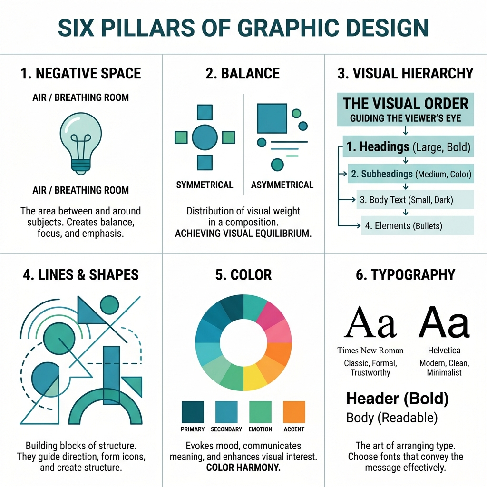
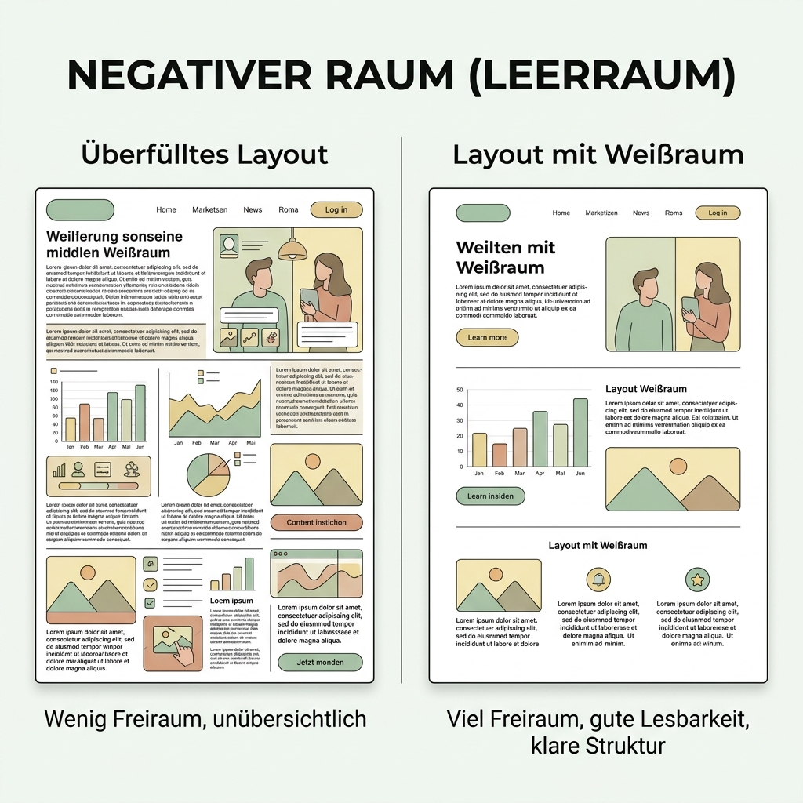
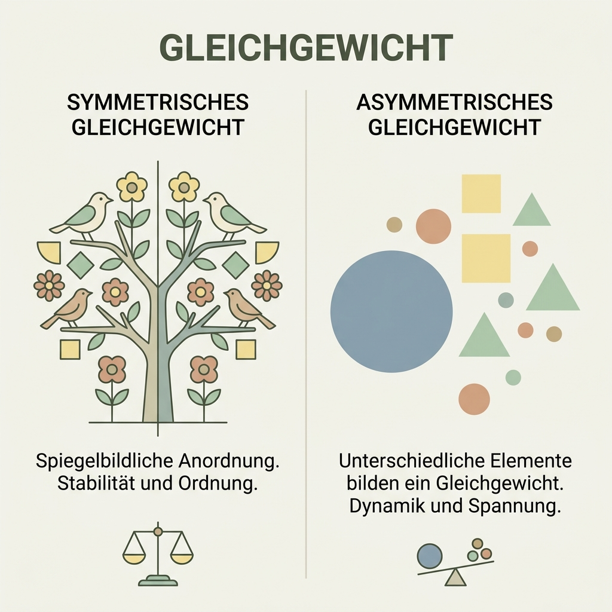
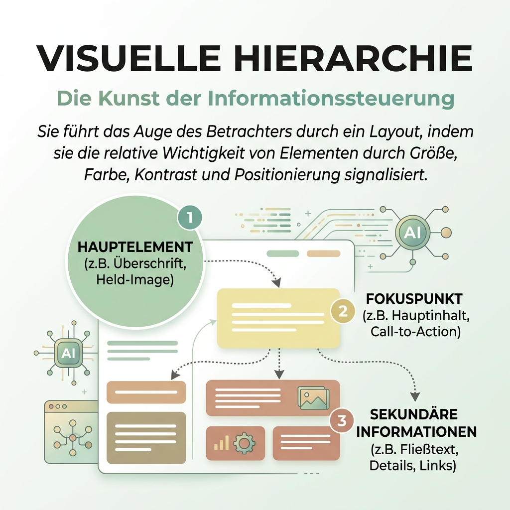
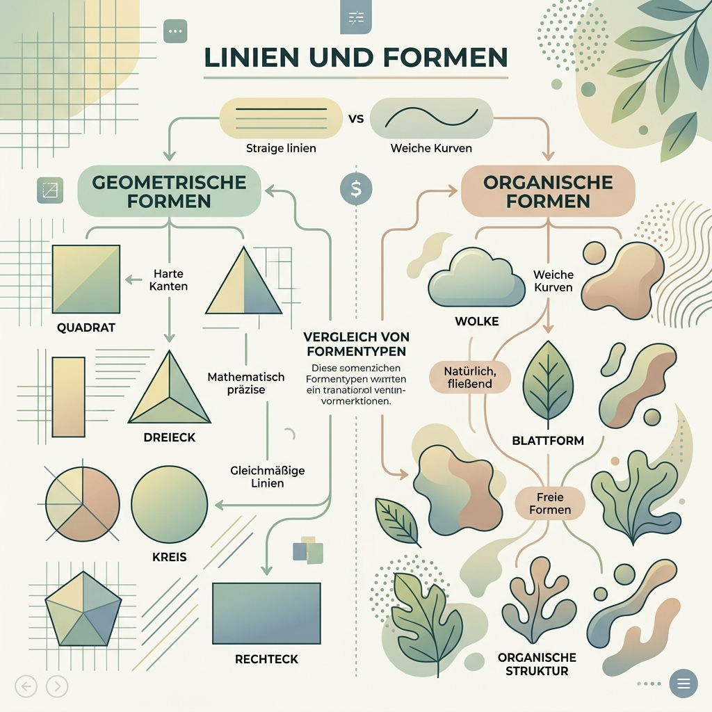
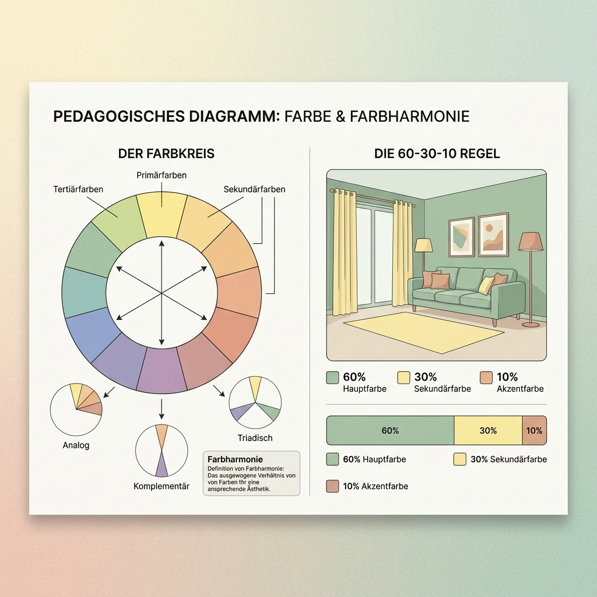
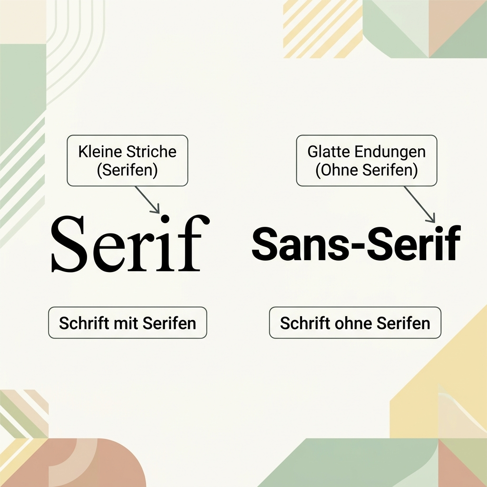
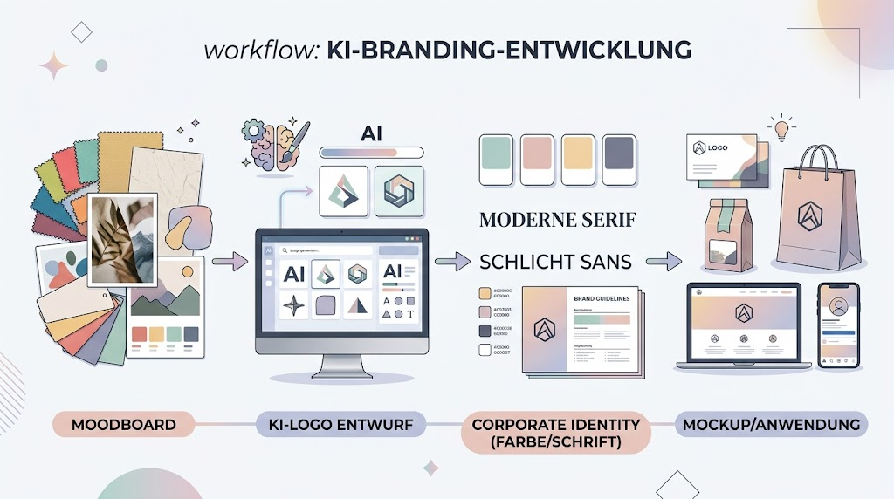
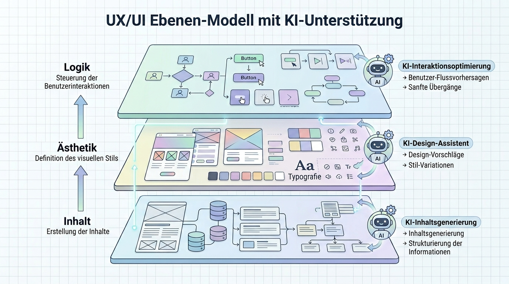

# Anleitung: Design & Branding-Workflows mit KI

## Zielbild
Dieses Modul baut auf dem klassischen **[Grafikdesign-Skript (PDF)](../02_templates/05%20-%20Grafikdesign.pdf)** auf und erweitert es um KI-gestützte Workflows. In diesem Modul lernen wir, wie man eine konsistente visuelle Identität (Branding) entwickelt, indem wir klassische Designregeln mit der Geschwindigkeit von KI-Tools kombinieren. Am Ende steht ein vollständiges Design-Paket: Logo, Farbwelt, Typografie und ein UI-Mockup.

---

## Unterrichtsskript

### Phase 1: Die Sprache der Gestaltung (Die 6 Säulen des Grafikdesigns)
Bevor wir Tools wie Midjourney, Claude oder Figma bedienen, müssen wir die Sprache des Designs verstehen. Eine KI ist nur so gut wie der Prompt, der sie steuert. Wer die grundlegenden Designprinzipien kennt, kann Ergebnisse nicht nur besser bewerten, sondern auch zielgerichtet steuern.

Hier sind die 6 fundamentalen Gestaltungsprinzipien detailliert aufgeschlüsselt:

1.  **Raum (Space / Negative Space):** 
    *   **Was ist es?** Der sogenannte "Weißraum" (Negative Space) ist der leere Raum zwischen, um und innerhalb von Elementen. 
    *   **Warum ist es wichtig?** Weißraum ist kein "verlorener Platz", sondern ein aktives Gestaltungselement. Er gibt dem Design "Luft zum Atmen", reduziert kognitive Überlastung und lenkt den Fokus des Betrachters auf das Wesentliche. Ein Design ohne Weißraum wirkt chaotisch und billig.
    *   **Wie anwenden?** Gruppiere zusammengehörige Elemente eng aneinander (Proximity) und nutze großzügigen Weißraum, um sie von anderen Gruppen abzugrenzen.
    
    

2.  **Balance:** 
    *   **Was ist es?** Die visuelle Ausgewogenheit eines Layouts. Es gibt formelle (symmetrische) und informelle (asymmetrische) Balance.
    *   **Warum ist es wichtig?** Ein unausgeglichenes Design erzeugt unterbewusst Unbehagen beim Betrachter. Balance sorgt für Stabilität und Harmonie.
    *   **Wie anwenden?** Bei symmetrischer Balance werden Elemente spiegelbildlich angeordnet (wirkt klassisch, seriös, statisch). Bei asymmetrischer Balance wird ein großes, schweres Element durch mehrere kleine, leichtere Elemente auf der anderen Seite ausgeglichen (wirkt modern, dynamisch, spannend).

    

3.  **Hierarchie:** 
    *   **Was ist es?** Die gezielte Lenkung des Auges. Sie bestimmt, in welcher Reihenfolge Informationen wahrgenommen werden.
    *   **Warum ist es wichtig?** Der Nutzer scannt Webseiten oder Plakate in Bruchteilen von Sekunden (oft im F- oder Z-Muster). Ohne klare Hierarchie weiß das Auge nicht, wo es anfangen soll.
    *   **Wie anwenden?** Das wichtigste Element (z.B. Headline oder Call-to-Action) muss den größten visuellen Kontrast haben – durch Größe, Farbe, Fettdruck oder Platzierung. Weniger wichtige Informationen ordnen sich optisch unter.

    

4.  **Linien und Formen:** 
    *   **Was ist es?** Die strukturellen Bausteine jedes Designs. Geometrische Formen (Kreise, Quadrate) vs. organische Formen (natürlich, unregelmäßig) sowie führende Linien.
    *   **Warum ist es wichtig?** Linien verbinden Elemente oder trennen sie voneinander. Formen wecken Assoziationen (Quadrate = Stabilität/Tech; Kreise = Harmonie/Gemeinschaft).
    *   **Wie anwenden?** Nutze Linien, um Rasterkreuze zu bilden oder den Blickverlauf zu steuern. Verwende weiche, abgerundete Formen für nahbare Marken und scharfe, eckige Formen für technische, dynamische Marken.

    

5.  **Farbe:** 
    *   **Was ist es?** Der bewusste Einsatz von Farbtönen zur Kommunikation. Hier greift die Farbenlehre (Farbkreis nach Itten) und die Farbpsychologie.
    *   **Warum ist es wichtig?** Farbe weckt als erstes Emotionen, bevor überhaupt ein Wort gelesen wird. Rot signalisiert Energie/Leidenschaft/Gefahr, Blau vermittelt Vertrauen/Seriosität, Grün steht für Natur/Wachstum/Nachhaltigkeit.
    *   **Wie anwenden?** Entwickle Farbpaletten basierend auf dem Farbkreis: Analog (benachbarte Farben, wirkt harmonisch), Komplementär (gegenüberliegende Farben, starker Kontrast), oder Triadisch (Dreieck im Farbkreis). Weniger ist oft mehr (60-30-10 Regel: 60% Primärfarbe, 30% Sekundärfarbe, 10% Akzentfarbe).

    

6.  **Typografie:** 
    *   **Was ist es?** Die Kunst der Textgestaltung. Sie umfasst die Auswahl von Schriftarten, Zeilenabständen und Laufweiten.
    *   **Warum ist es wichtig?** Text ist die direkteste Form der Kommunikation. Die falsche Schriftart kann die Botschaft komplett zerstören (z.B. Comic Sans für ein Anwaltsbüro).
    *   **Wie anwenden?** Beschränke Dich auf 1-2 Schriftarten. Kombiniere z.B. eine traditionelle *Serif*-Schrift (mit Füßchen, wie Times New Roman – wirkt klassisch, intellektuell) für Fließtext mit einer *Sans-Serif*-Schrift (ohne Füßchen, wie Helvetica – wirkt modern, clean) für Überschriften. Weitere Kategorien sind *Script* (Schreibschrift, elegant) und *Decorative* (Zierschriften, nur sparsam für Logos einsetzen).

    

*   **Diskussion:** Warum funktionieren Logos wie das von Apple oder Nike über Jahrzehnte? (Antwort: Radikale Reduktion auf die Essenz – perfekter Einsatz von Formen und Weißraum, Loslösung von kurzlebigen Trends).
*   **Aufgabe 1: Analyse der Design-Prinzipien:** Suche ein bestehendes Design (z.B. die Website von Apple oder Stripe) und analysiere es: Wie wird das Auge gelenkt (Hierarchie)? Wo sorgt Weißraum für Struktur? Welche Emotionen wecken die Farben?
*   **Lernziel:** Die Fähigkeit, Design nicht nur nach "gefällt mir" zu beurteilen, sondern handwerkliche Entscheidungen zu erkennen. Dieses Vokabular ist essenziell, um später Bildgeneratoren (Midjourney) oder Layout-KIs präzise zu steuern.

### Phase 2: Brand Discovery (Moodboarding mit KI)

Wir nutzen KI, um die "Seele" einer Marke zu definieren.
*   **Tools:** ChatGPT/Claude (für Konzepte), Midjourney/Flux (für Moods).
*   **Aufgabe 2: Das KI-Moodboard:** Generiere 4 Bilder, die die Stimmung einer Marke für "nachhaltigen Luxus" beschreiben. Achte auf konsistente Texturen und Farben.
*   **Lernziel:** Abstraktion von Werten in visuelle Stimmungen.

### Phase 3: Logo Prototyping & Vektorisierung
Vom Prompt zum professionellen Logo.
*   **Workflow:**
    1.  **Ideation**: Nutze spezialisierte Logo-Prompts in Midjourney.
    2.  **Refinement**: Nutze Upscaling und Inpainting für Details.
    3.  **Vektorisierung**: Umwandlung in Pfade mittels **Adobe Firefly** oder **Vectorizer.ai**.
*   **Aufgabe 3: Das 10-Minuten-Logo:** Erstelle ein minimalistisches Logo für ein Start-up und wandle es in eine skalierbare Vektordatei um.
*   **Lernziel:** Beherrschung der Kette von Raster (KI) zu Vektor (Produktion).

### Phase 4: Corporate Identity & Design System (Farbe & Typografie)
Systematisierung des Designs in eine professionelle Vorgabe.
*   **Tools:** **Huemint**, **Canva Magic Studio**, **Adobe Color**, **Claude Design**, **Figma**.
*   **Aufgabe 4: Die Designvorlage (Design System / UI Kit):** Definiere Primär- und Sekundärfarben (unter Berücksichtigung der in Phase 1 gelernten Farbpsychologie) sowie eine harmonische Font-Paarung (z.B. Serif für Überschriften, Sans-Serif für Fließtext), die zum Logo aus Phase 3 passt. 
    Führe diese Elemente in einer professionellen **Designvorlage (Design System / UI Kit)** zusammen. Dies entspricht modernen Workflows, wie sie durch Claude Design (Artifacts) oder in Figma State of the Art sind.
*   **Lernziel:** Erstellung eines kohärenten, skalierbaren Design-Systems (Single Source of Truth für Gestaltung).

### Phase 5: UI/UX & Layouting (Mockups)

Anwendung des Designs auf digitale Produkte.
*   **Tools:** **Figma AI**, **Canva**, **Uizard**.
*   **Aufgabe 5: Das Landing-Page Mockup:** Entwirf eine Hero-Section für eine Website unter Nutzung deines Logos und Farbschemas. Nutze KI für Platzhaltertexte und passende Bilder (Referenz: [Bilderzeugung](../bilderzeugung/)).
*   **Lernziel:** Anwendung von Design-Systemen auf komplexe Layouts.

### Phase 6: Mockups & Präsentation
Das Design in der "echten Welt".
*   **Aufgabe 6: Das Product-Reveal:** Setze dein Logo auf ein physisches Produkt (Mockup), z.B. eine Kaffeetasse oder ein Smartphone. Nutze dafür Inpainting-Techniken aus dem Bilderzeugungs-Modul.
*   **Lernziel:** Professionelle Präsentation von Design-Ergebnissen.

---

## Hausaufgabe
Erstelle eine einseitige "Brand Identity Card" für ein fiktives Unternehmen. Sie muss enthalten: Logo (Vektor), Farbcodes (HEX), Schriftarten und ein Anwendungsbeispiel (Mockup). Dokumentiere, an welchen Stellen die KI den Prozess beschleunigt hat.
