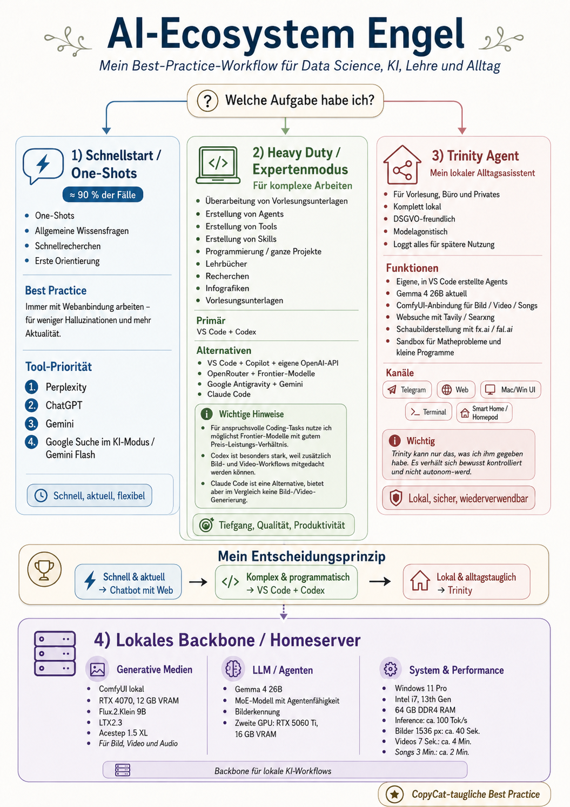
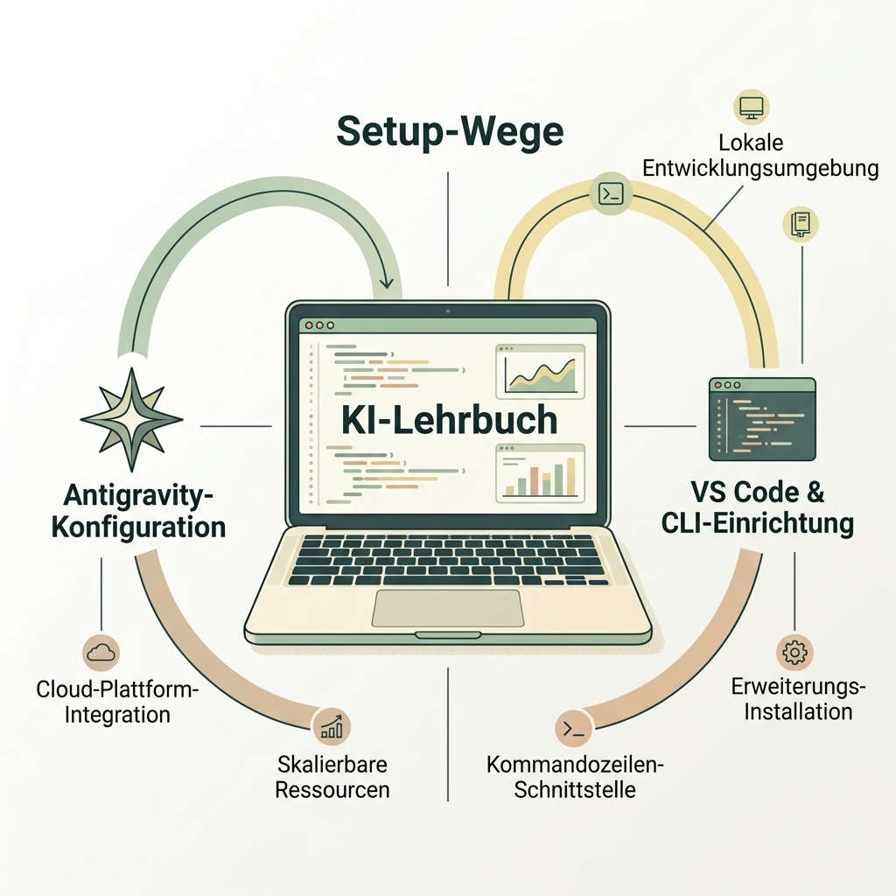
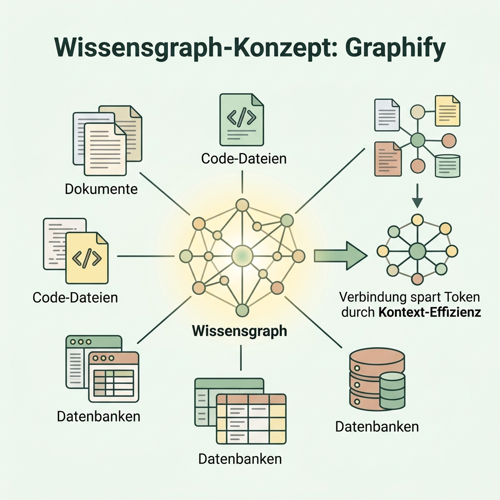
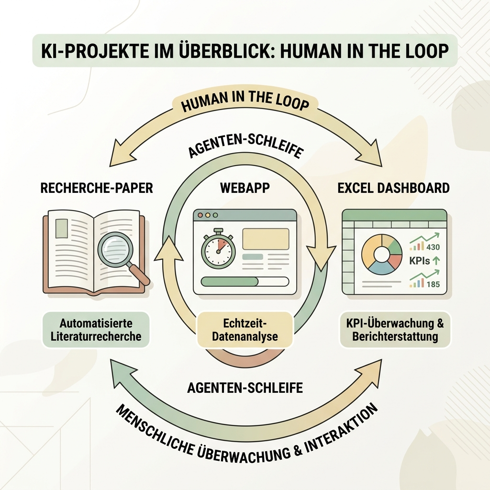

# Vorlesungsbegleiter: Agents Desktop (Master Guide)

Dieses Dokument ist dein ultimativer Begleiter durch das Modul "Agents Desktop". Wenn du diesen Guide vollständig durchgearbeitet hast, bist du in der Lage, deinen Rechner in ein KI-Labor zu verwandeln. Du wirst verstehen, wie du Agenten-Tools konfigurierst, semantische Kontexte aufbaust und echte, wertschöpfende Projekte (wie Dashboards, Web-Apps oder Recherchen) von KI-Agenten autonom erstellen lässt – stets mit dir als Dirigent ("Human-in-the-Loop").

---

## 🌟 Best Practice: Das AI-Ecosystem Engel

Bevor wir in das Setup einsteigen, möchte ich euch mein persönliches KI-Ökosystem vorstellen. Dies dient als Inspiration und "Best Practice" für euren eigenen Workflow. Es zeigt, dass man für unterschiedliche Aufgabenstellungen auch unterschiedliche Werkzeuge benötigt – vom schnellen Cloud-Chatbot bis zum komplett lokalen, autonomen Backend.

> **🖥️ Factbox: Der Hardware-Backbone (Infrastruktur)**
> Um ein lokales Ökosystem (wie Trinity und ComfyUI) reibungslos zu betreiben, setze ich auf einen dedizierten Homeserver. 
> - **System:** Windows 11 Pro, Intel i7 (13. Gen.), 64 GB DDR4 RAM
> - **GPU 1 (Multimedia):** RTX 4070 (12 GB VRAM) für lokales ComfyUI (Flux2.Klein 9B, LTX 2.3, Acestep 1.5 XL). Generiert Bilder (1536px) in ~40 Sek, Videos in ~7 Sek/4 Min, Songs in ~3 Min/2 Min.
> - **GPU 2 (Inferenz):** RTX 5060 TI (16 GB VRAM) betreibt aktuell **Gemma 4 26B** (MoE, Agentenfähigkeit, Bilderkennung) mit extrem schnellen ~100 Tokens/Sekunde.

---

# 🛠️ PHASE 1: Setup & Tooling – Dein Agenten-Workspace

Bevor wir komplexe Projekte umsetzen, müssen wir unsere Arbeitsumgebung einrichten. Wir teilen diesen Bereich in zwei Tracks auf. Wähle den Track, der zu deinen Lizenzen und Präferenzen passt.

## Track A: Antigravity (Für Google Abonnenten)
Antigravity ist Googles Agenten-Umgebung, tief integriert in das System. 
1. **Installation**: Installiere die Antigravity-Anwendung.
2. **Konfiguration**: Melde dich mit deinem Google-Account an.
3. **Fähigkeiten**: Antigravity erlaubt es dir, durch `.md` Dateien Regeln für Agenten ("Skills") vorzugeben und das System Dateien auf deinem Rechner lesen und schreiben zu lassen.

## Track B: VS Code, Copilot & CLI (Für alle anderen)
Wer flexibel bleiben möchte oder eigene API-Keys nutzt, baut sich sein Agenten-Labor in **Visual Studio Code** zusammen.

### 1. GitHub Copilot & OpenAI Kompatibilität
- Installiere in VS Code die reguläre Erweiterung **"GitHub Copilot Chat"**.
- Installiere die Erweiterung **"OAI Compatible Provider for Copilot"** von *Johnny Zhao*. 
- **Warum?** Diese Erweiterung erlaubt es dir, Copilot Chat nicht nur mit den Standard-Modellen von Microsoft/GitHub zu betreiben, sondern deine eigenen API-Keys (z.B. OpenAI, OpenRouter, lokale Modelle) einzubinden.

### 2. Codex & ClaudeCode CLI
- **Codex**: Wir integrieren reine Code-Agenten, die sich stark auf das Entwickeln fokussieren.
- **ClaudeCode CLI**: Installiere das Anthropic-Tool für die Kommandozeile (`npm install -g @anthropic-ai/claude-code`). Damit holst du dir einen Chatbot direkt ins Terminal, der Befehle ausführen, Code lesen und Dateien bearbeiten kann.

---

# 🧠 PHASE 2: Agentic Workflows & Graphify

Herkömmliche LLMs beantworten Fragen basierend auf ihrem Trainingswissen. **Agenten (Agents)** hingegen haben Tools: Sie können im Web suchen, Terminal-Befehle ausführen, Dateien lesen und schreiben. 

## Wie Agenten denken (Reasoning)
Agenten durchlaufen einen iterativen Prozess (ReAct: Reason, Act, Observe):
1. Sie planen das Vorgehen (Plan).
2. Sie nutzen ein Werkzeug, z.B. Lesen einer Datei (Action).
3. Sie bewerten das Ergebnis (Observation) und passen ihre nächste Aktion an.

## Das Kontext-Problem & Graphify
Wenn ein Projekt wächst, ist es zu teuer und ineffizient, dem Agenten immer alle Dateien in den Prompt zu kopieren. 
**Die Lösung:** Wir nutzen [Graphify](https://graphify.net/).

### Was ist Graphify?
Graphify vernetzt die Inhalte deines Projekts semantisch in einem Wissensgraphen (Knowledge Graph). Dadurch muss der Agent nicht mehr tausende Zeilen Code oder Text lesen, sondern traversiert den Graphen. **Das spart bis zu 70% der Tokens!**

### 📝 Übung: Graphify lokal installieren und nutzen
1. Öffne dein Terminal im aktuellen Projektordner.
2. Installiere Graphify (z.B. via `pip install graphify`).
3. Führe den Initialisierungsbefehl aus (z.B. `graphify update .`), um dein Verzeichnis zu scannen und den Graphen aufzubauen (oft abgelegt unter `graphify-out/`).
4. **Test**: Nutze das ClaudeCode CLI oder Antigravity, um eine Frage zur Architektur deines Projekts zu stellen. Der Agent nutzt nun den Knowledge Graph, anstatt blind per `grep` zu suchen.

---

# 🚀 PHASE 3: Praxis-Labor (Agentic Projects)

Jetzt, wo das Labor steht und Graphify den Kontext sichert, bauen wir eigene Projekte. Du bist der "Human-in-the-Loop" (HITL): Du steuerst, delegierst und korrigierst, während die Agenten die Fleißarbeit erledigen.

### 📝 Projekt A: Das Recherche-Paper (Web-Recherche & HITL)
**Ziel:** Ein sauber gegliedertes Paper oder Essay durch orchestrierte Agenten erstellen lassen.
**Material:** Kein externes Material nötig, der Agent nutzt seine Web-Recherche-Tools (z.B. in Antigravity oder ClaudeCode).

**Der Prompt (Copy & Paste für deinen Agenten):**
> "Recherchiere umfassend zum Thema 'Auswirkungen von KI auf die universitäre Lehre bis 2030'. Führe eine Web-Suche durch, um aktuelle Quellen und Diskussionen zu finden. Erstelle mir im ersten Schritt nur eine strukturierte Gliederung für ein 3-seitiges Essay inkl. einer vorläufigen Quellenliste. Warte auf mein Feedback, bevor du anfängst zu schreiben."

**Schritt-für-Schritt Ablauf:**
1. **Ordner erstellen:** Erstelle auf deinem PC/Mac einen neuen Ordner namens `Paper-Recherche`.
2. **IDE öffnen:** Öffne VS Code (oder Antigravity) und lade diesen Ordner als deinen Workspace.
3. **Initiale Datei:** Erstelle manuell eine Datei namens `Anforderungen.md` und kopiere den obigen Prompt dort hinein.
4. **Agenten starten:** Öffne den Agenten-Chat (Copilot/ClaudeCode) und weise ihn an: "Lies die Datei `Anforderungen.md` und starte die Aufgabe."
5. **Review:** Der Agent präsentiert dir im Chat (oder in einer neuen Datei `Gliederung.md`) seine gefundenen Quellen und den Aufbau.
6. **Iteration (HITL):** Optimiere die Gliederung, z.B. "Füge Kapitel 3.1 KI-Ethik hinzu und verwerfe Punkt 4".
7. **Ausführung:** Bitte den Agenten: "Schreibe nun das vollständige Paper auf Basis der finalen Gliederung in eine neue Datei `Paper.md`."

### 📝 Projekt B: Die kleine interaktive WebApp
**Ziel:** Ohne eigenes Coden eine voll funktionsfähige Applikation bauen.
**Material:** Dein lokales Projektverzeichnis (Agent muss Schreibrechte haben).

**Der Prompt (Copy & Paste für deinen Agenten):**
> "Erstelle in meinem aktuellen Verzeichnis eine kleine Single-Page WebApp bestehend aus `index.html`, `style.css` und `app.js`. Es soll ein interaktiver Pomodoro-Timer werden. Die Nutzer sollen Arbeits- (25 Min) und Pausenzeiten (5 Min) starten, pausieren und resetten können. Nutze für das Design modernes 'Glassmorphism' mit einer beruhigenden Farbpalette. Setze sauberen, gut kommentierten Code ein."

**Schritt-für-Schritt Ablauf:**
1. **Ordner erstellen:** Erstelle auf deinem PC/Mac einen Ordner namens `Pomodoro-App`.
2. **IDE öffnen:** Öffne diesen Ordner in VS Code.
3. **Prompting:** Öffne den Agenten-Chat und gib den obigen Prompt ein.
4. **Dateien generieren:** Der Agent wird die Dateien `index.html`, `style.css` und `app.js` in deinem Ordner erstellen. Bestätige die Schreibrechte (Accept).
5. **Testen:** Navigiere in deinem Datei-Explorer (Finder/Windows Explorer) zu dem Ordner und mache einen Doppelklick auf `index.html`. Die App öffnet sich im Browser.
6. **Korrektur (HITL):** Gehe zurück in die IDE. Sage dem Agenten im Chat: "Ändere in der `style.css` die Hintergrundfarbe auf dunkelblau und mache den Button rund." Lade danach den Browser neu, um das Ergebnis zu sehen.

### 📝 Projekt C: Dashboard-HTML aus einer Excel-Auswertung
**Ziel:** Komplexe Datenanalyse und Visualisierung in einem interaktiven Dashboard.
**Material:** Die Datei `BI_Demounternehmen.xlsx`
*(URL für den Agenten: `https://raw.githubusercontent.com/ProfEngel/datasets/main/BI_Demounternehmen.xlsx`)*

**Der Prompt (Copy & Paste für deinen Agenten):**
> "Lade die Excel-Datei unter `https://raw.githubusercontent.com/ProfEngel/datasets/main/BI_Demounternehmen.xlsx` herunter. Analysiere die Datenstruktur mittels Python/Pandas. Erstelle anschließend eine eigenständige `dashboard.html`-Datei. Extrahiere die relevanten Datenströme (z.B. Umsatz nach Regionen, Top-Produkte, Gewinnmargen) als JSON direkt in die HTML-Datei und visualisiere diese mit der Bibliothek Chart.js. Füge oben im Dashboard 3 KPI-Cards (Gesamtumsatz, Bester Kunde, Top Produkt) hinzu."

**Schritt-für-Schritt Ablauf:**
1. **Ordner erstellen:** Erstelle einen Ordner namens `Excel-Dashboard` und öffne ihn in VS Code.
2. **Daten-Download:** Bitte den Agenten im ersten Schritt: "Lade die Datei `https://raw.githubusercontent.com/ProfEngel/datasets/main/BI_Demounternehmen.xlsx` in diesen Ordner herunter" (Alternativ: manuell herunterladen und in den Ordner ziehen).
3. **Prompting:** Kopiere den obigen Haupt-Prompt in den Agenten-Chat. Der Agent analysiert die Excel-Datei (meist via Python/Pandas im Hintergrund).
4. **HTML Generierung:** Der Agent schreibt das extrahierte Wissen (JSON-Daten) und den Visualisierungs-Code direkt in eine neue Datei `dashboard.html`. Bestätige den Schreibvorgang.
5. **Ergebnis prüfen:** Öffne die `dashboard.html` mit einem Doppelklick im Browser.
6. **Refinement (HITL):** Das Dashboard ist meist beim ersten Mal nicht perfekt. Gehe in den Chat: "Mach das Layout responsiv" oder "Tausche das Bar-Chart für den Umsatz gegen ein Pie-Chart". Lade den Browser danach neu.

---

## 🛡️ Best Practices für Agentic Coding
1. **Git Commits:** Wenn Agenten Dateien schreiben, mache regelmäßig Commits. Falls der Agent etwas zerstört, kannst du sofort zurückrollen.
2. **Kleine Schritte:** Sage nicht: "Baue mir Amazon nach." Sage: "Erstelle die Grundstruktur. Okay, jetzt baue den Login. Okay, jetzt baue den Warenkorb."
3. **Graphify aktuell halten:** Wenn du oder der Agent viele Dateien geändert hat, führe `graphify update .` erneut aus, damit der Graph nicht veraltet.

---
[[Projekt_KI_VL]]
