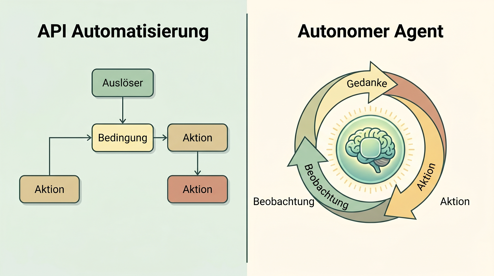

# Vorlesungsbegleiter: Agents To-Go & Low-Code

Dieser Vorlesungsbegleiter führt uns von der deterministischen Prozessautomatisierung hin zu autonomen, probabilistischen Agentensystemen.

## 1. Vom Chatbot zum Agenten (Die 5 Stufen der KI)
Die Evolution der KI vollzieht sich in Stufen:
1. **Chatbots (System 1):** Flexible Gesprächspartner, probabilistisch, oft ungenau.
2. **Reasoners (System 2):** "Think before you speak" (z.B. OpenAI o1). Sie durchdenken komplexe Probleme (Chain-of-Thought), bevor sie antworten.
3. **Agents:** Hier befinden wir uns jetzt. Agenten generieren nicht nur Text, sie **handeln**. Sie nutzen Werkzeuge, surfen im Internet und bedienen Programme.

## 2. Infrastruktur der Automatisierung (n8n & APIs)
Die Business Process Automation (BPA) bildet das Rückgrat der Wirtschaft.
- **API:** Der "Kellner", der Bestellungen standardisiert in die Küche trägt und das Essen zurückbringt (meist als JSON-Daten).
- **Webhook:** Ein "Briefkasten" (Push-Prinzip). Anstatt ständig bei einer API nachzufragen ("Ist ein neues Paket da?"), schickt der Webhook sofort eine Nachricht, wenn etwas passiert.
- **n8n:** Eine visuelle Low-Code-Plattform. Wir können LLMs hier als **intelligente Router** einsetzen: Wenn eine E-Mail ankommt (Webhook), liest das LLM sie und entscheidet, ob ein Support-Ticket angelegt oder direkt geantwortet wird.

*(Schaubild: Der Unterschied zwischen einem starren n8n API-Workflow und einem autonomen Agentic Loop)*

## 3. Der ReAct-Loop & MCP
Das Herzstück eines echten Agenten ist der **ReAct-Loop** (Reasoning + Acting):
1. **Thought:** Was ist das Problem? Welches Tool brauche ich?
2. **Action:** Führe das Tool aus (z.B. Google-Suche).
3. **Observation:** Lese das Ergebnis des Tools.
*(Beginne wieder bei Schritt 1, bis das Ziel erreicht ist).*

### Das Model Context Protocol (MCP)
Früher mussten wir für jedes Programm eine eigene Schnittstelle für die KI schreiben. Anthropic hat **MCP** als offenen Standard eingeführt – den "USB-C-Stecker" für KI. Damit kann ein Agent (z.B. Claude) direkt und sicher auf lokale Tabellen, deinen Kalender oder GitHub zugreifen, ohne dass du Daten hochladen musst.

## 📝 Laborübungen (Auszug)
1. **System 1 vs. 2:** Teste ein Logikrätsel ("Schläger und Ball kosten 1,10€...") mit Llama 3 (System 1) und DeepSeek-R1 (System 2). Vergleiche die "Thought"-Logs.
2. **Der LLM Router in n8n:** Sende einen Text via Postman an einen n8n Webhook. Lass einen KI-Node analysieren, ob der Text "wütend" oder "neutral" ist, und route ihn weiter.
3. **MCP Action:** Konfiguriere deinen lokalen Agenten (z.B. Antigravity) über die `mcp.json` so, dass er auf einen lokalen Ordner zugreifen kann, und lass ihn eine dort liegende Excel-Tabelle analysieren.

---
[[Projekt_KI_VL]]
