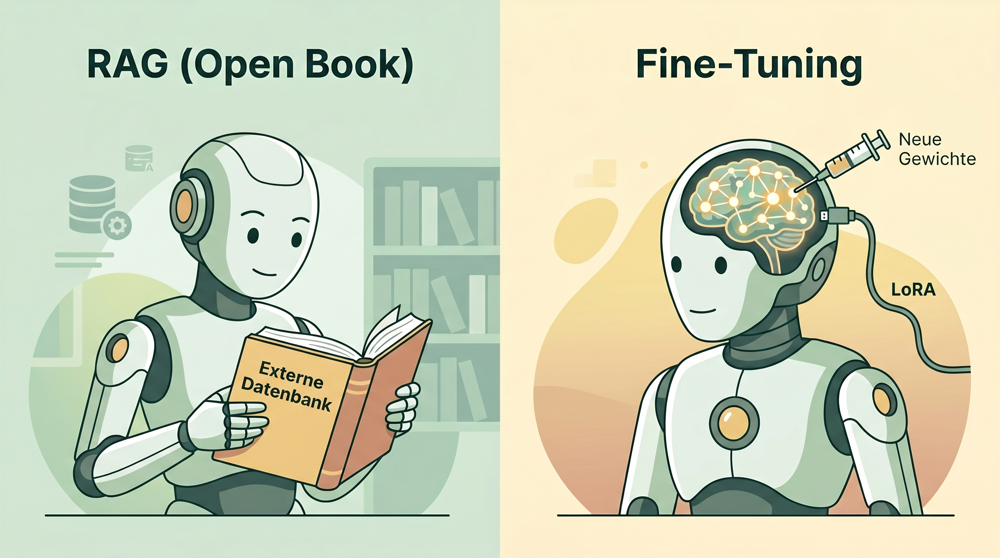

# Vorlesungsbegleiter: Fine-Tuning & LoRA

## 1. Das Dilemma: RAG oder Fine-Tuning?
Oft wird geglaubt, man müsse ein Modell mit den eigenen Unternehmensdaten "neu trainieren" (Fine-Tuning), damit es firmenspezifische Fragen beantworten kann. Das ist heutzutage meist falsch und ineffizient.
- Wenn Sie wollen, dass die KI die **aktuelle Urlaubsregelung** kennt, nutzen Sie **RAG**.
- Wenn Sie wollen, dass die KI auf Beschwerden im exakten **Corporate Tone of Voice** des Unternehmens antwortet, nutzen Sie **Fine-Tuning**.

*(Schaubild: Der Unterschied zwischen der Nutzung einer externen Datenbank (RAG) und dem Einspritzen neuen Wissens in das neuronale Netz)*

## 2. LoRA: Demokratisierung des Fine-Tunings
Vollständiges Fine-Tuning kostet Millionen. **LoRA (Low-Rank Adaptation)** ist ein mathematischer Trick: Das Basis-Modell wird "eingefroren" (es kann nichts mehr vergessen). Darauf wird eine kleine, trainierbare Schicht gelegt.
Das Ergebnis ist ein "Adapter" (eine kleine Datei von wenigen Megabyte), den man dem Basis-Modell bei Bedarf einfach "aufsetzt". 

## 3. Die Kunst der Datenerstellung (JSONL)
Die größte Herausforderung beim Fine-Tuning ist nicht der Code, sondern die Beschaffung von hunderten hochwertigen `User-Assistant` Interaktionen.
- **Tipp:** Nutzen Sie starke Modelle (wie GPT-4o), um synthetische Trainingsdaten im JSONL-Format zu generieren, mit denen Sie dann ein kleines, lokales Open-Source-Modell (z.B. Llama 3 8B) kostengünstig trainieren ("Knowledge Distillation").

## 📝 Laborübungen (Auszug)
1. **JSONL Inspektion:** Öffne einen bereitgestellten Datensatz im `.jsonl` Format und untersuche die `system`, `user` und `assistant` Rollen.
2. **OpenTune Weaver (Demo):** Begutachte die Oberfläche eines Fine-Tuning-Tools. Wir starten (als Demo) einen LoRA-Trainingslauf mit einem 50-Zeilen Datensatz und analysieren die Loss-Kurve (Fehlerrate), die mit jeder Epoche sinken sollte.

---
[[Projekt_KI_VL]]
