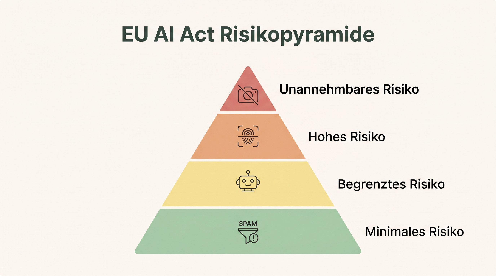

# Vorlesungsbegleiter: Ethik & Governance

## 1. Bias: Die Schatten der Vergangenheit
Bias (Verzerrung) bedeutet, dass ein KI-System systematische Vorurteile reproduziert oder verstärkt, die bestimmte demografische Gruppen, Geschlechter oder Kulturen benachteiligen.
- Das Internet ist kein objektiver Spiegel der Realität. Es ist historisch von bestimmten Perspektiven dominiert.
- Ein klassisches Beispiel: Das gescheiterte Recruiting-Tool von Amazon, das weibliche Bewerber systematisch benachteiligte, weil es aus 10 Jahren männerdominierten historischen Einstellungsdaten gelernt hatte. Die KI extrapolierte sexistische Präferenzen der Vergangenheit in die Zukunft.

### 📝 Übung: Bias aufdecken
Lass ein LLM eine extrem kurze, anonyme Beurteilung über einen "Top-CEO" und eine "erfolgreiche Erziehungskraft in der Kita" schreiben. Analysiere die verwendeten Adjektive auf geschlechtsspezifische Stereotypen.

## 2. Der EU AI Act (Risikopyramide)
Europa reguliert KI nach einem risikobasierten Ansatz (Risk-Based Approach). Je höher das Risiko für Grundrechte, desto strenger die Auflagen:

*(Schaubild: Die 4 Risikostufen des EU AI Acts)*

1. **Inakzeptables Risiko (Verboten):** Social Scoring, unterschwellige Manipulation, biometrische Massenüberwachung.
2. **Hohes Risiko (Streng reguliert):** KI im Recruiting, Kreditvergabe, kritische Infrastruktur (Human Oversight und Bias-Tests zwingend).
3. **Begrenztes Risiko (Transparenzpflicht):** Generative KI, Chatbots. Der Nutzer muss wissen, dass er mit einer Maschine spricht. Wasserzeichen für Deepfakes.
4. **Minimales Risiko:** Spam-Filter. (Keine Sonderregulierung).

## 3. Schatten-KI & Corporate Governance
Die größte Gefahr für die Datensicherheit ist der gutgläubige Mitarbeiter. Wenn die IT keine sicheren, gekapselten Enterprise-Lösungen (z.B. Azure OpenAI) bereitstellt, weichen Mitarbeiter aus ("Schatten-KI"). Sie laden vertrauliche Bilanzen bei kostenlosem ChatGPT hoch, wodurch Unternehmensgeheimnisse als Trainingsdaten in die USA abfließen.

### 📝 Übung: Erstellung einer AI Policy
Versetze dich in die Rolle eines "AI Compliance Officers". Schreibe eine "Acceptable Use Policy" (AUP) mit Ampelsystem (welche Daten dürfen in welche Tools?). Erkläre deinen Mitarbeitern, warum der Datenabfluss kritisch ist. Nutze KI, um deinen Entwurf in sauberes "Corporate Wording" zu übersetzen.

---
[[Projekt_KI_VL]]
