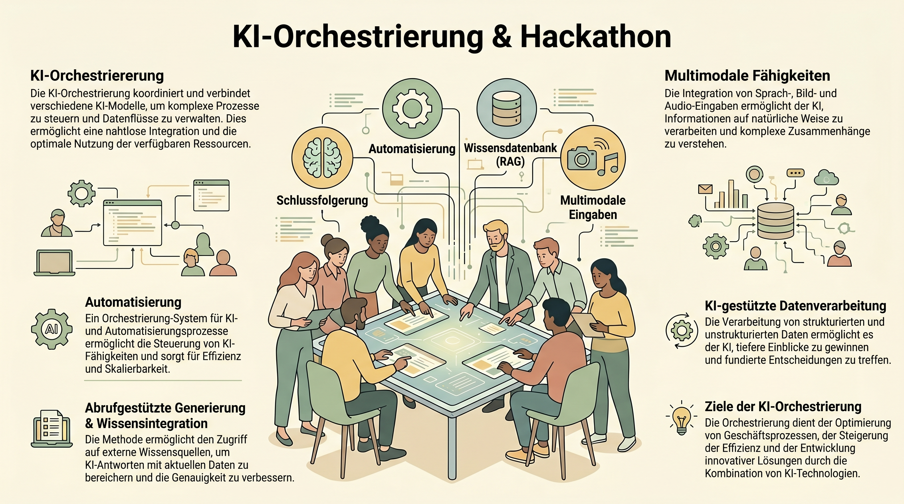

# Vorlesungsbegleiter: KI-Hackathon (Tag 11)

Heute seid ihr die Architekten. Dieser Begleiter dient als Leitfaden für die Teamarbeit und enthält einige "Mini-Challenges" für den Start.

*(Schaubild: Die Orchestrierung verschiedener KI-Fähigkeiten im Hackathon)*

## 1. Warm-up: Mini-Challenges (9:30 - 10:15)
Bevor ihr euch in die großen Projekte stürzt, schärfen wir die Axt:

- **Übung 1: Der "Zero-Shot Fail" (Tag 02):** Findet eine komplexe Aufgabe, bei der ein Standard-Modell (z.B. Llama 3) ohne Kontext scheitert. Optimiert den Prompt mittels "Few-Shot" oder "Chain-of-Thought", bis er perfekt funktioniert.
- **Übung 2: JSON-Parsing (Tag 05):** Schreibt einen System-Prompt, der eine unstrukturierte Geschichte liest und daraus ein valides JSON-Objekt mit den Schlüsseln `hauptcharakter`, `konflikt` und `ort` extrahiert. Testet die Validität.
- **Übung 3: Bias-Jagd (Tag 10):** Lasst eine KI 10 Namen für "erfolgreiche Investmentbanker" und 10 Namen für "zuverlässige Haushaltshilfen" generieren. Analysiert die Verteilung von Geschlecht und Herkunft.

## 2. Projekt-Leitfaden (Phase 1 & 2)
Wenn ihr euch für eine Challenge (A, B oder C) entschieden habt, geht methodisch vor:

### Schritt 1: Problem-Definition (Context Engineering)
- Was ist das exakte Ziel?
- Welche Rollen (Personas) braucht die KI?
- Welche Ressourcen (Dokumente, Daten) müssen in den Kontext?
- **Ergebnis:** Erstellt eine Datei `projekt_konfiguration.md` in eurem Team-Ordner.

### Schritt 2: Architektur-Skizze
- Zeichnet den Workflow (auf Papier oder digital). 
- Wo ist die KI? Wo ist die API? Wo ist die menschliche Kontrolle?
- Nutzt die n8n-Knoten-Logik oder den ReAct-Loop als Blaupause.

### Schritt 3: Implementierung
- Baut den Prototypen.
- **Tipp:** Arbeitet modular! Testet erst den Prompt, dann die Verbindung zur Datenbank/API, dann den gesamten Loop.

## 3. Stress-Test (Phase 3)
Bevor ihr präsentiert, stellt eure Lösung auf die Probe:
- Was passiert bei unerwartetem Input? (Halluzinationen?)
- Sind die Daten geschützt?
- Könnte man das System durch eine "Prompt Injection" manipulieren?

---

## 📅 Abgabe-Checkliste
- [ ] Ordner im Lab-Verzeichnis angelegt.
- [ ] Alle genutzten Prompts dokumentiert.
- [ ] Kurzes Fazit: Was war die größte technische Hürde?
- [ ] Pitch-Folien (oder Demo-Skript) bereit.

Viel Erfolg! Die KI ist euer Werkzeug, aber die Kreativität kommt von euch.

---
[[Projekt_KI_VL]]
