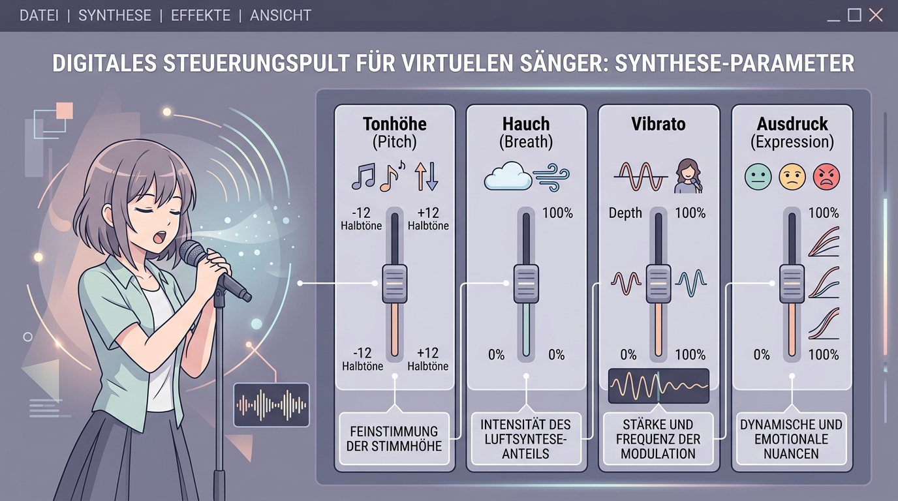

# Anleitung: Professionelle Songerzeugung mit KI

## Zielbild
Dieses Modul führt von der ersten Idee eines Songs über die automatisierte Generierung hin zur hochpräzisen Steuerung virtueller Sänger und komplexer Partituren. Wir nutzen sowohl cloudbasierte "One-Click"-Tools als auch lokale Node-basierte Workflows.

---

## Unterrichtsskript

### Phase 1: Die Anatomie des Klangs (Was ist ein Lied?)
Bevor wir die KI "rechnen" lassen, müssen wir die Sprache der Musik verstehen.
*   **Diskussion:** Was macht einen Song zum Hit? Ist es die Melodie oder der Rhythmus?
*   **Aufgabe 1: Genre-Analyse:** Wähle 3 Genres (z.B. Cyberpunk-Techno, Akustik-Folk, Cinematic-Orchestral) und beschreibe ihre typischen Merkmale (BPM, Instrumentierung).
*   **Lernziel:** Verständnis der Parameter, die wir später in Prompts übersetzen.

### Phase 2: Der schnelle Song (Entry Level Tools)
Wir nutzen Tools, die Text-Prompts direkt in fertige Audio-Dateien (inkl. Gesang) verwandeln.

> [!TIP] Prompt-Vorlagen
> Nutze unsere spezialisierten **[Prompt-Vorlagen](./PromptVorlagen.md)** und **[System-Prompts](./System_Prompts.md)**, um aus Referenzsongs professionelle KI-Prompts zu generieren.

*   **Tools:** **Suno**, **Mozart AI**, **Audimee**.
*   **Aufgabe 2: Der 30-Sekunden-Jingle:** Erzeuge einen kurzen Werbe-Song für ein fiktives Produkt.
*   **Aufgabe 3: Voice-Transfer:** Nutze **Audimee**, um eine bestehende Melodie mit einer neuen (geklonten) Identität zu versehen.
*   **Lernziel:** Schnelle Erfolgserlebnisse und Verständnis von Audio-Identität.

### Phase 3: Lokale Kontrolle (ComfyUI AceStep1.5 XL)
Wir verlassen die Cloud und nutzen lokale Rechenpower für maximale Kontrolle.
*   **Tool:** **ComfyUI AceStep1.5 XL** (Node-based Workflow).
*   **Aufgabe 4: Der Node-Song:** Baue einen Workflow in ComfyUI auf, der Audio-Segmente basierend auf Seed-Werten variiert.
*   **Lernziel:** Verständnis der latenten Audio-Generierung und lokaler Ressourcenverwaltung.

### Phase 4: Die virtuelle Stimme (Vocal Synthesis)
Für professionelle Produktionen reichen einfache Generatoren nicht aus. Wir brauchen volle Kontrolle über die Performance.

*   **Tools:** **ACE Studio**, **Synthesizer V**.
*   **Aufgabe 5: Emotionaler Ausdruck:** Programmiere eine Strophe in **Synthesizer V** oder **ACE Studio**. Ändere die Parameter für "Atem", "Hauch" und "Vibrato", um die Stimmung zu beeinflussen.
*   **Lernziel:** Beherrschung der Feinheiten menschlicher Gesangsdarbietung durch KI.

### Phase 5: Echtzeit-Morphing & Identität
Wie verändern wir Stimmen in Echtzeit oder erzeugen völlig neue Identitäten?
*   **Tools:** **Vocoflex**, **Audimee**.
*   **Aufgabe 6: Der Stimm-Transformer:** Nutze **Vocoflex**, um deine eigene Stimme in Echtzeit in ein anderes Geschlecht oder Alter zu morphen.
*   **Lernziel:** Verständnis von Formanten, Pitch-Shifting und Identitäts-Design.

### Phase 6: Der professionelle Workflow (DAW Integration)
Zusammenführung aller Elemente in einer Digital Audio Workstation (DAW).
*   **Aufgabe 7: Von der Partitur zum Master:** Erstelle eine MIDI-Partitur, nutze **Synthesizer V** für die Vocals, **AceStep** für die Texturen und mische alles in einer DAW ab.
*   **Lernziel:** Erstellung eines sendefähigen Musikprodukts auf Profi-Niveau.

---

## Hausaufgabe
Produziere einen 2-minütigen Song, der mindestens einen KI-generierten Vocal-Track (ACE Studio/Synthesizer V) und eine KI-generierte Instrumental-Ebene enthält. Dokumentiere die genutzten Prompts und Parameter.
