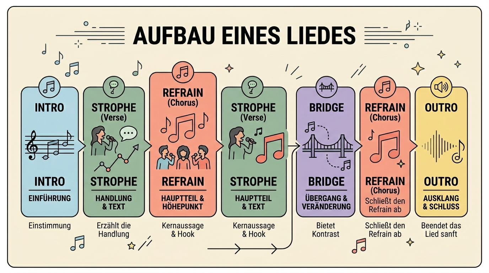
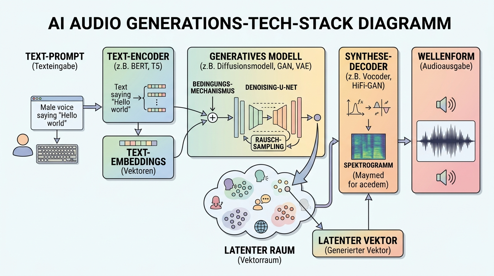

# Audio-Erzeugung Verstehen: Von der Schwingung zum Song

Um Musik mit KI zu erzeugen, müssen wir verstehen, wie Klang digital repräsentiert wird und welche Elemente eine Komposition ausmachen.

## 1. Was ist ein Lied? (Die Anatomie)
Ein Lied ist mehr als nur ein Geräusch; es ist eine strukturierte Abfolge von Frequenzen und Rhythmen. Die Kernkomponenten sind:

*   **Melodie**: Die lineare Abfolge von Tönen, die wir mitsingen (das "Thema").
*   **Harmonie**: Mehrere Töne gleichzeitig (Akkorde), die das emotionale Fundament bilden.
*   **Rhythmus**: Die zeitliche Struktur (Takt, Tempo/BPM, Groove).
*   **Dynamik**: Die Veränderung der Lautstärke und Intensität.
*   **Klangfarbe (Timbre)**: Die spezifische Qualität eines Instruments oder einer Stimme.

## 2. Song-Struktur (Das Skelett)

Die meisten modernen Songs folgen einem festen Bauplan:
1.  **Intro**: Einleitung, oft instrumental.
2.  **Strophe (Verse)**: Erzählt die Geschichte, musikalisch meist zurückhaltender.
3.  **Refrain (Chorus)**: Der emotionale Höhepunkt, hoher Wiedererkennungswert ("Ohrwurm").
4.  **Bridge**: Ein kontrastierender Teil, der Abwechslung bringt.
5.  **Outro/Coda**: Ausklang des Songs.

## 3. Genres und ihre Merkmale
KI-Modelle müssen die spezifischen "Regeln" eines Genres kennen:
*   **Pop**: Fokus auf klare Melodien, 4/4-Takt, polierte Produktion.
*   **Rock**: Fokus auf verzerrte Gitarren, Schlagzeug, energetische Vocals.
*   **Lo-Fi / Ambient**: Fokus auf Atmosphäre, langsame Tempi, oft instrumental.
*   **Electronic / Techno**: Fokus auf Synthesizer, repetitive Beats, Sounddesign.
*   **Klassik**: Komplexe Orchestrierung, Dynamiksprünge, oft keine festen Beats.

## 4. Wie funktioniert KI-Audio?

Moderne Audio-KIs arbeiten oft mit zwei Ansätzen:
*   **Symbolische KI**: Generiert Noten (MIDI), die dann von virtuellen Instrumenten abgespielt werden.
*   **Audio-Diffusion**: Generiert direkt die Wellenform oder das Spektrogramm des Klangs (ähnlich wie Bild-KIs Pixel generieren). Dies ermöglicht realistische Stimmen und komplexe Klangfarben.

> [!NOTE] Latent Audio Diffusion
> Ähnlich wie Stable Diffusion für Bilder nutzt **Stable Audio** oder **AceStep** einen latenten Raum, um Audio-Informationen effizient zu komprimieren und neu zu berechnen.
