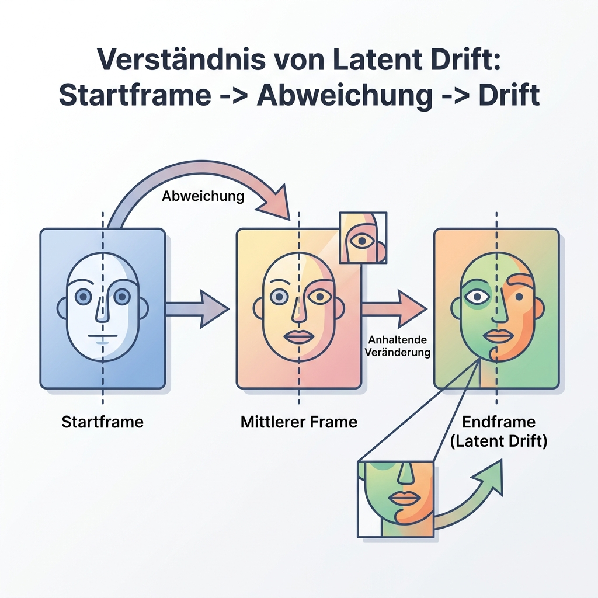
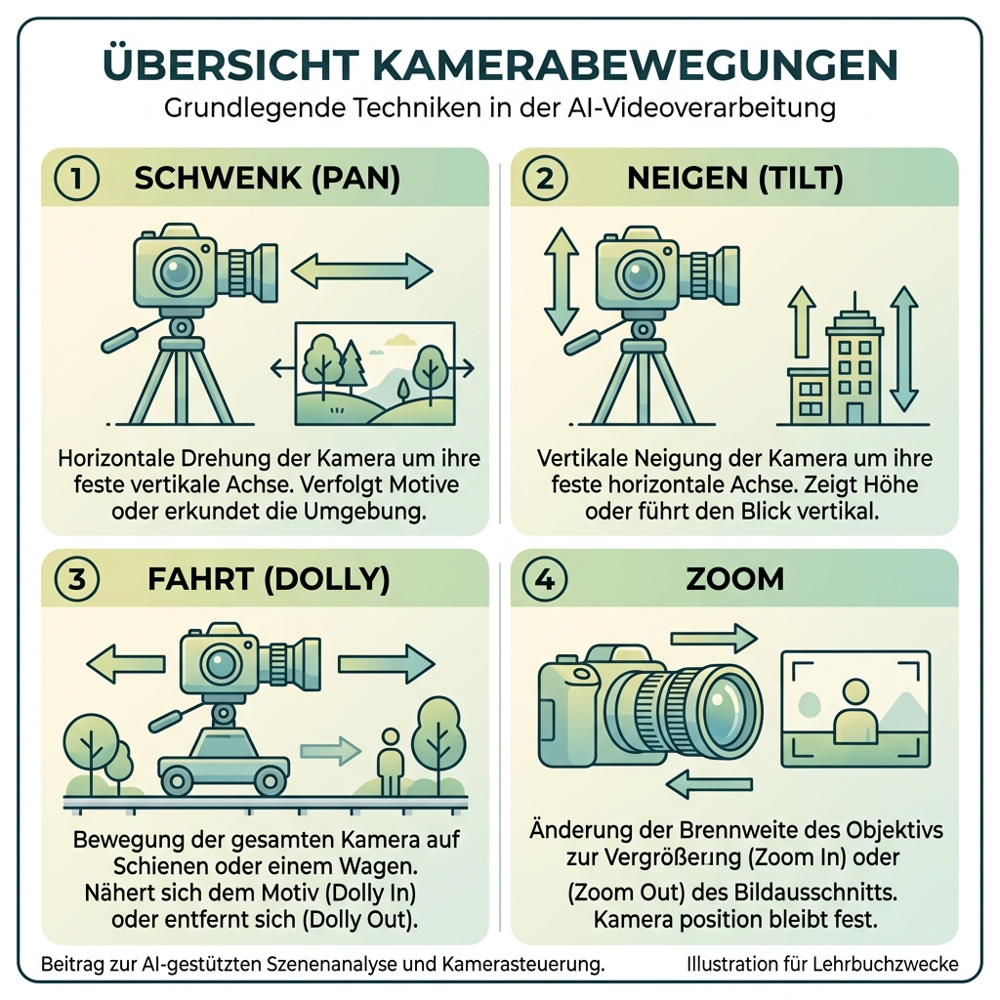
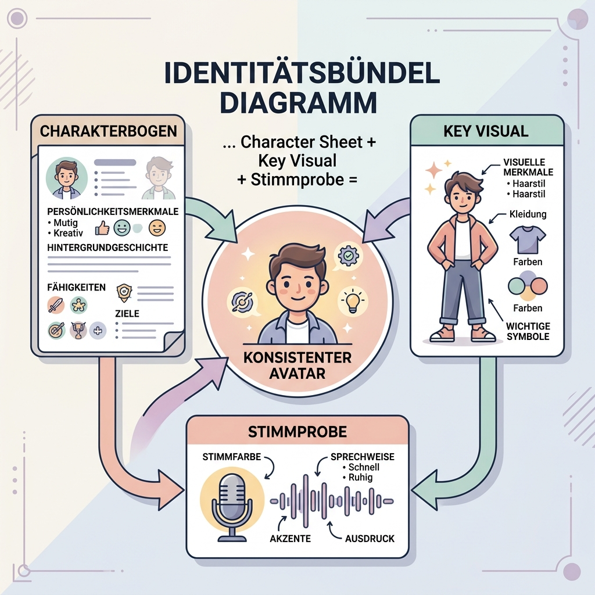
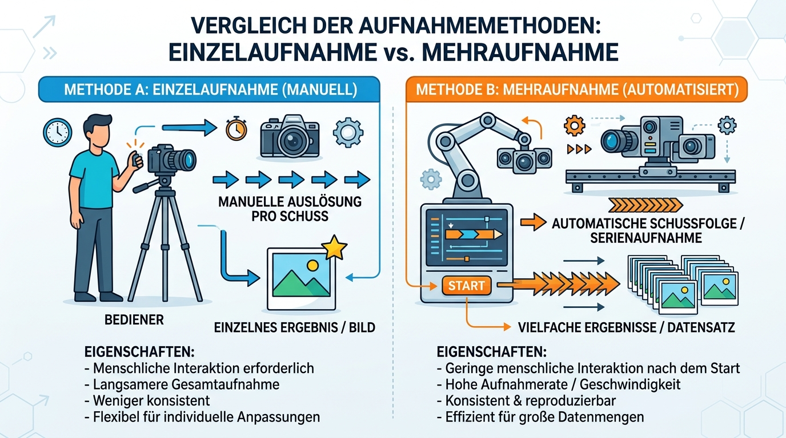
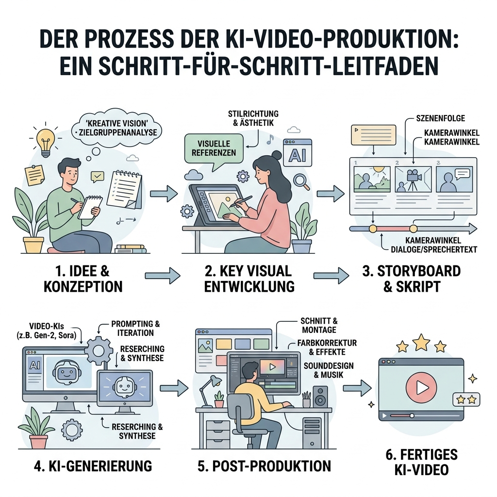
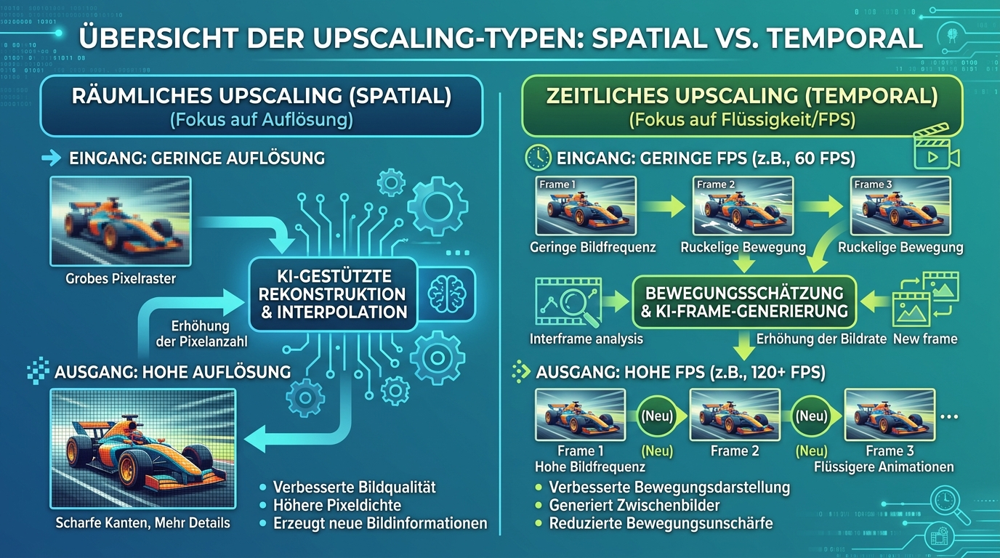

# Anleitung: Von der statischen Szene zum kinematischen KI-Video

## Zielbild
Dieses Modul führt Lernende von der einfachen Animation eines statischen Bildes über die gezielte Kamerasteuerung bis hin zur Erstellung komplexer, konsistenter Videosequenzen. Der Fokus liegt auf der Beherrschung allgemeiner KI-Workflows und der Nutzung von Large Language Models (LLMs) zur Vorstrukturierung von Multi-Shot-Prompts.

---

## Unterrichtsskript

### Titel
**Kinematische Welten: Systematische Videogenerierung mit KI**

### Zielgruppe
Studierende oder Medienschaffende, die bereits Grundkenntnisse in der KI-Bildgenerierung haben und nun zeitbasierte Medien erstellen wollen.

### Lernziele
Nach dem Modul können die Lernenden:
* Die Konzepte der temporalen Konsistenz und des "Motion Bucket" verstehen.
* Statische Bilder gezielt in Bewegung versetzen (Image-to-Video).
* Kamerabewegungen (Pan, Zoom, Orbit) präzise steuern.
* Konsistente Charaktere über mehrere Video-Shots hinweg beibehalten.
* Kinematische Videosequenzen mittels LLM-Storyboarding planen und umsetzen.

> [!TIP] Vertiefung für Fortgeschrittene
> Ergänzend zu diesem Basis-Workflow findest Du hier Best Practices für die **[lokale Videogenerierung (Specs/ComfyUI)](./BestPractice.md)** und die Erstellung von professionellen **[Produkt-Werbespots](./BestPractice.md)**.

* Komplexe Sequenzen mittels strukturierter Multi-Shot-Prompting-Frameworks planen.
* Post-Produktions-Workflows (Upscaling, Sound) anwenden.

---

## Ablaufplan

### Phase 1: Die Architektur der Zeit (FPS & Bewegung)

#### Aufgabe 1: Die First-Frame vs. Last-Frame Analyse

Die Lernenden nehmen einen kurzen KI-Clip (z.B. 4 Sekunden) und vergleichen das allererste Bild (Startframe) direkt mit dem allerletzten Bild (Endframe).
*   **Beobachtung:** Haben sich Details am Subjekt verändert (z.B. Anzahl der Knöpfe, Brillenform)? Ist der Hintergrund noch identisch?
*   **Analyse:** Wo genau tritt "Latent Drift" auf? 
    *   > [!IMPORTANT] Definition: Latent Drift
    *   > Latent Drift bezeichnet das Phänomen, bei dem die KI während der Generierung sukzessive die Kontrolle über die ursprünglichen Bildinformationen verliert. Da die KI jeden neuen Frame basierend auf einer statistischen Wahrscheinlichkeit des vorherigen Frames berechnet, summieren sich kleine Abweichungen auf. Das Resultat: Nach wenigen Sekunden "driften" Details (Anatomie, Muster, Licht) weg, und das Subjekt sieht am Ende nicht mehr aus wie am Anfang.
*   **Diskussion:** Warum ist die Übereinstimmung von Start- und Endpunkt entscheidend für die Loop-Fähigkeit und die Glaubwürdigkeit einer Szene?

**Ziel der Aufgabe:**
Das Verständnis dafür schärfen, dass Videogenerierung ein additiver Prozess ist. Die Lernenden sollen erkennen, dass ein Video-Modell nicht nur "schöne Einzelbilder" liefern muss, sondern dass die wahre Qualität in der **Identitätsbewahrung** über die Zeit liegt.

#### Aufgabe 2: Stillstand vs. Kinetik (Motion Intensity)
Zwei gegensätzliche Prompts werden verglichen, um die Belastungsgrenze der KI zu finden.
*   **Prompt A (Low Motion):** "A statue in a park, subtle wind blowing through nearby leaves, extremely stable, cinematic."
*   **Prompt B (High Motion):** "An athlete sprinting through a futuristic city at night, heavy motion blur, debris flying, high energy."
*   **Lernziel:** Die Studierenden lernen, dass hohe Bewegungsintensität die Wahrscheinlichkeit für morphologische Fehler (Glitching) erhöht.

**Ziel der Aufgabe:**
Die Belastungsgrenze der KI-Modelle verstehen. Die Lernenden sollen begreifen, dass es einen Trade-off zwischen "spektakulärer Action" und "visueller Stabilität" gibt.

---

### Phase 2: Kamera- vs. Objektbewegung (Regie & Schauspiel)

In dieser Phase lernen wir, die Regie (Kamera) vom Schauspiel (Objekt) zu trennen. Das Ziel ist es, gezielte Kontrolle über den Bildraum zu gewinnen.

#### Vorbereitung: Das Ausgangsbild (Key Visual)
Bevor wir animieren, brauchen wir eine hochwertige Vorlage. Erstellt dieses Bild mit einem modernen Bild-Generator (z.B. Image-Gen 2 / Nano Banana):

> [!EXAMPLE] Prompt für das Key Visual
> Cinematic portrait of a futuristic cyber-scientist, elderly man with a well-groomed gray beard, wearing high-tech glowing glasses and a structured dark coat with metallic accents. He is standing in a library filled with glowing holographic books. Soft blue and amber lighting, high detail, realistic skin textures, 8k resolution, shot on 85mm lens.

---

#### Aufgabe 3: Der "Statue-Orbit" (Orbit)
**Was passiert hier?** Die Kamera bewegt sich auf einer Kreisbahn um das Motiv, während das Motiv völlig starr bleibt.
*   **Produktions-Prompt (I2V):** `camera orbit 180 degrees clockwise, slow movement, subject is perfectly still like a frozen statue, cinematic 3D parallax.`
*   **Beobachtung:** Bleiben Gesichtszüge und Kleidung aus allen Winkeln konsistent?
*   **Ziel der Aufgabe:** Die räumliche Konsistenz der KI prüfen.

#### Aufgabe 4: Der "Intensitäts-Dolly" (Dolly In)
**Was passiert hier?** Die Kamera fährt physisch auf das Motiv zu. Der Bildausschnitt wird enger, die Intimität steigt.
*   **Produktions-Prompt (I2V):** `slow and steady dolly in towards the scientist's eyes, focus on the glowing glasses, background bokeh expands, subject remains still.`
*   **Beobachtung:** Bleibt der Fokus stabil? Entstehen "Halluzinationen" (neue Details) im Hintergrund?
*   **Ziel der Aufgabe:** Die Tiefenwahrnehmung der KI verstehen.

#### Aufgabe 5: Der "Ehrfurchts-Tilt" (Tilt Up)
**Was passiert hier?** Die Kamera steht fest an einem Punkt und schwenkt vertikal von unten nach oben.
*   **Produktions-Prompt (I2V):** `low angle shot, slow camera tilt up from the scientist's waist to his face, showing scale and authority, background holograms shift vertically.`
*   **Beobachtung:** Verzerren sich die Proportionen unrealistisch?
*   **Ziel der Aufgabe:** Die Wirkung von Kameraperspektiven auf die Bildpsychologie verstehen.

#### Aufgabe 6: Der "Vertigo-Effekt" (Dolly Zoom)
**Was passiert hier?** Eine der komplexesten filmischen Bewegungen. Die Kamera fährt vor, während gleichzeitig rausgezoomt wird.
*   **Produktions-Prompt (I2V):** `dolly zoom effect, vertigo effect, subject stays centered and same size while the background library expands and distorts, trippy cinematic visuals.`
*   **Beobachtung:** Kann die KI Vorder- und Hintergrund unabhängig voneinander manipulieren?
*   **Ziel der Aufgabe:** Die absolute Belastungsgrenze der räumlichen Logik testen.

#### Aufgabe 7: Das "Karussell" (Nur Objektbewegung)
**Was passiert hier?** Die Kamera steht fest auf einem Stativ. Nur das Motiv im Bild bewegt sich (hier: eine Drehung um die eigene Achse).
*   **Produktions-Prompt (I2V):** `static camera shot, tripod, the scientist is slowly rotating on his own axis, 360 degree turn, camera does not move, background remains stable.`
*   **Beobachtung:** Verliert der Charakter seine Form, während er sich dreht (Morphing)?
*   **Ziel der Aufgabe:** Die zeitliche Konsistenz (Temporal Consistency) isoliert von Kamerabewegungen bewerten.

> [!TIP] Weitere Bewegungen & Effekte
> Dies sind nur die gängigsten Basiseffekte. Eine vollständige Liste aller kinematischen Kamerabewegungen (wie Crane Shots, Dutch Angles oder Handheld-Effekte) sowie weitere Objektbewegungen findest du im **[cheatsheet.md](./cheatsheet.md)**.

---

### Phase 3: Charakter- & Objekt-Konsistenz (Deep Identity)

Die größte Herausforderung bei KI-Video ist die Bewahrung der Identität über visuelle und auditive Ebenen hinweg. Ein stabiler Charakter benötigt eine exakte Definition, bevor die Generierung beginnt.

#### Das "Consistency-Bundle"

Ein professioneller Charakter-Workflow erfordert die Bereitstellung folgender Assets:
1.  **Character Sheet:** Mehrere Ansichten der Person (Front, Profil, Back), um die Geometrie und Proportionen zu fixieren.
2.  **Anfangsbild (Key Visual):** Definiert den exakten Startpunkt: Kleidung, Lichtstimmung und die initiale Mimik (Gesichtsausdruck) im Moment des Beginns.
3.  **Stimmprobe (Voice Sample):** Eine ca. 5-sekündige, "trockene" Aufnahme (ohne Hintergrundgeräusche/Musik) der Stimme für das Voice-Cloning.
4.  **Scaling:** Bei mehreren Personen im Bild muss das Bundle für jede Identität erstellt werden.
5.  **Produkte als Charaktere:** Auch Objekte (z.B. eine Coladose) müssen wie Charaktere behandelt werden (Product Sheet), um Logos und Formen stabil zu halten.

> [!TIP] Profi-Tipp: Outfit-spezifische Charaktersheets
> Erzeuge im Idealfall je Szene ein eigenes Charaktersheet. Sollte die Person in unterschiedlichen Szenen unterschiedliche Kleidung tragen (z.B. Astronaut mit und ohne Helm, Fußballspieler(in), Business-Outfit vs. Casual Look), dann erstelle dafür jeweils ein passendes Charaktersheet, um die Konsistenz der Details zu maximieren.

---

#### Aufgabe 8: Der visuelle Avatar-Transfer
**Was passiert hier?** Wir übertragen eine bestehende Identität aus einem Character Sheet in eine neue Videosequenz.
*   **Vorbereitung:** Nutze das Character Sheet aus dem Bilderzeugungs-Modul.
*   **Produktions-Prompt (I2V):** `use character reference [Sheet], person [Name] is speaking and nodding, wearing the exact same dark coat, consistent facial features, photorealistic.`
*   **Ziel der Aufgabe:** Die Vermeidung von "Identity Leakage". Die Lernenden lernen, wie sie Referenzbilder nutzen, damit die Person nicht zwischen den Frames "morpht".

#### Aufgabe 9: Voice-Cloning & Lip-Sync
**Was passiert hier?** Die Person im Video erhält eine konsistente Stimme, die synchron zu den Lippenbewegungen ist.
*   **Vorbereitung:** Lade eine 5-sekündige Stimmprobe (WAV/MP3) hoch.
*   **Workflow:** Text eingeben → Stimme klonen → Video generieren.
*   **Beobachtung:** Passt die Stimme zur Erscheinung der Person? Ist die Lippensynchronität (Lip-Sync) natürlich?
*   **Ziel der Aufgabe:** Verständnis der multimodalen Konsistenz. Die Lernenden begreifen, dass Identität auch über den Ton definiert wird.

#### Aufgabe 10: Produkt-Konsistenz (The Object-Character)
**Was passiert hier?** Wir animieren ein Produkt (z.B. eine Dose), ohne dass sich das Logo oder die Form verzieht.
*   **Vorbereitung:** Erstelle ein "Product Sheet" der Dose (verschiedene Seiten, Logo-Close-up).
*   **Produktions-Prompt (I2V):** `product reference [Dose], slow rotation, logo remains perfectly sharp and static on the surface, metallic reflection.`
*   **Ziel der Aufgabe:** Übertragung der Charakter-Prinzipien auf das Marketing/Product-Design.

---

### Phase 4: Multi-Shot-Prompting (Strukturierte Sequenzen)

Ein Video besteht selten aus nur einem Shot. In der professionellen Produktion generieren wir meist kurze Segmente von **2 bis 7 Sekunden** und verbinden diese. Es gibt zwei Wege, dies umzusetzen:

#### Die zwei Wege der Produktion
1.  **Methode A: Single-Shot Generierung (Manuell)**
    *   **Workflow:** Jeder Clip wird einzeln generiert. In der Post-Produktion (Schnitt) werden sie zusammengefügt.
    *   **Vorteil:** Maximale Kontrolle über jeden Frame und höchste Detailtiefe pro Shot.
    *   **Herausforderung:** Man muss die Konsistenz (Licht, Kleidung) manuell durch Referenzbilder erzwingen.
2.  **Methode B: Multi-Shot/Sequence Mode (Automatisiert)**
    *   **Workflow:** Moderne SOTA-Tools erlauben die Eingabe einer ganzen Shot-Liste (Storyboard). Die KI generiert eine zusammenhängende Datei mit harten Schnitten.
    *   **Vorteil:** Die KI versucht, die Konsistenz zwischen den Schnitten intern zu wahren.
    *   **Herausforderung:** Weniger Kontrolle über Einzeldetails; "Latent Drift" kann sich über die Clips hinweg verstärken.

#### Die "15-Sekunden-Grenze"
Moderne SOTA-Modelle können heute zwar bis zu 15 Sekunden (oder mehr) am Stück generieren, doch ab ca. 5-7 Sekunden treten oft Probleme auf:
*   **Latent Drift:** Die KI "vergisst" die Ausgangssituation. Gesichter verändern sich, Objekte verschwinden.
*   **Physik-Zerfall:** Bewegungen werden unnatürlich oder "traumartig" (halluzinogen).
*   **Rechenlast:** Die Aufrechterhaltung der temporalen Kohärenz über Hunderte von Frames erfordert extrem viel VRAM.
**Lösung:** Kurze, präzise kontrollierte Einzelclips, die durch geschickten Schnitt eine Geschichte erzählen.

#### Aufgabe 11: Der Shot-Wechsel (Methode A: Single-Shot)
**Was passiert hier?** Wir generieren zwei Clips völlig separat und prüfen, ob wir sie durch geschicktes Referenz-Management "match-cut-fähig" machen können.
*   **Vorbereitung (The Identity Bundle):**
    1.  **Key Visual:** Erstelle ein Bild der Frau in der Küche (Morgenlicht, weiße Tasse).
    2.  **Character Sheet:** Erstelle ein konsistentes Blatt der Frau (verschiedene Winkel).
    3.  **Tassen-Referenz:** Ein Close-up der spezifischen weißen Keramiktasse.
*   **Produktion (I2V):**
    *   **Shot 1 (Medium Shot):** `use character reference [Sheet], use image reference [Key Visual], young woman in kitchen, sitting at wooden table, holding white ceramic mug, steam rising, soft morning sunlight.`
    *   **Shot 2 (Close-up):** `use character reference [Sheet], use image reference [Tasse], extreme close-up of steam rising from the white mug, the woman's hands visible, warm morning light.`
*   **Ziel:** Die manuelle Kontrolle der Konsistenz über räumliche Sprünge hinweg beherrschen.

#### Aufgabe 12: Der strukturierte Director-Workflow (Methode B: Multi-Shot)
**Was passiert hier?** Die Lernenden nutzen die Storyboard-Funktion moderner Tools, um eine automatisierte Sequenz zu planen und zu generieren.
*   **Vorbereitung (The Identity Bundle):**
    1.  **Character Sheet:** Der Koch (Mann, ca. 40, Schürze).
    2.  **Stimmprobe:** 5 Sek. ruhiges Sprechen ("Gleich ist das Essen fertig").
    3.  **Produkt-Referenz:** Ein spezifisches Gemüse (z.B. rote Paprika).
*   **Workflow:**
    1.  **Schritt 1: LLM-Planung:** Kopiere den folgenden technischen "KI-Director" Prompt in dein LLM (z.B. Claude). Ersetze die Platzhalter in Klammern durch deine Szenen-Idee.
    
    > [!TIP] Der ultimative Director-Prompt für diese Aufgabe (Template)
    > *"Write me a multi-shot prompt that describes the below scene using the uploaded image as a key visual reference… [INSERT CHARACTER, ACTION, LOCATION, TIME OF DAY] Structure it as a sequence of shots totalling exactly 15 seconds, where each shot is a minimum of 2 seconds and a maximum of 5 seconds. Choose the shot count freely based on what best serves the action — anywhere from 3 shots (longer, more contemplative beats) up to 7 shots (fast, punchy cutting) — and vary this choice each time the prompt is run so results feel fresh. Chain shots with 'Cut to.' between them. For each shot specify: shot size (wide/medium/close-up/macro), lens (e.g. 24mm, 35mm, 50mm, 85mm), camera angle (low/high/eye-level/over-the-shoulder/Dutch), and one clear camera movement verb (push in, pull out, track, orbit, pan, tilt, handheld, static). Vary all four across the sequence and pick the angle that best sells each beat. Output one flowing paragraph, no line breaks, no lists, no markdown, 1000 characters maximum. End the prompt with: 'Photo real, natural framing. Audio: diegetic sound only — natural ambience, environmental foley, and subject-driven sound.'"*
    > 
    > **Hinweis:** Eine erweiterte Version dieses Prompts mit spezifischen Befehlen für Modelle wie LTX, Seedance, Kling, Sora und Veo findest du im **[directorprompt_template.md](./directorprompt_template.md)**.

    > [!EXAMPLE] Ausgefüllter Beispiel-Prompt für unsere Aufgabe (Der Koch)
    > *"Write me a multi-shot prompt that describes the below scene using the uploaded image as a key visual reference… **Character: A male chef, 40s, apron. Action: Chopping vegetables, slicing a red bell pepper, smiling and saying 'Dinner is almost ready'. Location: Bright modern kitchen. Time of day: Evening golden hour.** Structure it as a sequence of shots totalling exactly 15 seconds, where each shot is a minimum of 2 seconds and a maximum of 5 seconds. Choose the shot count freely based on what best serves the action — anywhere from 3 shots (longer, more contemplative beats) up to 7 shots (fast, punchy cutting) — and vary this choice each time the prompt is run so results feel fresh. Chain shots with 'Cut to.' between them. For each shot specify: shot size (wide/medium/close-up/macro), lens (e.g. 24mm, 35mm, 50mm, 85mm), camera angle (low/high/eye-level/over-the-shoulder/Dutch), and one clear camera movement verb (push in, pull out, track, orbit, pan, tilt, handheld, static). Vary all four across the sequence and pick the angle that best sells each beat. Output one flowing paragraph, no line breaks, no lists, no markdown, 1000 characters maximum. End the prompt with: 'Photo real, natural framing. Audio: diegetic sound only — natural ambience, environmental foley, and subject-driven sound.'"*
    
    2.  **Schritt 2: Generierung (Storyboard Mode):** Gib die resultierende Shot-Liste in den Multi-Shot-Editor deines Video-Tools ein.
    *   **Shot A (Wide):** `character [Sheet], man chopping vegetables, bright kitchen, camera pans left.`
    *   **Shot B (Macro):** `product [Paprika], knife slicing through pepper on wooden board, crisp detail.`
    *   **Shot C (Medium + Audio):** `character [Sheet], voice [Sample], man looks up, smiles, says: "Gleich ist das Essen fertig", steam in background.`
*   **Ziel der Aufgabe:** Orchestrierung einer komplexen, automatisierten narrativen Abfolge.

---

### Phase 5: Der professionelle Workflow (Regie & Generierung)

Dieser Workflow führt alle bisherigen Erkenntnisse in einer strukturierten Produktionskette zusammen. Das Ziel ist der Wechsel vom "Prompt-Experiment" hin zur gezielten Filmerstellung.

#### Aufgabe 13: Die komplette Produktion (Director Workflow)
**Was passiert hier?** Die Lernenden produzieren eine zusammenhängende Sequenz (ca. 10-15 Sekunden) basierend auf einer festen Idee.
*   **Schritt 1: Das Key Visual (Anker):** Erstelle das Master-Bild für Licht, Stil und Charakter (Text-to-Image).
*   **Schritt 2: Planning mit KI-Director (LLM):** Zerlegung der Handlung in Einzelszenen (Shots) mittels des Storyboard-Prompts aus Phase 4.
*   **Schritt 3: Generierung (Orchestrierung):** Umsetzung der Shots im Video-Generator (Methode A oder B). Achte auf die Einhaltung des "Identity Bundles".
*   **Ziel der Aufgabe:** Den gesamten Prozess von der Vision bis zum Rohmaterial (Rushes) eigenständig steuern.

---

### Phase 6: Post-Produktion & Veredelung (The Final Polish)

KI-Video verlässt die generative KI selten in finaler Qualität. In dieser Phase veredeln wir das Material.

#### Aufgabe 14: KI-Upscaling (Spatial & Temporal)

**Was passiert hier?** Wir verbessern die Bildqualität und die Flüssigkeit des Videos.
*   **Spatial Upscaling:** Erhöhung der Auflösung (z.B. von 720p auf 4K) und Schärfung von Texturen.
*   **Temporal Upscaling (Interpolation):** Erhöhung der Framerate (z.B. von 24 auf 60 FPS) für extrem flüssige Bewegungen.
*   **Methode:** Nutze SOTA-Upscaler (z.B. Topaz Video AI oder integrierte Lösungen).
*   **Ziel der Aufgabe:** Verstehen, dass die "generative Basis" nur das Fundament ist. Die Veredelung macht den Unterschied zwischen "KI-Clip" und "Film".

#### Aufgabe 15: Finaler Schnitt & Sound-Design
**Was passiert hier?** Die Einzelclips werden in einer NLE-Software (CapCut/DaVinci Resolve) zusammengeführt.
*   **Der unsichtbare Schnitt:** Achte auf "Match Cuts" (Bewegungskontinuität zwischen Shots).
*   **Color Grading:** Vereinheitliche die Farben über alle Clips hinweg.
*   **Sound Design:** Füge Hintergrundatmosphäre (Ambience), Sound-Effekte (Foley) und ggf. das geklonte Voiceover hinzu.
*   **Ziel der Aufgabe:** Ein fertiges, sendefähiges Medienprodukt erstellen.

---

## Bewertungsraster

| Kriterium | Sehr gut | Mittel | Schwach |
| :--- | :--- | :--- | :--- |
| **Konsistenz** | Charakter/Stil bleiben über Shots identisch | Leichte Abweichungen | Starke Sprünge (Glitching) |
| **Kamerasteuerung** | Dynamik unterstützt die Story | Bewegung vorhanden, aber beliebig | Statisch oder ruckelig |
| **Prompt-Struktur** | Klare Trennung von Motiv und Bewegung | Vermischung von Parametern | Ungezielte Beschreibung |
| **Post-Produktion** | Scharfes Bild, passender Sound | Bild okay, kein Sound-Edit | Pixelig und unbearbeitet |

---

## Hausaufgaben
Erstelle eine 15-sekündige Sequenz, die eine konsistente Person in zwei verschiedenen Einstellungsgrößen (Close-up & Wide) zeigt. Nutze ein Voiceover.
