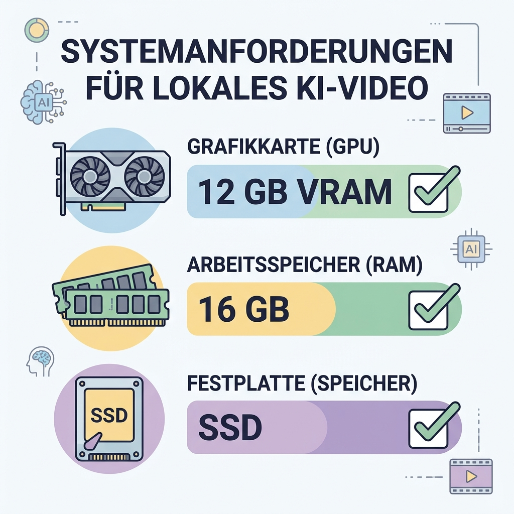
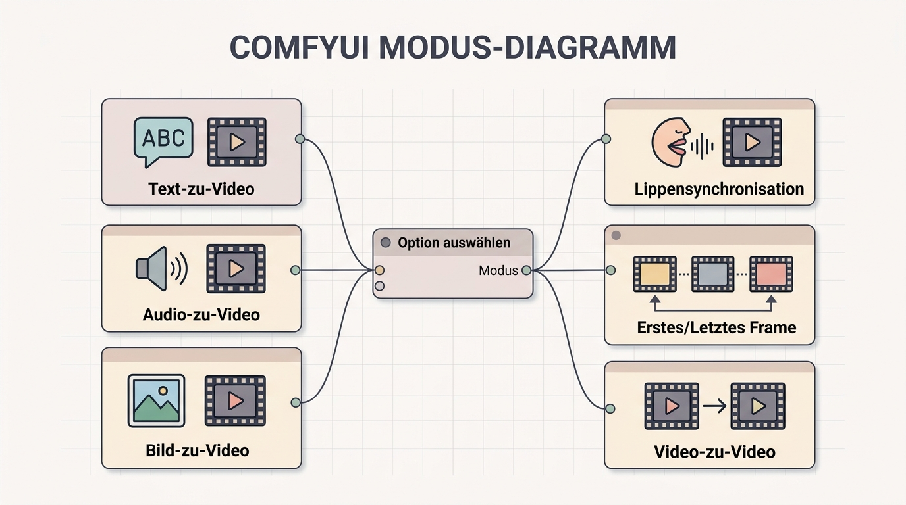
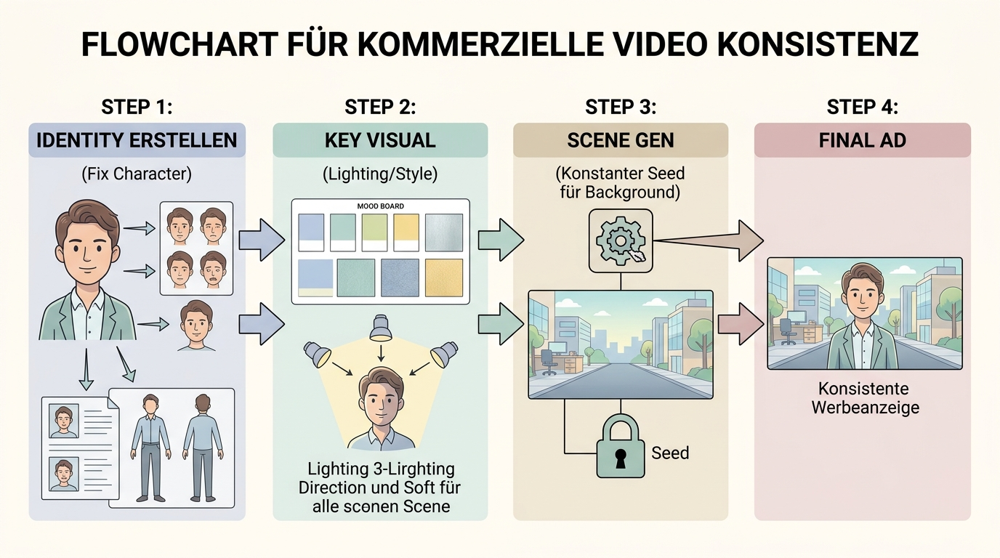

# Best Practices: Lokale Videogenerierung & Produktwerbung

Dieses Dokument vertieft fortgeschrittene Workflows der Videoerzeugung, basierend auf aktuellen Industriestandards für lokale Kontrolle und kommerzielle Produktion.

---

## 1. Lokaler Workflow: LTX 2.3 All-in-One (ComfyUI)
Wenn maximale Kontrolle über Lip-Sync, Bewegung und Bildübergänge gefragt ist, bietet der LTX 2.3 Workflow in ComfyUI eine modulare Lösung.

### Hardware-Spezifikationen
Für einen stabilen Betrieb des LTX 2.3 Modells (ca. 24 fps Generierung) ist folgende Hardware essenziell:

*   **GPU:** NVIDIA RTX Serie (mind. 12 GB VRAM) für FP8-Quantisierung.
*   **RAM:** 16 GB (32 GB für parallele Prozesse empfohlen).
*   **SSD:** NVMe empfohlen, da Checkpoints (>20 GB) beim Start geladen werden müssen.

### Die 6 Modi des All-in-One Workflows
Ein zentraler "Selector Node" erlaubt den Wechsel zwischen verschiedenen Generierungs-Logiken:

1.  **Text-to-Video:** Direkte Generierung aus Prompts.
2.  **Audio-to-Video:** Generierung synchron zu einer Audiospur.
3.  **Image-to-Video:** Animation eines Startbildes (Keyframe 1).
4.  **Cinematic Lip-Sync:** Hochpräzise Mundsynchronisation für KI-Sprecher.
5.  **First & Last Frame:** KI berechnet die Bewegung *zwischen* zwei vorgegebenen Bildern.
6.  **Video-to-Video:** Stil-Transfer oder Bewegungs-Übertragung von einem Referenzvideo.

**Video-Anleitung:** [LTX2.3 All-in-One-Workflow im Detail](https://youtu.be/3HXCeSGnoq0?si=bggUL2XXgIDU0I-x)

---

## 2. Produktwerbung: Seedance 2.0 & Kling 3.0
Die Erstellung von Werbespots erfordert "Product Consistency" – das Produkt darf sich nicht verändern.

### Konsistenz-Strategien (Branding Loop)
Um sicherzustellen, dass ein Produkt (z.B. ein Parfümflakon) über mehrere Szenen hinweg identisch bleibt, nutzen wir den Branding-Loop:

*   **Fixed Identity:** Erstellung eines "Identity Bundles" (Referenzbilder des Produkts aus allen Winkeln).
*   **Constant Seed:** Nutzung des identischen Seed-Wertes für den Hintergrund, während nur das Produkt animiert wird.
*   **Motion Control (Level 5-7):** In Seedance 2.0 steuert dieser Parameter die Dynamik. Für Werbung ist Level 6 meist der "Sweet Spot" zwischen Realismus und Dynamik.

### Pro-Tipps für Commercials
*   **Prompt-Struktur:** Beginne mit dem Fokusobjekt, gefolgt von Lichtstimmung und Kamerafahrt (z.B. *"Macro shot of a cold soda can, water droplets, golden hour light, slow dolly zoom"*).
*   **Iterative Verfeinerung:** Nutze die "Seed-Variation", um kleine Details in der Reflexion anzupassen, ohne die Grundform zu verlieren.

**Video-Anleitung:** [Profis-Workflows für KI-Werbung](https://youtu.be/ClIaRcvwnTQ?si=_YDb1S6VvfcoW6_A)

---

## Zusammenfassung
Die Wahl des richtigen Tools hängt vom Ziel ab:
*   **Cloud (Seedance/Kling):** Schnelle High-End Ergebnisse für Werbung.
*   **Lokal (ComfyUI):** Maximale technische Kontrolle und Lip-Sync-Präzision.

---
[[Anleitung]] | [[Projekt_KI_VL]]
